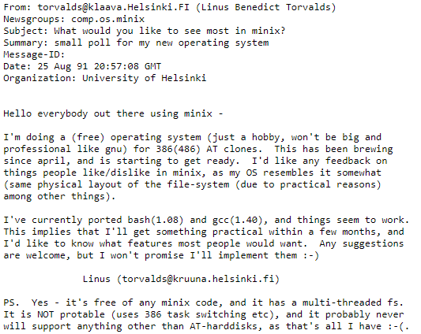

# Introduction

## Linux
Windows, made by Microsoft, is a well known operating system that we see a lot in Desktop environments, but there are other alternatives as well. One of the more popular ones are MacOSX, ChromeOS, but also Linux. Linux, as a desktop variant, is less prominent than the others.

In Server / IOT / mobile environments we see a certain shift in used operating systems. Linux is one of the most popular operating systems in these markets. Some interesting statements:
* [Most supercomputers run on Linux](https://itsfoss.com/linux-runs-top-supercomputers/)
* [More than 80% of the top 25 most popular websites in the world run on a Linux server](https://www.alexa.com/topsites)
* [The most popular cloud infrastructure providers use Linux](https://www.linuxfoundation.org/blog/how-amazon-web-services-uses-linux-and-open-source/)

You will find Linux in smartphones, (web) servers, tablets, IoT devices, Smart washing machines, self driving cars, modems, routers, PlayStation, ... In short: Linux is used way more than you would initially think. Linux even has his own mascotte, the penguin Tux!

### Unix
Dennis Ritchie and Ken Thompson created the Unix operating system in 1969. The source code from this OS was open source at that moment. After a while the company AT&T Bell Labs decided they wanted to sell Unix commercially. Not everyone followed this vision and this resulted in 2 versions:
* Unix: The commercial version
* BSD Unix: The open source version

In the '80 you would find different versions of Unix. One of them was the _GNU project ("GNU is not unix")_. The goal of GNU was the development of an open source operating system where everyone could work on together as a community.

### Linux
A student named Linus Torvalds created a post in a newsgroup about his own operating system in the '90:

This has grown in the the Linux kernel that we know today.

#### Linux distributions
Linux distributions (distros in short) are collections of tools on top of the Linux kernel. Every distro can have his own focus points. Some well known distros are Ubuntu, RedHat, Fedora, CentOS, Debian, Archlinux, ...

<i class="fa-solid fa-film"></i>  [What is linux?](https://www.youtube.com/watch?v=zA3vmx0GaO8)

<i class="fa-solid fa-earth-europe"></i> [High level overview Linux](https://www.linux.com/what-is-linux/)

<i class="fa-solid fa-earth-europe"></i> [Most popular linux distros](https://distrowatch.com/dwres.php?resource=popularity)

<i class="fa-solid fa-film"></i> [[Pluralsight] Linux introduction](https://app.pluralsight.com/course-player?clipId=f23dd1fa-7766-49d0-9b6d-6530142b38c6)

