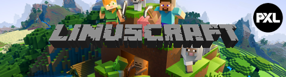

# Labo case <!-- {docsify-ignore} -->

Binnen de cursus volgen we Linus. Linus is een eerstejaars student toegepaste informatica aan de hogeschool PXL. Zijn hobbies bestaan uit muziek, uitgaan en gamen. 

Sinds kort is hij volledig in de ban van Minecraft. Uren heeft hij al in zijn eigen wereld gestoken. Zijn vrienden spelen het spel ook, ze delen elke week verhalen over hun avonturen & tonen screenshots van hun indrukwekkende creaties in hun werelden.

Linus heeft gehoord dat het mogelijk is om Mincraft in multiplayer te spelen. Hiervoor hebben ze een *minecraft server* nodig. Dit is een computer met als doel het hosten van de wereld. Verschillende mensen kunnen dan verbinding maken met die server om op die manier samen te spelen.

Dit is **exact** waar Linus naar op zoek is. Na enkele Google opdrachten blijkt echter dat veel van de guides voor het opzetten van een minecraft server termen gebruiken zoals Linux, Unix, chmod, ...Termen waarvan Linus nog nooit van gehoord heeft. Ondanks is hij heel gemotiveerd om de server up en running te krijgen met als naam "Linuscraft"

Hier begint meteen het verhaal van deze cursus. We nemen je mee in het proces waarbij Linus een Minecraft server opzet & onderhoudt en waarbij we een aantal basisconcepten tegenkomen die we verder uit de doeken doen. In zijn zoektocht ziet Linus dat er binnen het gebruik van systemen verschillende besturingssystemen zijn.