# Installatie

## Virtualisatie
Om de minecraft server op te zetten heb je een server nodig met een publiek IP adres. In de praktijk ga je hiervoor snel op zoek naar een cloud provider waar je een server kan huren. Voor deze cursus simuleren we dit gebeuren door gebruik te maken van een virtuele machine.

Virtualisatie is het concept waarbij we een computersysteem virtueel op een ander systeem draaien. Hierdoor is het mogelijk om verschillende besturingssystemen tegelijkertijd virtueel te draaien op één *host* systeem.

Linus wil graag het besturingsysteem [Ubuntu server](https://ubuntu.com/download/server) virtualiseren. Uiteraard zou je gerust ook een andere Linux distributie kunnen gebruiken. Voor deze cursus maken we gebruik van een debian based distributie.
µ :fa-solid fa-list-check: _Download alvast de `.iso` file voor Ubuntu server via bovenstaande link. Een `.iso` bestand is een exacte kopie van een CD of DVD. Deze heb je later in het hoofstuk nodig voor de installatie van het besturingssysteem._ µ

## Virtualisatiesoftware
Om virtualisatie toe te passen zijn er verschillende opties. Veel voorkomende software is:
- VMware workstation
- Virtualbox
- Hyper-V

Binnen deze cursus ondersteunen we het opzetten van een virtuele machine in VMWare maar de stappen in de andere pakketten zijn gelijkaardig. Als student van de Hogeschool PXL krijg je een licentie voor VMware Workstation pro.

#TODO: schema virtualisatie toevoegen

## Aanmaken VM
om een nieuwe virtuele machine (VM) aan te maken in vmware maak je gebruik van het menu item `file`>`New virtual machine`. Vervolgens doorlop je een wizard om de machine te configureren.

In het eerste scherm kiezen we ervoor om het besturingssysteem later te installeren:

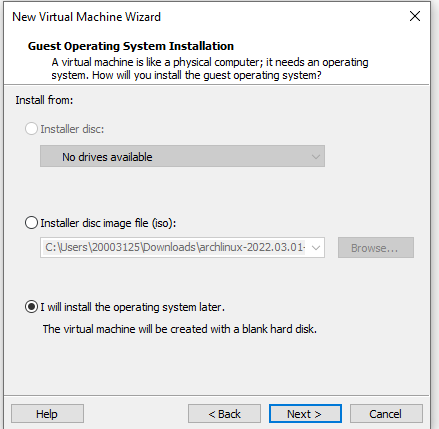

Hierna kiezen we als besturingsysteem `Linux`. Bij de dropdown 'versie' kies je voor `Ubuntu 64 bit`. Dit is de linux distributie die we tijdens deze cursus gaan gebruiken.

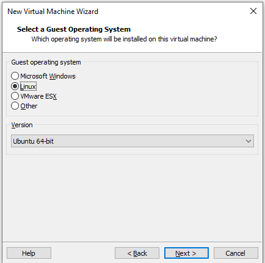

Hierna geef je de virtuele schijfgrootte in. Voor deze machine is een harde schijf van 20 GB voldoende. We kunnen dit later nog altijd uitbreiden:

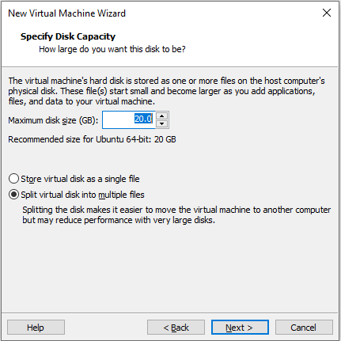

Vervolgens loop je de wizard verder door en wordt de virtuele machine voor je aangemaakt. De laatste stap is het koppelen van de ubuntu-server iso die je eerder hebt gedownload aan de virtuele cd-rom speler van je machine. Dit doe je door met je rechtermuisknop op je virtuele machine te klikken. Vervolgens ga je naar `settings`. Hierin koppel je de `iso` file op volgende manier:

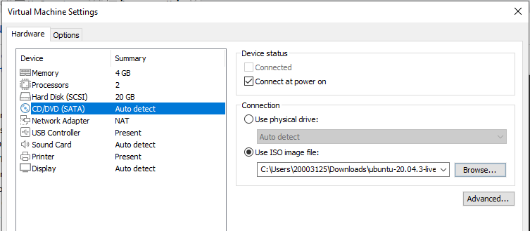

Hierna kan je de virtuele machine opstarten met de groene pijl. De CDrom zal opstarten om de installatieprocedure van Ubuntu server booten.

## Installatie Ubuntu server
Zoals aangegeven gebruiken we binnen deze cursus de distributie Ubuntu. Na het aanmaken van de VM, krijg je enkele stappen die je moet doorlopen om Ubuntu te installeren. Je zal merken dat er geen muis beschikbaar is, navigeren doe je met de pijltjes & enter toetsen.

µ <i class="fa-solid fa-circle-info"></i> krijg je bij het opstarten de error `This host supports Intel VT-x, but Intel VT-x is diabled`? Dan moet je in de BIOS van je laptop de VT-x optie nog activeren. Meer informatie hierover kan je terugvinden in [dit artikel](https://www.qtithow.com/2020/12/fix-error-this-host-supports-Intel-VT-x.html).µ


We starten met het selecteren van de taal, hier kiezen we Engels:

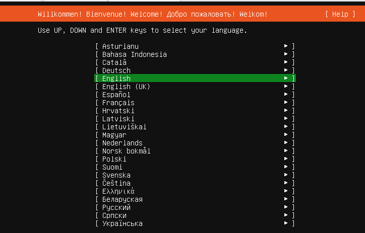

De installer update slaan we over:

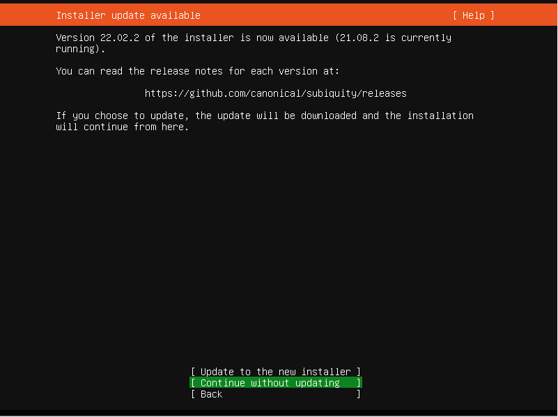

Kies de correcte keyboard layout. Voor de `azerty` layout kies je voor `Belgian`:

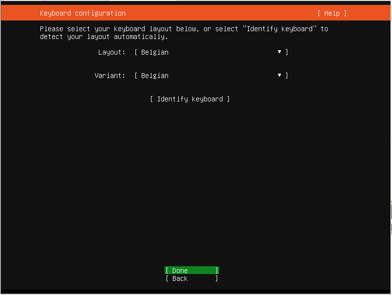

In het volgende 5 schermen doen we geen aanpassingen & klik je gewoon op done:

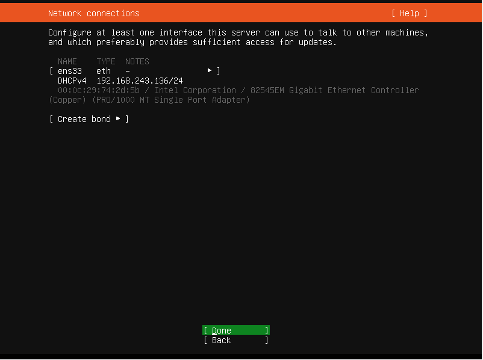

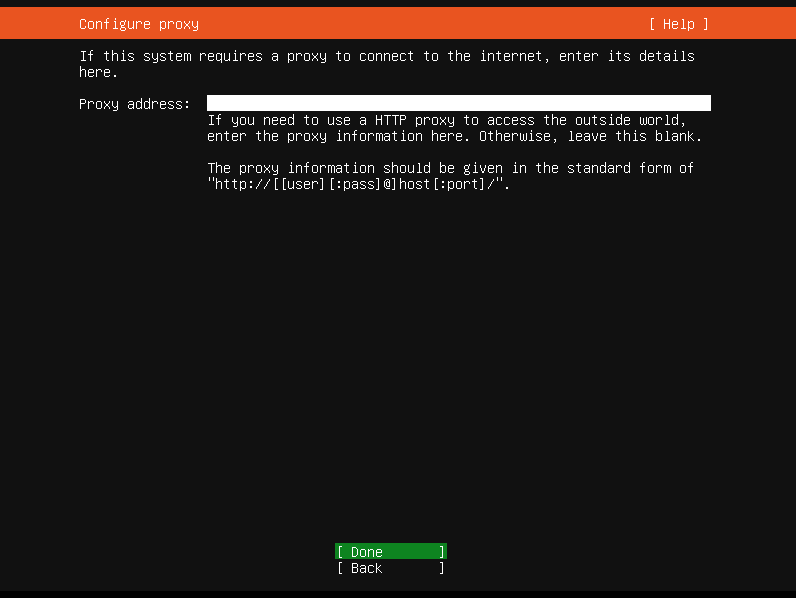

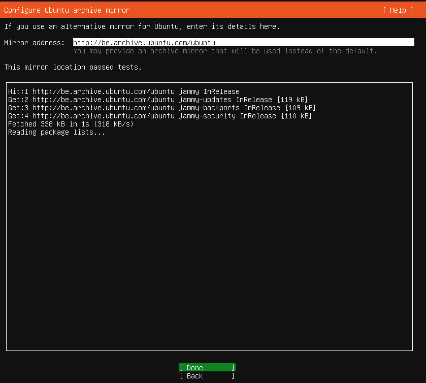
e
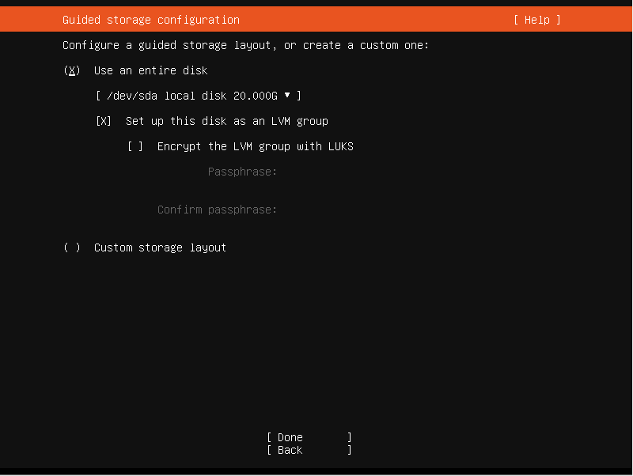

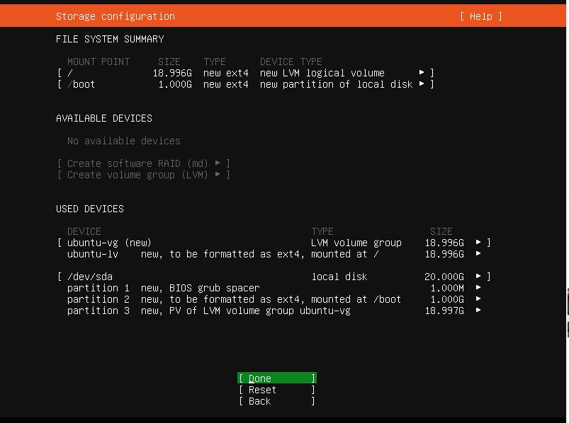

Vervolgens maken we onze user account aan die gebruikt wordt binnen het besturingssysteem. We gebruiken hiervoor onderstaande instellingen:
```
username: student
server name: linux-essentials
password: pxl
```

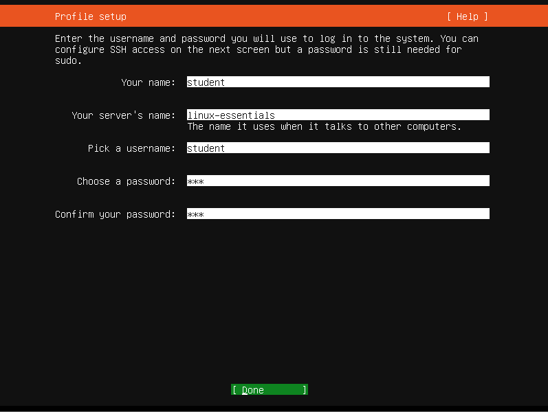

Ook in de volgende 2 schermen doen we geen aanpassingen en klik je gewoon op done:

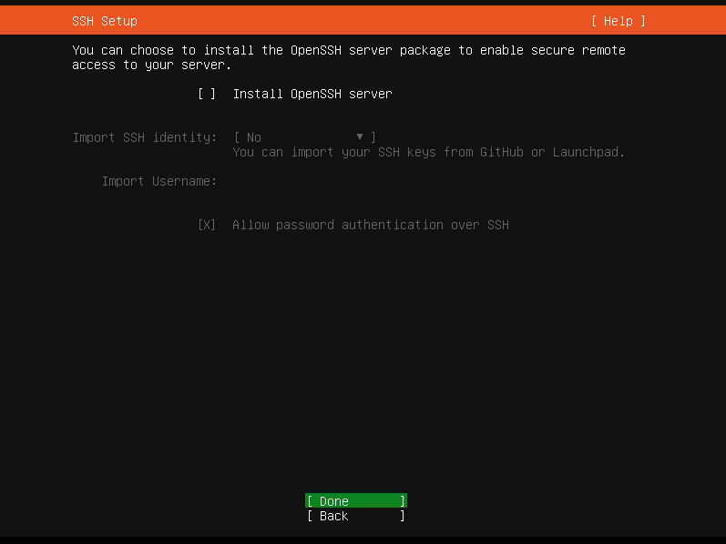

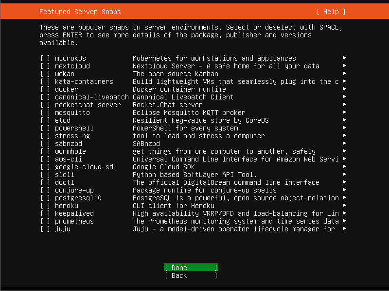

Vervolgens zal het besturingsysteem geïnstalleerd en geconfigureerd worden. Na verloop van tijd verschijnt er de `Reboot Now` optie. Dit wil zeggen dat de installatie voltooid is:

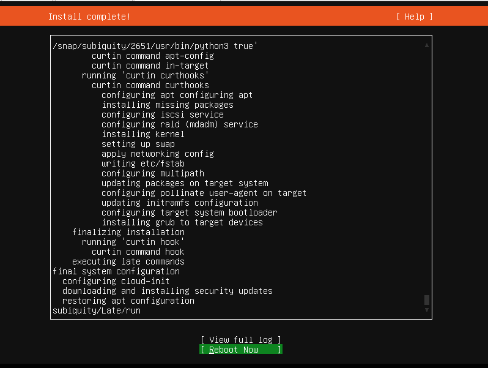

Hierna sluit je de VM af. Vervolgens pas je in de settings de CD-ROM speler aan zodat hij niet meer het `.iso` bestand gebruikt. Dit doe je als volgt:

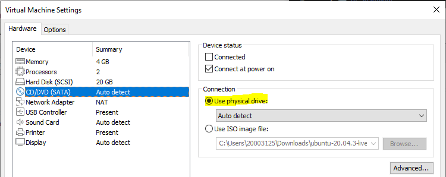

Al deze stappen worden ook doorlopen in onderstaand filmpje:

<i class="fa-solid fa-film" style="color: #fff;"></i> [Installatie demo Ubuntu in VMware](https://www.youtube.com/watch?v=u8WLsyMuSgw)

