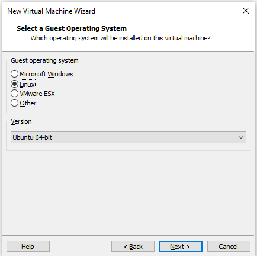
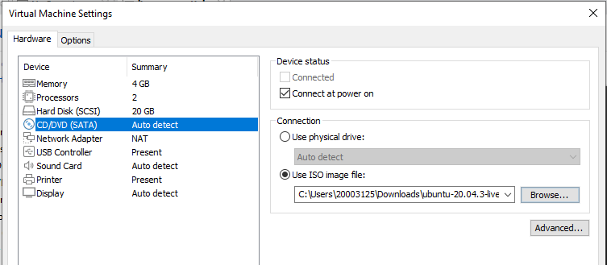
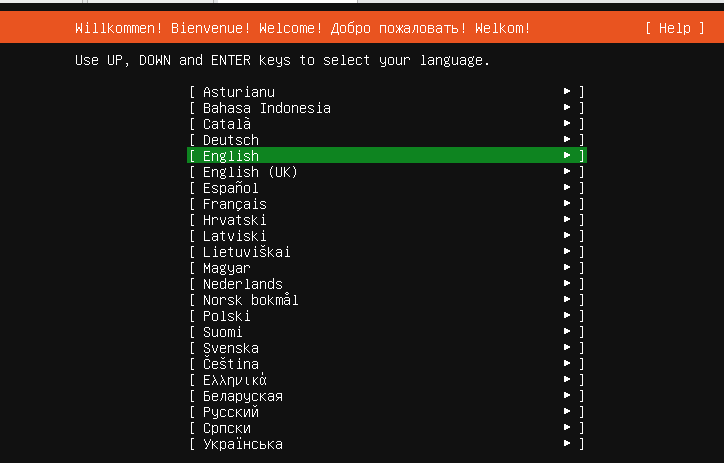
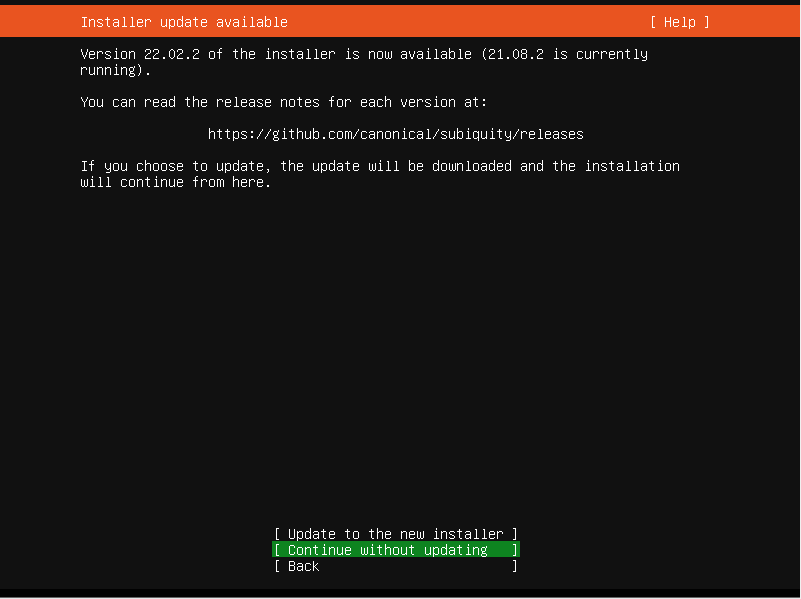
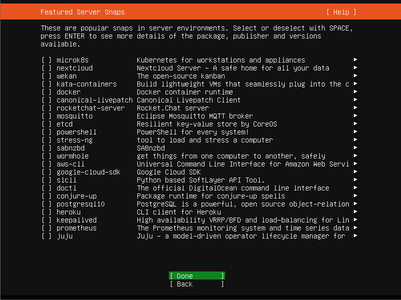

# Installation

## Virtualisation
To install servers that offer services (such as a minecraft server!) you will need a server with a public IP address. Usually you would go to a cloud provider where you can rent a server for a fixed fee / month. For this course we will simulate this process by using a virtual machine.

Virtualisation is a concept where you can run a computer system with an operating system virtually on another system. This makes it possible to have multiple _guest operating systems_ with their own virtual hardware on one _host system_.


For this course we want to use and install the operating system [Ubuntu server](https://ubuntu.com/download/server) in a virtual environment. You could use any Linux distribution you want. For this course we will use a debian based distro.

?> :fa-solid fa-list-check: _Download the `.iso` file for Ubuntu server using [this link](https://ubuntu.com/download/server). A `.iso` file is an exact copy of a CD/DVD. You will use this later to install the operating system in your virtual machine._

## Virtualisation software
To use virtualisation there are several options. The most common virtualisation software is:
- VMware workstation
- Virtualbox
- Hyper-V

In this course we will use and support VMware but the other software packages are similar. Students of PXL University College will get a free educational licence to use VMware Workstation pro through OnTheHub.

## Create a new VM
To create a new virtual machine (VM) in VMWare you go to the menu `file`>`New virtual machine`. The wizard to create a new VM will appear.

In the first screen we select the option to `install the operating system later`:


Next we choose the operating system `Linux`. In the version dropdown we select `Ubuntu 64 bit`. This is the Linux distribution that we will use during this course.



In the next screen we configure the virtual harddisk size for the VM. We will create a disk that has 20GB storage. We can expand this later if needed:


Continue through the next steps and the virtual machine will be created. After the VM is created we need to link the ubuntu-server ISO file to the virtual CD-rom drive. We do this by right clicking the virtual machine and going to the `settings` page. Here we can link the `iso` file:



After linking the iso file you can boot the VM by clicking the green arrow icon. This will boot the virtual machine and run the installation media.

## Installation Ubuntu server
As described earlier we will use the distro Ubuntu. After creating and booting the virtual machine there will be an installation process that we need to run through. You will notice that there is no mouse pointer available. We will use the keypoint arrow keys & enter key to navigate through the steps.

?> <i class="fa-solid fa-circle-info"></i> Does booting the VM result in the error `This host supports Intel VT-x, but Intel VT-x is diabled`? You will have to activate the VT-X option in the BIOS of your laptop. More information can be found in [this article](https://www.qtithow.com/2020/12/fix-error-this-host-supports-Intel-VT-x.html).


We start by selecting the laguage. We choose English:



We skip the installer update:



Choose the correct keyboard layout. For `azerty` select `Belgian`:


In the next 5 steps we dont make any changes and we just select `done`:


Next up we create a user account that we use to login to the operating system. We use following credentials:
```
username: student
server name: linux-essentials
password: pxl
```


We make no changes in the next 2 steps. We just select `done`:




The operating system will be installed and configured. After a while the `Reboot now` option will appear. This indicates that the installation is complete:


Shutdown the virtual machine and go to the settings screen. In the `CD/DVD (SATA) ` settings screen you select the option `use physical drive`. This makes sure that the virtual machine does no longer use the installation ISO.


All of these steps can also be viewed in the video below:
<iframe width="560" height="315" src="https://www.youtube.com/embed/u8WLsyMuSgw" title="YouTube video player" frameborder="0" allow="accelerometer; autoplay; clipboard-write; encrypted-media; gyroscope; picture-in-picture" allowfullscreen></iframe>
