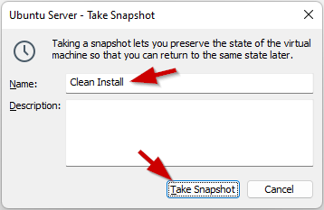

## Lab <!-- {docsify-ignore} -->
In the following chapters Linus will install a Minetest Server. Before he can do that, he will need to have a Linux System up and running. In this lab he will have to install a Virtualization Package on his computer and virtualize a Linux Server. With this infrastructure set up he will be able to install, configure and maintain his Minecraft Server at a later time.

### Installing VMware Workstation 

Before doing anything else, Linus needs to have some kind of Virtualization Technic. 

`Install VMware Workstation`.

### Installing Ubuntu Server

The Minecraft Server will run in a Linux Server Envrironment. 

`Install a Ubuntu Server VM` as described in this chapter. 

### Updating the OS

It's allways best to update your Operating System. That's why it's best to update all installed packages to their latest version.
`Update all packages to the latest version` 
You can do this as follows:

```bash
student@linux-ess:~$ sudo apt update
```

```bash
student@linux-ess:~$ sudo apt -y upgrade
```

### Shutting down the virtual machine

Before taking the snapshot it might be best to shut down the virtual machine. 
`Shutdown the VM` as described below:

```bash
student@linux-ess:~$ sudo shutdown now
```


### Taking a snapshot of the VM in VMware Workstation

Before doing anything else, it's recommended to take a snapshot. If, at a later time, he breaks his Linux System, he can allways return to this snapshot in time.
Being able to roll back to this point saves time. Otherwise he will need to install the Linux system again from scratch.

`Take a snapshot of the Ubuntu Server VM, named "Clean Install"` as follows:

_VM/Snapshot/Take Snapshot..._
 





?> <i class="fa-solid fa-circle-info"></i> At a later time you can always go back to this snapshot in time with:  _VM/Snapshot/Revert to Snapshot..._
