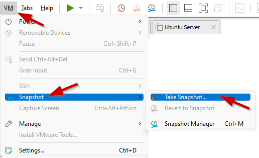

## Lab <!-- {docsify-ignore} -->
In de volgende hoofdstukken installeert Linus een Minetest Server. Voordat hij dat kan doen, moet hij een Linux-systeem in gebruik hebben. In dit lab zal hij een virtualizatie pakket op zijn computer moeten installeren en een Linux Server moeten virtualiseren. Met deze infrastructuur opgezet zal hij in staat zijn om zijn Minecraft Server op een later tijdstip te installeren, configureren en onderhouden. 

### VMware Workstation installeren  

Voordat u iets anders kunt doen, moet Linus een soort virtualisatietechniek hebben.  

`Installeer VMware Workstation` zoals beschreven in dit hoofdstuk. 

### Ubuntu Server installeren 

De Minecraft Server draait in een Linux Server Envrironment.  

`Installeer een Ubuntu Server VM` zoals beschreven in dit hoofdstuk.  

### Het besturingssysteem bijwerken 

Het is altijd het beste om uw besturingssysteem bij te werken. Daarom is het het beste om alle geïnstalleerde pakketten bij te werken naar hun nieuwste versie. 
`Update alle pakketten naar de nieuwste versie` 
U kunt dit als volgt doen: 

```bash
student@linux-ess:~$ sudo apt update
```

```bash
student@linux-ess:~$ sudo apt -y upgrade
```

### De virtuele machine afsluiten 

Voordat u de momentopname, ookwel een snapshot genoemd, maakt, is het misschien het beste om de virtuele machine af te sluiten.  

`Sluit de VM af` zoals hieronder beschreven: 

```bash
student@linux-ess:~$ sudo shutdown now
```

### Een momentopname maken van de VM in VMware Workstation 

Voordat u iets anders doet, is het raadzaam om een momentopname te maken. Als Linus op een later moment zijn Linux-systeem breekt, kan hij altijd in tijd terugkeren naar deze momentopname. 

In staat zijn om terug te draaien naar dit punt bespaart tijd. Anders moet hij het Linux-systeem helemaal opnieuw installeren. 

`Maak een momentopname van de Ubuntu Server VM, genaamd "Clean Install"` als volgt: 

_VM/Snapshot/Take Snapshot..._
 




?> <i class="fa-solid fa-circle-info"></i> Op een later moment kun je altijd teruggaan naar deze snapshot in de tijd met: _VM/Snapshot/Revert to Snapshot..._ 
