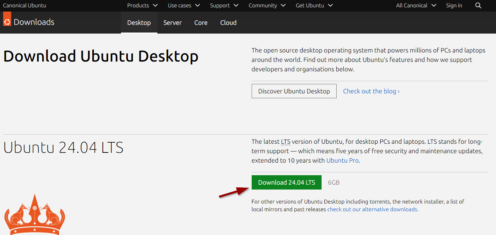
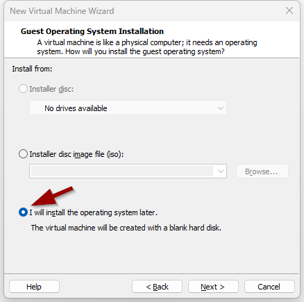
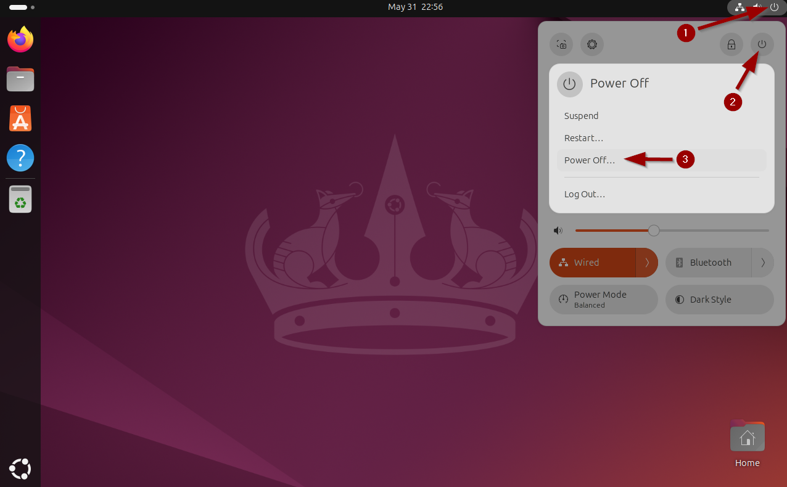
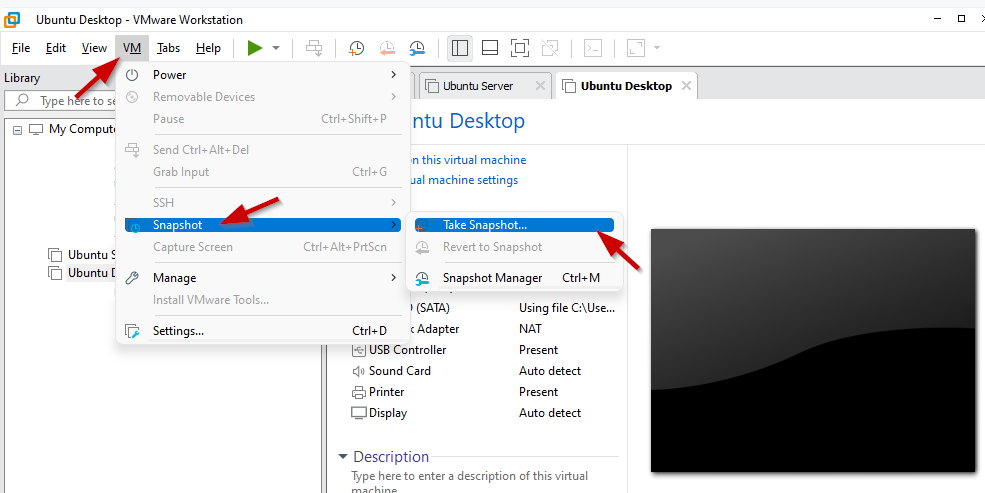
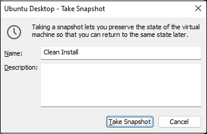

# Assignment CH2
## Task 1 - Download Ubuntu Desktop
Linux also has a desktop version. Download [Ubuntu Desktop](https://ubuntu.com/download/desktop).

## Task 2 - Install Ubuntu Desktop
Install [Ubuntu Desktop](https://ubuntu.com/download/desktop) in a new virtual machine and explore the interface.

### Create the new VM
To create a new virtual machine (VM) in VMWare you go to the menu `file`>`New virtual machine`. The wizard to create a new VM will appear.

In the first screen we select the option `Typical`:

Next we choose to `install the operating system later`:

Next we choose the operating system `Linux`. In the version dropdown we select `Ubuntu 64 bit`. This is the Linux distribution that we will use during this course.

In the next screen we give the virtual machine a name. You can also specify a different folder to store the virtual machine on your computer.

In the next screen we configure the virtual harddisk size for the VM. We will create a disk that has 30GB of storage. Mind that the disk size will grow from 0GB till max 30GB while we are saving to the disk:

We have to click on `Customize Hardware` to configure the virtual machine a little more:

We still need to link the Ubuntu-server ISO file to the virtual CD-rom drive. We do this by selecting `New CD/DVD` and browsing to the downloaded `iso` file:

Click on `Finish` and the virtual machine will be created.

You can now boot the VM by clicking the green arrow icon. This will boot the virtual machine and run the installation process.

### Installation Ubuntu Desktop

?> <i class="fa-solid fa-circle-info"></i> Does booting the VM result in the error `This host supports Intel VT-x, but Intel VT-x is diabled`? You will have to activate the VT-X option in the BIOS of your laptop. More information can be found in [this article](https://www.qtithow.com/2020/12/fix-error-this-host-supports-Intel-VT-x.html).

When booting the VM for the first time we need to press `enter` or wait 30 seconds:

We have to wait a few seconds for the boot to finish:

In the next few steps there will be an installation process that we need to go through. 

We make the choice to Install:

We choose the correct keyboard layout. For `azerty` we select `Belgian`:

?> <i class="fa-solid fa-circle-info"></i> If you have a QWERTY keyboard you have to stick with `English (US)`

We go for the normal installation with some extra closed-source drivers and software:

We choose to erase the disk and install Ubuntu Desktop on it:

We choose to apply the changes by writing the changes to disk:

?> <i class="fa-solid fa-circle-info"></i> Mind that you erase the Virtual Disk of your VM. `The hard disk of your computer/laptop will not be erased!`
  
For the TimeZone we pinpoint Brussels on the map or write it in the textbox:

We specify the username and computername:

Now we have to wait untill the installation is finished:

Once the installation is finished we have to click on `Restart Now` to reboot the VM:

On the last screen just press `enter`. The computer will reboot and the installation will be finished:

## Task 3 - Login for the first time
The very first time we login we have to go through some configuration screens:

?> <i class="fa-solid fa-circle-info"></i> If a window named `Software Updater` pops up we can click `Remind Me Later`

## Task 4 - Take a snapshot of the VM
Before doing anything else, it's good practice to have a savepoint in time. If, at a later time, our Ubuntu Desktop breaks, we can allways return to this savepoint in time.
Being able to roll back to this point will be a time saver, because otherwise we will need to install the Linux system again from scratch.

`Take a snapshot of the Ubuntu Desktop VM, named "Clean Install"` as follows:

_First shutdown the VM..._

_VM/Snapshot/Take Snapshot..._
 

?> <i class="fa-solid fa-circle-info"></i> At a later time you can always go back to this savepoint in time with:

_VM/Snapshot/Revert to Snapshot..._

## Task 5 - Get to know the Desktop Environment
In the Ubuntu desktop machine, try to execute the following subtasks:
- Try to add a user with your name.
- Create a new text file with the tool "Text Editor" (=gedit).
- Pin the Terminal -application to the Dock (=launcher).
- Configure the Thunderbird app to use your school email.
- Surf to the school website.

This is all we are going to do with the Desktop version. The focus of this course is towards the Server version. So it is safe to delete this virtual machine if you don't want to explore any further.
