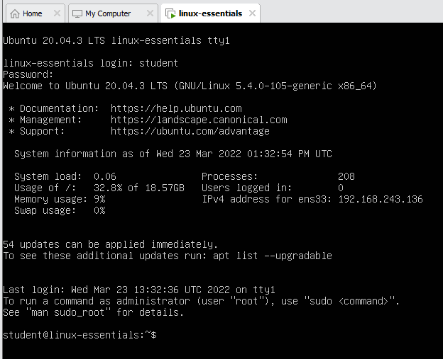

# Command line interface
Bij het opstarten merkt Linus op dat hij enkel een zwart scherm met wat witte tekst ziet. Zijn muis lijkt niet te werken. Hij kan met behulp van het toetsenbord wel inloggen. Na het inloggen krijgt hij volgend scherm te zien:



Wat we hier zien is een command line interface (CLI). In de Ubuntu server omgeving is er geen graphic user interface (GUI) aanwezig. Dit onder andere om systeemresources te besparen. Daarnaast zal blijken dat een CLI een zeer efficiënte & betrouwbare manier is om te werken met een besturingssysteem.

CLI's geven ons later ook veel meer mogelijkheden naar automatisatie toe, iets wat met GUI's veel moeilijker is.

## De prompt
Na het inloggen krijg je volgende tekst te zien. Dit noemen we de prompt.


De prompt bestaat uit een aantal onderdelen en geeft ons eigenlijk gewoon meer informatie over het systeem waarop we ingelogd zijn. Zo zie je hier de username waarmee we ingelogd zijn, en zien we ook de hostname van de server waarop we ingelogd zijn. 

Het `~` symbool is een afkorting voor de map `/home/student`. Hier komen we later op terug, vergelijk het voorlopig met het Windows pad `c:\Gebruikers\student`. Tussen het `:` teken en het `$` teken staat dus een pad naar een map waar we ons op dat moment bevinden.

<i class="fa-solid fa-earth-europe"></i> [Linux prompt definition](http://www.linfo.org/prompt.html#:~:text=A%20command%20prompt%2C%20also%20referred,terminal%20window%20by%20a%20shell.)

## commando's en opties
Je zal merken dat alles wat je op je toetsenbord typt na het `$` teken verschijnt. Het `$` geeft het einde van de prompt aan en tegelijkertijd het begin van een commando. Werken met het besturingssysteem doen we aan de hand van commando's. Het eerste commando dat we in deze cursus zit in het volgende:
```bash
sudo shutdown -h now
```
Dit commando zal de Ubuntu server machine onmiddelijk afsluiten. het `sudo` commando staat voor *super user do*. Voor sommige commando's zijn er administrator rechten nodig. Door `sudo` voor een commando te plaatsen, voer je dit als administrator (in Linux noemt deze gebruiker `root`) uit. Vervolgens krijgen we het `shutdown` commando met als optie `-h`. Deze optie krijgt als waarde `now`mee.


<i class="fa-solid fa-earth-europe"></i> 
[Linux command structure](https://uofabioinformaticshub.github.io/BASH-Intro/notes/extra_command_syntax.html)

## manpages
Linus heeft al snel door dat er een hele hoop commando's zijn. Commando's die hij op dit moment niet kent. Om commando's te zoeken kunnen we uiteraard gebruik maken van Google, maar in het besturingssysteem zit ook informatie over commandos. Deze noemen we `manpages`.

Op de minecraft server website is er een download link voor de server versie. Deze file moet Linus op de een of andere manier op de server krijgen. Hij moet dus op zoek naar een commando waarmee hij bestanden kan downloaden.

Je kan op basis van keywords zoeken naar commando's op volgende manier
```bash
man -k download
```
Hiermee roepen we het `man` commando op. We gebruiken de optie `-k` met als waarde `download`. Dit commando gaat in de manpages zoeken naar een commando waarbij het woord `download` in de omschrijving zit. Als output krijgen we een lijst van commando's met beschrijvingen die we kunnen gebruiken:

```
student@linux-essentials:~$ man -k download
apt-transport-http (1) - APT transport for downloading via the Hypertext Tran...
apt-transport-https (1) - APT transport for downloading via the HTTP Secure p...
git-fetch (1)        - Download objects and refs from another repository
git-http-fetch (1)   - Download from a remote Git repository via HTTP
update-pciids (8)    - download new version of the PCI ID list
wget (1)             - The non-interactive network downloader.
```

Het laatste commando lijkt ons interessant. Vervolgens moeten we meer informatie krijgen over het `wget` commando. Dit kan je opnieuw doen a.d.h.v. het `man` commando:

```bash
man wget
```
Als output krijgen we een volledige *manual* van het `wget` commando:

```
WGET(1)                            GNU Wget                            WGET(1)

NAME
       Wget - The non-interactive network downloader.

SYNOPSIS
       wget [option]... [URL]...

DESCRIPTION
       GNU Wget is a free utility for non-interactive download of files from
       the Web.  It supports HTTP, HTTPS, and FTP protocols, as well as
       retrieval through HTTP proxies.

       ...

OPTIONS
   Option Syntax
       Since Wget uses GNU getopt to process command-line arguments, every
       option has a long form along with the short one.  Long options are more
       convenient to remember, but take time to type.  You may freely mix
       different option styles, or specify options after the command-line
       arguments.  Thus you may write:

               wget -r --tries=10 http://fly.srk.fer.hr/ -o log

       The space between the option accepting an argument and the argument may
       be omitted.  Instead of -o log you can write -olog.

       You may put several options that do not require arguments together,
       like:

               wget -drc <URL>
   Basic Startup Options
       -V
       --version
           Display the version of Wget.

       -h
       --help
    
    ...

```

µ  <i class="fa-solid fa-circle-info"></i> manpages zijn vrij groot en bestaan uit meerdere pagina's. Doorgaan naar een volgende pagina doe je door op `spatie` te drukken. Gelukkig kan je hier ook vrij gemakkelijk in zoeken. Dit doe je door het `/` teken in te typen gevolgd door het kernwoord waar je naar wil zoeken. Als een woord meerdere keren voorkomt, kan je naar de volgende overeenkomst gaan door op de letter `n` (next) te duwen. Manpages afsluiten doe je door op de `q` (quit) toets te drukken. Meer weten over manpages? Voer dan het commando `man man` uit!µ

Met bovenstaande info slaagt Linus erin om onderstaand commando op te bouwen:
```bash
wget https://launcher.mojang.com/v1/objects/c8f83c5655308435b3dcf03c06d9fe8740a77469/server.jar
```

De download van de minecraft server is geslaagd, hij krijgt namelijk de melding `server.jar saved`, maar Linus heeft geen idee waar dit bestand is opgeslagen of hoe hij dit nu moet uitvoeren. In het volgende hoofdstuk verkennen we file & folder structuren om onze weg te kunnen vinden in het bestandssysteem van Linux.

<i class="fa-solid fa-earth-europe"></i> [Linux man pages guide](https://itsfoss.com/linux-man-page-guide/)