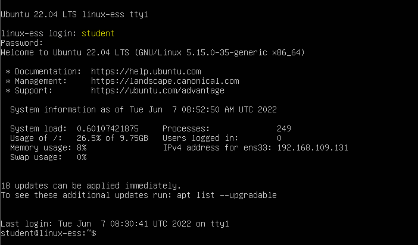

# Command line interface
When booting the virtual machine, all that will show is a black screen with some white text:


You will notice that there is no mouse pointer available. We will only use our keyboard as input device. This environment is called a _command line interface (CLI)_. There is no _graphic user interface (GUI)_ present in Ubuntu server. One of the reasons why they chose this is because having no GUI present will save system resources. A CLI is also proven to be a very efficient & trustworthy way of working & interacting with an operating system and its services.

?>You can login with you username `student` and the password you have set `pxl`. Notice that you do not see what you are typing for the password. Just type the password and press `enter`.

CLIs will be a lot more intersting towards automation, something that is harder when using a GUI. We can see this trend in Windows systems as well. Where _Powershell_ is becomming more and more popular to interact with Windows servers and performing automation tasks.

## The prompt
After logging in, you are shown the following line in the CLI. This is called the _prompt_:


The prompt exists of multiple parts which gives us more information about the system that we are using. We can see information about our user and the hostname of the server that we logged into.

The `~` symbol is an abbreviation of the homefolder of the logged in user (in our case the folder `/home/student`). We will learn about paths & folders in a later chapter. For now you can compare this to the path `C:\Users\student` in Windows. So what we actually see in between the `:` and the `$` sign is a path pointing to the folder we are currently in.

<i class="fa-solid fa-earth-europe"></i> [Linux prompt definition](http://www.linfo.org/prompt.html#:~:text=A%20command%20prompt%2C%20also%20referred,terminal%20window%20by%20a%20shell.)


## commands and options
Whenever you type something using the keyboard the input will apear after the `$` sign. The `$` sign indicates the end of the prompt and the start of the user's input (= a command). To use the operating system using a CLI, we will have to use commands. The first command we will use is the `echo` command:
```bash
echo hello world
```
The string `hello world` is considered an _argument_ of the `echo` command. This command just prints out whatever argument we provide.

The second command we will learn to use is the `shutdown` command:
```bash
sudo shutdown -h now
```
This command will shut down the Ubuntu server machine immediately. This is also the propper way of shutting down the virtual machine! The `sudo` command stands for _super user do_. Some commands require administrator rights. By adding the `sudo` command in front, you will run this command as the _super user_. This user, in Linux, is called _root_ (compared to the administrator user in Windows). The example actually exists out of 2 commands. The `sudo` command followed by the `shutdown command`. The `shutdown` command will use _the option_ `-h` with _a value_ of `now`.

Commands often have all kinds of options (that might take values as well) to extend the functionality of a command. The option `-h` for the `shutdown` command will take an (optional) value that defines when the server needs to actually shutdown. If no value is given, it will plan the shutdown task 1 minute after running the command. Let's look at some other options with the command `man shutdown`:
```bash
SHUTDOWN(8)                                            shutdown                                           SHUTDOWN(8)

NAME
       shutdown - Halt, power-off or reboot the machine

SYNOPSIS
       shutdown [OPTIONS...] [TIME] [WALL...]

DESCRIPTION
       ...

OPTIONS
       The following options are understood:

       --help
           Print a short help text and exit.
       -H, --halt
           Halt the machine.
       -P, --poweroff
           Power-off the machine (the default).
       -r, --reboot
           Reboot the machine.
       -h
           Equivalent to --poweroff, unless --halt is specified.
       -k
           Do not halt, power-off, reboot, just write wall message.
       --no-wall
           Do not send wall message before halt, power-off, reboot.
       -c
           Cancel a pending shutdown. This may be used to cancel the effect of an invocation of shutdown with a time
           argument that is not "+0" or "now".
```

As you can see the `shutdown` command has a lot of options that we can use to extend the basic functionality of the command. Every command has his own set of unique options.

?> <i class="fa-solid fa-circle-info"></i> Everything in Linux is case sensitive: commands, options, arguments, file- and foldernames, ...

<i class="fa-solid fa-earth-europe"></i> 
[Linux command structure](https://uofabioinformaticshub.github.io/BASH-Intro/notes/extra_command_syntax.html)

## manpages
### man
In Linux we use a CLI. Therefore we will have to work with various commands. Our Ubuntu installation has all kinds of commands built-in. To find commands that we can use we could use Google, but the operating system itself also has information about all installed commands. This info is bundled in _manpages_ (short for manual pages). You can access these manpages through the `man` command.

Type man followed by a command (for which you want help) and start reading:
```bash
man shutdown
```
Not only commands have their own manpage, config/system files might have a manpage as well. The command below shows the manpage of the `syslog.conf` file:
```bash
man syslog.conf
``` 

?> <i class="fa-solid fa-circle-info"></i> manpages are pretty big and exist out of multiple pages and/or sections. To view the next page in a manpage you can press the `spacebar` or you can use the `arrow keys`. Manpages are pretty easy to search. Just type `/` followed by a keyword. The manpage will highlight the first occurence of that keyword. You can use the key `n` (_next_) to go to the next occurence of the keyword. Exiting a manpage can be done by pressing the `q` (_quit_) key. Want to know more about manpages? type `man man`!

You can search the description of an installed command by using the `-k` option (or the command apropos) as follows:
```bash
man -k shutdown                        or                  apropos shutdown
```

### manpage sections
Sometimes certain keywords can be used as a command, but may also be used as a (config)file, daemon, ... This is an issue because `man <keyword>` needs to open the propper manpage for that keyword. What if the keyword exists as a command and as a configuration file? A perfect example for this is `passwd`:
```
student@linux-ess:~$ apropos passwd
...
passwd (1)           - change user password
passwd (1ssl)        - compute password hashes
passwd (5)           - the password file
```
Looking at the output above we see 3 ```passwd``` entries containing different numbers between the brackets. The numbers refer to the _section_ of the manpage. By default, the `man` command will open section 1, which contains information about the command `passwd`. We can see that there is also a section 5 which contains information about the configuration file `/etc/passwd`. We can open this section as follows:
```bash
man 5 passwd
```
This command will now show the manpage of the configuration file rather than the `passwd` command.


### Handy man page shortcuts
You can go to the first line by typing _g_. To go to the last line you will have to push capital _G_.
To get help you can always push _h_.


### Searching through a man page
You can search through a man page by typing a slash (/) followed by a string (word, letter,...) and then pushing the enter key.
To go to the next occurence you can push the letter _n_. To go to the previous occurence you need to push the capital _N_.

?> <i class="fa-solid fa-circle-info"></i>It's allways a good idea to first type _g_ to go to the first line before starting your search!

### whereis & whatis
We can quickly view the description of a command without opening the full manpage by using the `whatis` command as follows:
```bash
student@linux-ess:~$ whatis route
route (8) - show / manipulate the IP routing table
```

To view the location of the manpage itself we can use the `whereis` command:
```bash
student@linux-ess:~$ whereis -m whois
whois: /usr/share/man/man1/whois.1.gz
```
The manpages are stored in archives with a `.gz` extention. This is comparable to a `zip` file containing text files. When typing the command `man whois` it will actually open the text file in the archive `/usr/share/man/man1/whois.1.gz`.

## Shell history
The command line interface in Linux environments is often called the _shell_. This shell keeps track of all the commands we have used in the past. This means we can use this to easily repeat / edit / lookup previously used commands.

?> Try using the `arrow up` and `arrow down` keys after using some commands. You will notice that these commands will appear after the prompt.

Repeating the last command is very easy as well. We can type `!!` (often referred to as _bang bang_) and this will run the command that we last used. We often use it when we don't have enough privileges and we want to run the command again with sudo:
```bash
student@linux-ess:~$ cat /etc/shadow
cat: /etc/shadow: Permission denied
student@linux-ess:~$ sudo !!
sudo cat /etc/shadow
[sudo] password for student:
root:*:19103:0:99999:7:::
daemon:*:19103:0:99999:7:::
bin:*:19103:0:99999:7:::
...
usbmux:*:19150:0:99999:7:::
student:$6$2YcjTQ1OiAVeexi5$MgKJ3MAZBx5P2ZfGIkIjbYYLtcPjxKBVAJx.RnuzPn.EJk/rQgQqAXiiR3jMfq4sDn31e9k5HkuwwR5vKy/D.0:19150:0:99999:7:::
lxd:!:19150::::::
```

?> Note that the shadow file holds the passwords of the users and is only viewable by root for security reasons!

To view the history of our last used commands we can use the `history` command:
```bash
student@linux-ess:~/linuscraft$ history 10
  257  ls
  258  pwd
  259  cd
  260  cd linuscraft
  261  mkdir testfolder
  262  rm -rf testfolder
  263  pwd
  264  ls /
  265  ls -alh /
  266  history 10
```
The number that we use as an argument is the amount of commands the output will show. We can run any of these commands by using the identifier listed before the command as follows: `!n`. So for example running `!261` will run the command `mkdir testfolder`.

?> Note that in some distros by default command lines that start with a space are not added to the history and if the command is identical to the previous command it is also witheld:
```bash
student@linux-ess:~$ echo Start
Start
student@linux-ess:~$ echo "echo command not beginning with a space"
echo command not beginning with a space
student@linux-ess:~$ echo "echo command not beginning with a space"
echo command not beginning with a space
student@linux-ess:~$  echo "echo command beginning with a space"
echo command beginning with a space
student@linux-ess:~$ echo End
End
student@linux-ess:~$ history 4
  220  echo Start
  221  echo "echo command not beginning with a space"
  222  echo End
  223  history 4
```

?> It's a good habbit to use `CTRL-R` to do a reverse search (newest to oldest) through your history. Just press `CTRL-R` and type your search string. Use `CTRL-R` again to search for the next command. Use arrows to go into the command line and alter words. Use `CTRL-C`to quit and go back to an empty command line.

## Extra course material <!-- {docsify-ignore} -->

<i class="fa-solid fa-earth-europe"></i> [Linux man pages guide](https://itsfoss.com/linux-man-page-guide/)

<i class="fa-solid fa-film"></i> [[Pluralsight] Using linux help resources](https://app.pluralsight.com/course-player?clipId=45fc2a82-103b-4d44-83b8-641411aa9c58)
