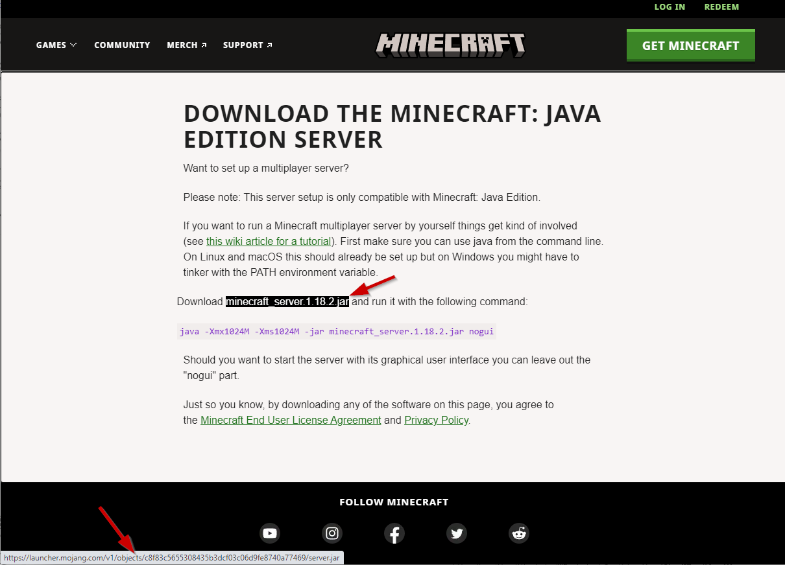
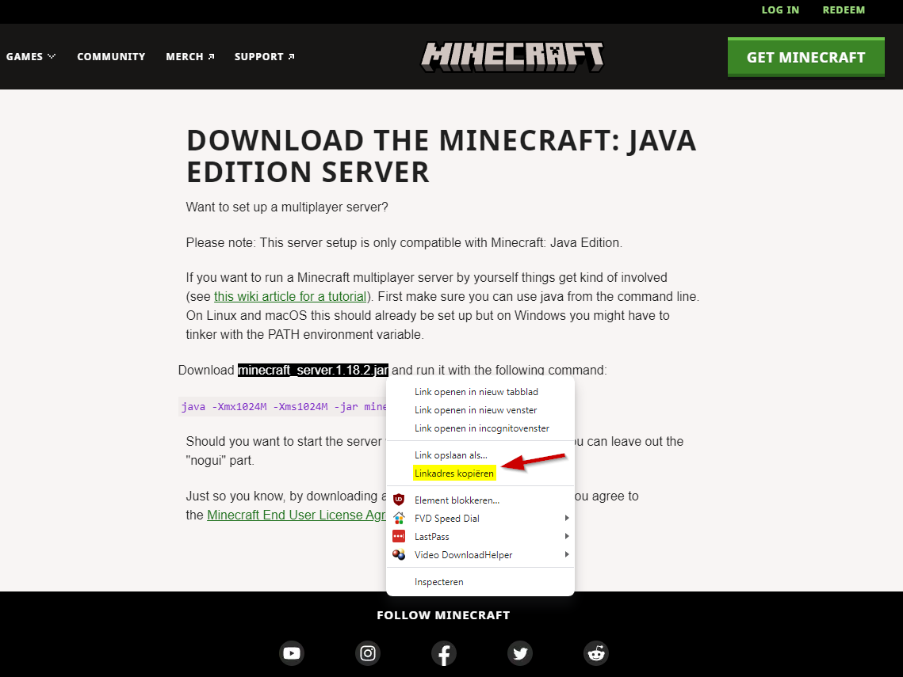
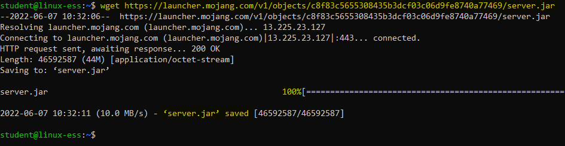

# Lab <!-- {docsify-ignore} -->
On the [minecraft server website](https://www.minecraft.net/en-us/download/server) we see a link that points to a java file to host a minecraft server on Linux :



Linus needs to download this file to his server in some way. He needs to find a command that allows him to download files.

Linus uses the `man` command to find a list of commands that have the keyword _download_ in their description:
```bash
man -k download                    or                    apropos download
```
The command will give the following output:
```
student@linux-essentials:~$ man -k download
apt-transport-http (1) - APT transport for downloading via the Hypertext Tran...
apt-transport-https (1) - APT transport for downloading via the HTTP Secure p...
git-fetch (1)        - Download objects and refs from another repository
git-http-fetch (1)   - Download from a remote Git repository via HTTP
update-pciids (8)    - download new version of the PCI ID list
wget (1)             - The non-interactive network downloader.
```
The last command in this list looks promising. Linus decides to investigate the `wget` command. First of he does this by using the `whatis` command:
```bash
whatis wget
```
This shows that the wget command has a section 1 which refers to an actual command. He wants to get more information about the usage of the command so he decides to view te manpage:
```bash
man wget
```
This command gives us the full _manual_ of the `wget` command:

```
WGET(1)                            GNU Wget                            WGET(1)

NAME
       Wget - The non-interactive network downloader.

SYNOPSIS
       wget [option]... [URL]...

DESCRIPTION
       GNU Wget is a free utility for non-interactive download of files from
       the Web.  It supports HTTP, HTTPS, and FTP protocols, as well as
       retrieval through HTTP proxies.

       ...

OPTIONS
   Option Syntax
       Since Wget uses GNU getopt to process command-line arguments, every
       option has a long form along with the short one.  Long options are more
       convenient to remember, but take time to type.  You may freely mix
       different option styles, or specify options after the command-line
       arguments.  Thus you may write:

               wget -r --tries=10 http://fly.srk.fer.hr/ -o log

       The space between the option accepting an argument and the argument may
       be omitted.  Instead of -o log you can write -olog.

       You may put several options that do not require arguments together,
       like:

               wget -drc <URL>
   Basic Startup Options
       -V
       --version
           Display the version of Wget.

       -h
       --help
    
    ...

```
He can navigate the manpage using the arrow keys on the keyboard. After reading through the manpage he closes it by pressing the `q` key on his keyboard. Using the info in the manpage, Linus figures out how to use the direct url to the file to download the `server.jar` file to his Linux server:
```bash
wget https://launcher.mojang.com/v1/objects/c8f83c5655308435b3dcf03c06d9fe8740a77469/server.jar
```
The download is succesfull! Linus sees the message `server.jar saved`, but he has no clue where this file is located or how he can run this file. In the next chapter we will explore how files & folders in Linux work.


?>We see that Linus has a challenge to put the URL right in his command. It would be easier for him if he could just paste the link in the prompt. If he wants to do that, he is obliged to use SSH.

The procedure would be als follows:

*First we need to get the IP adres of the server. We type `ip a` and look for the IP address of our network interface (ens33)
```bash
ip a
```


*Second we need to open Powershell on the Desktop and make a ssh-connection to the server. We are now working on the server from our desktop. Cool, isn't it?
```bash
ssh student@<server-ip>
```


*Third we can go to the website with the Minecraft Java Server url, rightclick on it and choose to copy the url. We can now paste the url with a rightclick after wehave type `wget`
```bash
wget <url>
```








?>You can choose to stay working on your desktop or go back to your VM in the interface of VMware Workstation.
