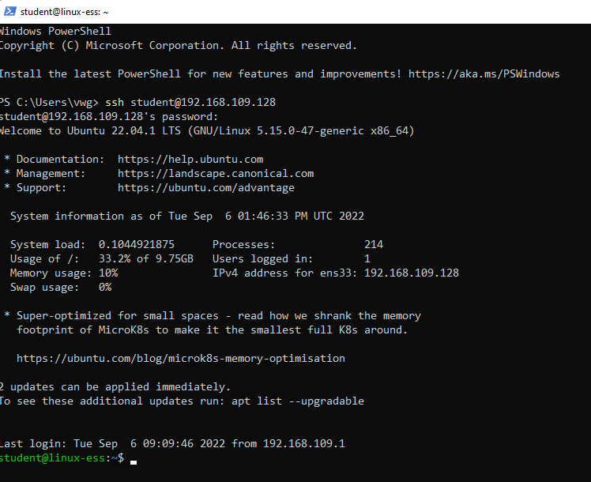
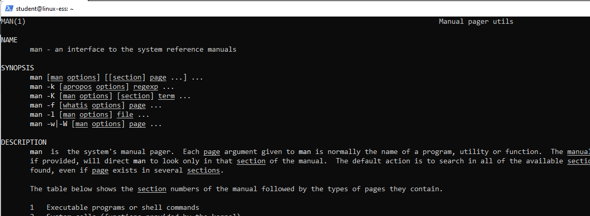

# Assignment CH3
## Task 1
Connect from Powershell on your laptop to your server over SSH and stay connected for the duration of the exercises. The benefit is that you can scroll through your screens with the mouse  
   

## Task 2
Make use of the command `man man` to figure out what the commando `man -f` does and with which other command it can be replaced
 
 

## Task 3
Make use of the command `man` to figure out what the option is for the command `shutdown` to reboot the machine instead of powering off

## Task 4
Use the command `apropos` and/or the command `man -k` to find the right commando to:
- reboot your vm
- change your password or another user's password
- show the contents of a directory
- clear the terminal screen
- see who is logged in --> try all the commands
- see how much free memory the server has  --> search in the manpage of this command how you can get the output more human readable (search in the manpage for _human_)
- see how much space you have free on the disk 

## Task 5
Use the manpage of `ls` to figure out how you could also see the hidden files. Show the hidden files of your homefolder

## Task 6 
Try to only show the short description of the commando `ls`

## Task 7 
Try to figure out where the command `reboot` and its manpage are stored on the disk

## Task 8 
Run the command `cd`. Run the command to also view the hidden files in this directory. Then run the command `cat .bashrc`. This file contains a script which runs every time you open a new shell (eg. terminal window). We will explain it in a later lesson. Run the command to clear the screen

## Task 9 
Use the arrow keys to go to the command `cat .bashrc` and use the arrow keys again to change it to `cat .bash_history`. Hit enter to execute the command. This file holds your history. It receives your history of commands when you close a shell (close terminal window, logout, ...). You do not see the last commands you typed in this shell

## Task 10
Run the command to shutdown you server immediately. Restart you server via VMware Workstation.
Connect to your server over SSH and stay connect for the exercises. If it doesn't work you have to check the IP of the server (from VMware Workstation).
Try to use the history to rerun the command `cat .bash_history`. You will now see that the commands are added of the session before you rebooted. Every time you start a new shell the commands from this file are copied into the shell's memory so we can use the history.
`sl` is to prank people who mistype 

## Task 11
Run the command ` echo This is the echo command with a space in front`. Mind the space at the beginning of the line, before the echo command.
Run the command `echo This is the echo command with no leading space`. Mind that there is no space in front of the echo command.
Type history to check your history.
You'll notice that commands started with a space will not be kept in history.
Run the command `ls -a`.
Run the same command `ls -a` again.
Type history to check your history.
You'll notice that repeating the same command consecutive will only keep the first occurence in history.

## Task 12
Run the command `apt install sl`. You'll notice more privileges are needed. We have to rerun this command with root privileges. Run the command `sudo !!` to rerun the last command with sudo in front. `sl` is to prank people that mistype the command `ls`. Type `sl` en push `enter`

## Task 13
Push the key combination `CTRL-R` and type `shu` to search for the last used shutdown command. Use the right arrow key to edit the line and change the command to `sudo shutdown -r now` and press enter to reboot your server. You can follow the boot process in VMware Workstation. Connect to your server over SSH and stay connect for the exercises. If it doesn't work you have to check the IP of the server (from VMware Workstation).

## Task 14
Push the key combination `CTRL-R` and type `shu` to search for the last used shutdown command. We see the command to `sudo shutdown -r now`. We don't want to reboot the server.  So we push the key combination `CTRL-R` again to go to an older command that has 'shu' in the name. Keep repeating the key combination untill you see the command `sudo shutdown now` and press enter

## Task 15
Try to connect from the Ubuntu Desktop to the Ubuntu Server over ssh.  

## Task 16
Install `Windows Terminal` on you Windows laptop via the 'Microsoft Store'. Try to connect from the Windows Terminal to the Ubuntu Server over ssh. 

