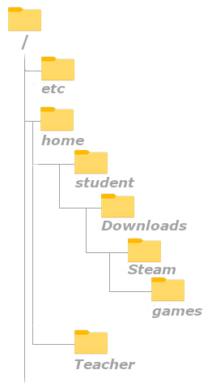

# Files and Directories
## Working with directories
### Print working directory (pwd)
The first command we will look at is the `pwd` command. The manpages gives an accurate description of what the command does:
```
student@linux-ess:~$ whatis pwd
pwd - print name of current/working directory
```

This command prints the current working directory. The working directory refers to the directory where the prompt is active in. Any command we run that involves files or folders will be ran in this directory:

```bash
student@linux-ess:~$ pwd
/home/student
```
In Windows, an _absolute path_ starts with `C:\...`. In Linux we do not use Drive letters. The highest folder (in Windows often `C:\`) in Linux is called the _root directory_. This directory is reffered to as a `/` at the beginning of a path. More about _absolute_ and _relative_ paths later in this chapter.

The folder `student` is our current working directory. This folder is a subfolder of the folder `home` which on his turn is a subfolder of the _root directory_ `/`.



?> <i class="fa-solid fa-circle-info"></i> Remember the prompt which contained an active path? The `~` sign was an abbreviation for the folder `/home/student`. This is called the _homefolder_. Every user on the operating system will get their own _homefolder_ in the folder `/home` just like in Windows, where every user has his own folder under `C:\Users`. This user has all permissions (read, write, execute) in his own homefolder. Outside of that folder he often only has _read_ permissions.

### Change working directory (cd)
You can change the current working directory with the `cd` command (change directory):
```bash
student@linux-ess:~$ pwd
/home/student
student@linux-ess:~$ cd /etc
student@linux-ess:/etc$ pwd
/etc
student@linux-ess:/etc$ cd ~
student@linux-ess:~$ pwd
/home/student
```
The command takes a path as an argument. In the example above we will navigate to the folder `etc` on the root directory `/`. We can see this in the output of the `pwd` command and in the prompt definition. As shown in the second part of the example above we can also use the `~` sign to quickly navigate to the user's homefolder.

We could also use the `cd` command without any argument. This will navigate back to the users homefolder as well:
```bash
student@linux-ess:/etc$ pwd
/etc
student@linux-ess:/etc$ cd
student@linux-ess:~$ pwd
/home/student
```
### Absolute & relative paths
When using commands we often have to use paths to certain folders/files. The `cd` command for example requires a path to navigate to.

Paths are used to point towards files and folders on the filesystem. We can use two types of paths: _relative_ and _absolute_ paths. Both types work in both Linux and Windows.

#### Absolute path
Absolute paths must start with a `/` sign. This means that an absolute path will start from the _root_ (`/`) directory (the highest level on the filesystem) and will work its way down. For example:
```bash
student@linux-ess:/etc$ pwd
/etc
student@linux-ess:/etc$ cd /home/student/
student@linux-ess:~/$pwd
/home/student
```
?> <i class="fa-solid fa-circle-info"></i> In Windows an absolute path will start with `C:\` rather than `/`!


?> <i class="fa-solid fa-circle-info"></i> Did you know the Linux CLI has command and pathcompletion? Try pressing the `tab` key when typing part of a command or folder name. If any command, file or folder matches the first part of the text you typed it will automatically complete the word for you!

#### Relative path
A relative path will always start from _the current working directory_ and will point to another file or folder from there. For example:
```bash
student@linux-ess:~$ pwd
/home/student
student@linux-ess:~$ cd Downloads/Steam/games
student@linux-ess:~/Downloads/Steam/games$ pwd
/home/student/Downloads/Steam/games
```
When using relative paths, we can use some shortcuts:
```
.(one dot): Refers to the current directory
..(two dots): Refers to the parent directory 
~ (tilde): Refers to the current user's homefolder
```
This means that, when in the folder `/home/student/Downloads`, we could use `..` to navigate to the parent directory `/home/student`:
```bash
student@linux-ess:~/Downloads$ pwd
/home/student/Downloads
student@linux-ess:~/Downloads$ cd ..
student@linux-ess:~$ pwd
/home/student
```
We could integrate these shortcuts in relative paths as well:
```bash
student@linux-ess:/etc$ pwd
/etc
student@linux-ess:/etc$ cd /home/student/Downloads # Absolute path
student@linux-ess:~/Downloads$ pwd
/home/student/Downloads
student@linux-ess:~/Downloads$ cd ../../teacher # Relative path
student@linux-ess:/home/teacher$ pwd
/home/teacher
```
?> <i class="fa-solid fa-circle-info"></i> A number sign `#` tells the shell that everything behind it is considered a comment and will not be interpreted as a command or argument!

### Listing directory contents (ls)

To list the contents of a directory, we can use the `ls` command. Using the command without any options or arguments will list de contents of the current working directory:
```bash
student@linux-ess:~$ ls
server.jar
```

We can also go in a certain directory to list its contents:
```bash
student@linux-ess:~$ cd /
student@linux-ess:/$ ls     
bin   dev  home  lib    lib64   lost+found  mnt  proc  run   snap  sys  usr
boot  etc  init  lib32  libx32  media       opt  root  sbin  srv   tmp  var
```


The `ls` command can also take one argument. This argument is a path which can be absolute or relative. The `ls` command will then show the contents of this folder.
```bash
student@linux-essentials:~$ ls
server.jar
student@linux-essentials:~$ ls /
bin   dev  home  lib    lib64   lost+found  mnt  proc  run   snap  sys  usr
boot  etc  init  lib32  libx32  media       opt  root  sbin  srv   tmp  var
student@linux-essentials:~$ 
```

The `ls` command has different options as well. The options can be found in the manpage using `man ls`. For example:
```bash
student@linux-ess:~$ ls -alh .       # The dot sign refers to the current directory, which in this case would be optional
total 45M
drwxr-xr-x 5 student student 4.0K Mar 27 16:36 .
drwxr-xr-x 3 root    root    4.0K Oct  5 13:40 ..
-rw------- 1 student student 1.7K Mar 17 12:14 .bash_history
-rw-r--r-- 1 student student  220 Oct  5 13:40 .bash_logout
-rw-r--r-- 1 student student 3.7K Oct  5 13:40 .bashrc
-rw-r--r-- 1 student student  807 Oct  5 13:40 .profile
-rw-r--r-- 1 student student    0 Oct  6 08:20 .sudo_as_admin_successful
-rw-r--r-- 1 student student  45M Feb 28 11:48 server.jar
```
Notice how we combined 3 options in the command above. Both `ls -a -l -h` and `ls -alh` will function exactly the same and will use all 3 options. The options can be put in any order, so `ls -hal` is also correct. These 3 option are often the most used ones when it comes to the `ls` command. You could look them up in the manpage but we will give an overview:
* the `-a` option will show hidden files and folders. **In Linux, hidden files and folders start with a `.` dot. eg. the `.bashrc` file.**
* the `-l` option will show a _long listing_. This means that it will show all the extra output\* and not just the file and folder names.
* the `-h` option refers to _human readable sizes_ and will make filesizes appear with the proper measuring unit rather than showing all sizes in bytes.

\* The `-rw-r--r-- 1` column refers to permissions on that specific file/folder. We will explain this in the chapter `users & permissions`. The column containing `student  student` refer to the owner of that specific file/folder and are linked to the permission column. The `45M` on the last line refer to the file size and  `Feb 28 11:48` refers to the timestamp of the last modification of the file.

?> <i class="fa-solid fa-circle-info"></i> Everything in Linux is a file. Not just the files, but folders too! They are just defined as _special_ files. Your hard disk? A file. A USB drive? A File. Hardware such as your keyboard? You guessed it, a file!

### Create directories (mkdir)
To create new directories we can use the `mkdir` (make directory) command. The command takes a path as an argument:
```bash
student@linux-ess:~$ mkdir backups
student@linux-ess:~$ ls
backups
server.jar
```
In the example above the `mkdir` command will create a folder named `backups` in the current working directory (`~` or `/home/student`). The folder name here is a _relative path_. 

#### paths with subdirectories
When using _relative_ or _absolute_ paths we could do the following:
```bash
student@linux-ess:~$ mkdir backups/Steam/games/PayDay2
mkdir: cannot create directory ‘backups/Steam/games/PayDay2’: No such file or directory
```
The command tries to make a folder named `PayDay2` in the folder `games` which is located in the folder `Steam` which is located in the folder `Backups`. However we get an error because the folders `games` or `Steam` do not exist. We can tell to create any missing subfolders in the path by using the `-p` option:
```
student@linux-ess:~$ mkdir -p backups/Steam/games/PayDay2
```
This will create the folders `Steam` and `games` if they don't exist.

?> <i class="fa-solid fa-circle-info"></i> As mentioned earlier everything in Linux is case sensitive. This is also applicable when creating files and folders. Try running the command `mkdir walkthroughs Walkthroughs`. This will create 2 folders: one with the name `walkthroughs` and one with the name `Walkthroughs`.

## Working with files
### Create an empty file (touch)
One easy way to create an empty file is with touch. The example starts with an empty directory, creates two files with touch and then lists
those files:
```bash
student@linux-ess:~$ ls -l
total 0
student@linux-ess:~$ touch fileOne
student@linux-ess:~$ touch fileTwo
student@linux-ess:~$ ls -l
total 0
-rw-r--r-- 1 student student 0 Feb 12 09:50 fileOne
-rw-r--r-- 1 student student 0 Feb 12 09:50 fileTwo
```
Note that both of these files are empty as seen by the file size. In the next chapter we will look into ways to create files with contents.


### Files with spaces in the name
If we want to work with files with spaces in the name we can put the name between double quotes:
```bash
student@linux-ess:~$ ls -l
total 0
student@linux-ess:~$ touch File One
student@linux-ess:~$ ls -l
total 0
-rw-r--r-- 1 student student 0 Feb 12 09:50 File
-rw-r--r-- 1 student student 0 Feb 12 09:50 One
student@linux-ess:~$ touch "File Two"
student@linux-ess:~$ ls -l
total 0
-rw-r--r-- 1 student student 0 Feb 12 09:50 File
-rw-r--r-- 1 student student 0 Feb 12 09:50 File Two
-rw-r--r-- 1 student student 0 Feb 12 09:50 One

```
Note that we could also use single quotes `touch 'File Two'` or a backslash to escape the space `touch File\ Two`.


### Move files (mv)
To move a file to another folder we can use the `mv` (move) command. This command takes two arguments: the source file/folder and the destination file/folder:
```bash
student@linux-ess:~$ ls
aFile  aFolder  server.jar
student@linux-ess:~$ mv aFile aFolder/
student@linux-ess:~$ ls aFolder
aFile
student@linux-ess:~$ ls
aFolder  server.jar
```

Since the second argument is a destination file or folder, we could use this command to rename a file as well. In the example below we use the `mv` command to move the file back to the homefolder but also renaming it:
```bash
student@linux-ess:~/aFolder$ ls 
aFile
student@linux-ess:~/aFolder$ mv aFile ../newFileName
student@linux-ess:~/aFolder$ ls ~
newFileName
```

When renaming only one file or folder, `mv` is the prefered command to use. The examples both used files, but the same logic works for renaming and moving folders.
```bash
student@linux-ess:~$ ls 
newFileName  aFolder  server.jar
student@linux-ess:~$ mv newFileName myFile 
student@linux-ess:~$ mv aFolder myFolder 
student@linux-ess:~$ ls
myFile  myFolder  server.jar
```

### Copy files (cp)
To make a copy of a file we can use the `cp` (copy) command as follows:
```bash
student@linux-ess:~$ ls
myFile  myFolder server.jar
student@linux-ess:~$ cp server.jar serverbackup.jar
student@linux-ess:~$ ls
myFile  myFolder  server.jar  serverbackup.jar
```
Both arguments are paths. The first path is the original file/folder. The second path is a path to the new location and (optional) filename/foldername. We can use the cp command to copy both files and folders to the same directory or a different directory.

#### Copy to another directory
The example below shows us how we can use the arguments in the `cp` command to copy files or folders to another directory. In this example we copy the file named `file12` into the directory called `folder99` using a _relative_ path.
```bash
student@linux-ess:~$ ls
aFile  aFolder  server.jar
student@linux-ess:~$ cp aFile aFolder/
student@linux-ess:~$ ls aFolder
aFile
student@linux-ess:~$ ls
aFile  aFolder  server.jar
student@linux-ess:~$ cp /home/student/aFile /home/student/aFolder/aFile.backup
student@linux-ess:~$ ls aFolder
aFile  aFile.backup
student@linux-ess:~$ ls
aFile  aFolder  server.jar
```
Note that we can use both _relative_ and _absolute_ paths in the copy command for both the original file/folder and the destination file/folder.

#### Copy recursive
To copy complete directories (meaning all subfolders and files inside the directory) we will have to use the `-r` (recursive) option:
```bash
student@linux-ess:~$ ls
aFile  aFolder  server.jar
student@linux-ess:~$ ls aFolder
aFile  aFile.backup
student@linux-ess:~$ cp -r aFolder/ aFolderBackup
student@linux-ess:~$ ls
aFile  aFolder  aFolderBackup  server.jar
student@linux-ess:~$ ls aFolderBackup
aFile  aFile.backup
```

#### Overwrite files
We have to be aware that the `cp` command will overwrite existing files by default. We can use the `-i` (interactive) option to get a prompt where we have to confirm if we want to overwrite the file as seen in the example below:
```bash
student@linux-ess:~$ ls aFolder
aFile  aFile.backup
student@linux-ess:~$ ls
aFile  aFolder  server.jar
student@linux-ess:~$ cp aFile aFolder/aFile.backup     # No error, the file gets overwritten
student@linux-ess:~$ ls aFolder
aFile  aFile.backup
student@linux-ess:~$ cp -i aFile aFolder/aFile.backup     # you will be asked to overwrite or not
cp: overwrite `aFile.backup'? y
```

### Rename files (rename)
We saw that we could use the `mv` command to rename files and folders. This works and is often very easy but when you have to rename files in bulk you might want to consider another approach. The `rename` command is designed specifically to rename multiple files and folders with one command. To do this it uses a _regular expression_ (Regex). A Regex is a sequence of characters that define a search pattern. We will learn more about regular expressions later in this course. It uses this search pattern to make certain changes to the filenames:
```bash
student@linux-ess:~/aFolder$ ls
aFile  afile.txt  aFile.backup  anotherfile.txt  backup.txt  profiles.backup  profiles.txt  yaay.txt
student@linux-ess:~/aFolder$ rename 's/file/document/' *.txt
student@linux-ess:~/aFolder$ ls
aFile  adocument.txt  aFile.backup  anotherdocument.txt  backup.txt  prodocuments.txt  profiles.backup  yaay.txt
```

?> <i class="fa-solid fa-circle-info"></i> If rename is not yet installed you can do this with the command `sudo apt -y install rename`. The installation process will ask you for your password.

A lot is going on in the example above, let's summarize what is present:
* The folder we are in contains some `txt` files, some `backup` files and files with `no extension`. Some of the files contain the word `file` that we want to replace with `document`
* the `rename` command takes in a _string_ with the value `s/file/document/`. This is the _regex_ that is being used by the command to search (`s`)for names containing the word `file` and replace it with the word `document`.
* the last argument is `.txt`. We use this to tell the `rename` command to only run the replacement regex on files ending in `.txt`

?> <i class="fa-solid fa-circle-info"></i> a `*` (asterix) is considered a wildcard character in bash. It refers to _zero, one or more characters_. So in the example above this translates to: "run this replacement regex on all files containing zero,one or more characters of any kind, followed by the string `.txt`.

We could also use the `rename` command to change the file extentions of all files and folders:
```bash
student@linux-ess:~/aFolder$ ls
adocument.txt  anotherdocument.txt  backup.txt  prodocuments.txt  profiles.backup  yaay.txt
student@linux-ess:~/aFolder$ rename 's/\.txt/\.odt/' *.txt
student@linux-ess:~/aFolder$ ls
adocument.odt  anotherdocument.odt  backup.odt  prodocuments.odt  profiles.backup  yaay.odt
```
?> <i class="fa-solid fa-circle-info"></i> Notice how we put a `\` (backslash) in front of the `.` sign? Some characters have special meanings is regular expressions (for example: `* . $ [ ] ( ) / { }`). To make sure our bash shell sees this character as a string we have to use _escaping_. This is the concept of using the `\` to indicate that the character that follows is interpreted as a string rather than a special character.

### identifying files (file)
In Linux systems we done have to use file extentions. This means we don't always know the file type. We can use the `file` command to identify the type of a file:
```bash
student@linux-ess:~$ file pxl.png
pic33.png: PNG image data, 1920 x 1080, 8-bit/color RGBA, non-interlaced
student@linux-ess:~$ file /etc/passwd
/etc/passwd: ASCII text
```

## Delete files & folders (rm)
For deleting folders we could use the `rmdir` command but nobody ever does,... **ever**. This is because it wont delete folders containing other folders out of the box and it wont ever delete folders that have files in them.

For deleting both files and folders we mostly use the `rm` command:
```bash
student@linux-ess:~$ ls
sampleFile moreStuff
student@linux-ess:~$ rm sampleFile
student@linux-ess:~$ ls
moreStuff
```
The `rm` command has different options aswell, the most used combination is `rm -rf`:
* `-r` will mean it will remove files & folders recursive
* `-f` will force the command to remove non-empty directories aswell. Something that wont happen out of the box.
```bash
student@linux-ess:~$ ls
myFolder fileAbc
student@linux-ess:~$ ls myFolder
afolder afile another_file
student@linux-ess:~$ rm -rf myFolder
student@linux-ess:~$ ls
fileAbc
```

Be mindfull when using the `rm -rf` command as the root user!

?> <i class="fa-solid fa-circle-info"></i> There is no garbage bin in linux. Removing a file means its gone forever!


## Extra course material <!-- {docsify-ignore} -->

<i class="fa-solid fa-film"></i> [[Pluralsight] Linux command syntax patterns](https://app.pluralsight.com/course-player?clipId=5c3b8432-e324-4b4b-adfd-2615298a7aba)

<i class="fa-solid fa-film"></i> [[Pluralsight] Working with files & directories](https://app.pluralsight.com/course-player?clipId=f98f5110-6ee4-43c4-af00-4de294c17bc9)
