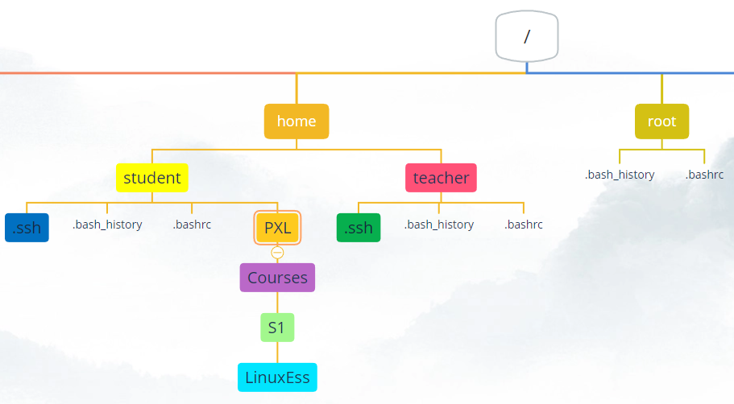

# Assignment on working with files and folders

`Connect over ssh to you server to do the exercises'

## Task 1
Navigate to your home directory with the least number of keystrokes (three to be exact)

## Task 2
In your homedirectory, create the following structure:
`
PXL/Courses/S1/LinuxEss
`  
Do this by going into each created directory to create the next one.
  

?> <i class="fa-solid fa-circle-info"></i> You'll need this structure in a next Task

## Task 3
Go back to your homefolder.
While staying in your homefolder create the directory _S2_ as a subdirectory of _Courses_. Do this by using an _absolute path_.
While staying in your homefolder create the directory _NetworksEss_ as a subdirectory of _S2_. Do this also by using an _absolute path_.

Please use tab-completion whenever you can!  
  

## Task 4
While staying in your homefolder create the directory _WindowsEss_ as a subdirectory of _S1_. Do this by using an _relative path_.

Please use tab-completion whenever you can!  
  

## Task 5
Create, without leaving your homedirectory, an empty file named `empty` in each folder created in the previous Task

## Task 6
Install the command `tree` on your ubuntu machine. You can use this command to get an overview of directorystructures on your system. Search the manpage of tree to show the contents of the root directory and one extra level.

## Task 7
Why doesn't tab-completion work when executing the following command to open .bashrc?:
`cat /home/student/.bash<tab>`

## Task 8
Create a new folder "My Pictures" in you homefolder. Go into this folder and create, with just one command, these following files (notice the capitalization):
- Picture1.JPG
- picture2.JPG
- Picture3.jpg
- picture4.jpg

 
## Task 9
Rename all files to with the command `rename` so no capitals exist anymore in any of the filenames

## Task 10
Make sure you are located in your homedirectory (~).  
Copy all 'files' from this directory into a subdirectory named `backup` in your homefolder.

## Task 11
Remove, with just one command, the folder `PXL` with all contents created in the previous Task

## Task 12
Create this directorystructure with just 1 command:
`/home/student/school/semester/1/courses/ubuntuserver/exercises/chapter5`

## Task 11
Create, in the folder named 'exercises', a folder named 'chapter6'

## Task 13
Remove the folder named 'chapter5'

## Task 14
Remove all folders starting from the school-directory  

?> <i class="fa-solid fa-circle-info"></i> Some Tasks require a second user on your installation. 
Execute `sudo useradd -m johndoe` to create the new user
Execute `sudo passwd johndoe` to set a password for the new user

## Task 15
Navigate using absolute-path syntax into the home folder of the user named 'johndoe'

## Task 16
Navigate to your own home directory

## Task 17
use cat to print the contents of the .bashrc file that is located in johndoe's homefolder. Use a relative-path syntax.

## Task 18
Try to navigate to the other user's homefolder with a maximum of 7 keystrokes

## Task 19
Clear the screen

## Task 20
Multiple people can have a ssh connection to the same server and meanwhile a person can be working on the server itself. Each person will have it's own screen (terminal window). 
Make sure you are logged in on the server itself and are also logged in over ssh. Make sure you see both screens at the same time.  

Search for commands that have the text "logged on" in their short description of the manpage

  
## Task 21
In the shell of your ssh session type one of the two commands you found in the previous task.
You will see two screens, tty1 and .
  
Everything is a file in linux. This is also true for the screen/window you're working in. When you are connected over _ssh_, your screen name is _pts/2_. When you are working _on the server_ itself, your screen name is _tty1_.  
  
In the shell of your ssh session type `echo hello there > /dev/tty1`. The greater than sign will redirect the output of the text _hello there_ to the tty1 device. The text appears on the screen on the server.
  
Try the following command in the shell of you ssh connection: `sl > /dev/tty1`.
  
If you want to see your prompt again on the server itself, you just have to press _enter_
