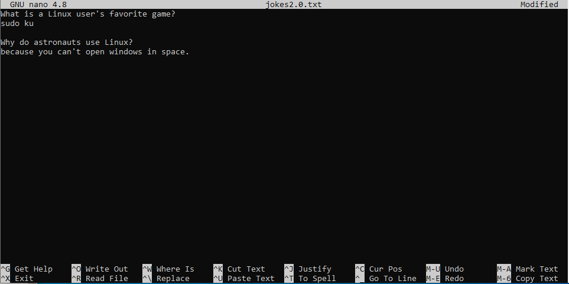

# File contents
## View full file (cat & tac)
To view the file contents we can use the `cat` command. This command takes in a path to a file as an argument:
```bash
student@linux-ess:~$ cat /etc/resolv.conf
# [network]
# generateResolvConf = false
nameserver 8.8.8.8
nameserver fec0:0:0:ffff::1
nameserver fec0:0:0:ffff::2
```
This will print the entire file contents in the terminal.

?> <i class="fa-solid fa-circle-info"></i> Note that you cannot scroll in a server CLI environment. If the file contents is to big for the terminal size it will only show the last bit! You could swap to commands such as `more` or `less` (see further) to solve this issue.

The `tac` command is the `cat` command written from right to left. This is also exactly what this command does, it outputs the file contents from bottom to top:
```bash
student@linux-ess:~$ tac /etc/resolv.conf
nameserver fec0:0:0:ffff::2
nameserver fec0:0:0:ffff::1
nameserver 8.8.8.8
# generateResolvConf = false
# [network]
```

The `cat` command can take multiple files as arguments and will concatenate the contents in the terminal as follows:
```bash
student@linux-ess:~$ cat count1.txt
1 2 3
student@linux-ess:~$ cat count2.txt
4 5 6
student@linux-ess:~$ cat count1.txt count2.txt
1 2 3
4 5 6
```
All filenames in the `cat` command are actually paths. So in the example above we use _relative_ paths to the files that are in the current working directory (`/home/student`). This means that the command `cat /home/student/count1.txt /home/student/count2.txt` would give the exact same output.

## Quick file contents (head & more)
Sometimes you don't want to view the entire file contents. Only the first or last couple of lines will suffice (in log files for example). To achieve this we can use the `head` or `tail` commands:
```bash
student@linux-ess:~$ head /etc/passwd
root:x:0:0:root:/root:/bin/bash
daemon:x:1:1:daemon:/usr/sbin:/usr/sbin/nologin
bin:x:2:2:bin:/bin:/usr/sbin/nologin
sys:x:3:3:sys:/dev:/usr/sbin/nologin
sync:x:4:65534:sync:/bin:/bin/sync
games:x:5:60:games:/usr/games:/usr/sbin/nologin
man:x:6:12:man:/var/cache/man:/usr/sbin/nologin
lp:x:7:7:lp:/var/spool/lpd:/usr/sbin/nologin
mail:x:8:8:mail:/var/mail:/usr/sbin/nologin
news:x:9:9:news:/var/spool/news:/usr/sbin/nologin
```
By default this command will show the first 10 lines of a file. When using `tail` it will show the last 10 lines:
```bash
student@linux-ess:~$ tail /etc/passwd
messagebus:x:103:106::/nonexistent:/usr/sbin/nologin
syslog:x:104:110::/home/syslog:/usr/sbin/nologin
_apt:x:105:65534::/nonexistent:/usr/sbin/nologin
tss:x:106:111:TPM software stack,,,:/var/lib/tpm:/bin/false
uuidd:x:107:112::/run/uuidd:/usr/sbin/nologin
tcpdump:x:108:113::/nonexistent:/usr/sbin/nologin
sshd:x:109:65534::/run/sshd:/usr/sbin/nologin
landscape:x:110:115::/var/lib/landscape:/usr/sbin/nologin
pollinate:x:111:1::/var/cache/pollinate:/bin/false
dries:x:1000:1000:,,,:/home/dries:/bin/bash
```

We can manipulate the amount of lines in the command output as follows (you can change the number `2` by any number):
```bash
student@linux-ess:~$ head -2 /etc/passwd
root:x:0:0:root:/root:/bin/bash
daemon:x:1:1:daemon:/usr/sbin:/usr/sbin/nologin
```

This command is often used for log files, where the last lines usually have information about the latest events. eg:
```bash
student@linux-ess:~$ tail -5 /var/log/dpkg.log
2021-08-19 22:20:53 status half-configured man-db:amd64 2.9.1-1
2021-08-19 22:20:53 status installed man-db:amd64 2.9.1-1
2021-08-19 22:20:53 trigproc libc-bin:amd64 2.31-0ubuntu9.2 <none>
2021-08-19 22:20:53 status half-configured libc-bin:amd64 2.31-0ubuntu9.2
2021-08-19 22:20:53 status installed libc-bin:amd64 2.31-0ubuntu9.2
```

## Create files with contents
### using echo
There are several ways to create files and add content to them. One of these ways is by using the `echo` command. The default behaviour of this command is that it just prints out whatever you use as an argument:
```bash
student@linux-ess:~$ echo hello world
hello world
```
You could use quotes to make it more obvious as to what the argument of the `echo` command is (This also impacts the command's behaviour which we will see in a later chapter):
```bash
student@linux-ess:~$ echo "hello world"
hello world
```
Now this is where it gets interesting. We can use a `>` sign to tell the shell to take the output of the previous command and write it to a file:
```bash
student@linux-ess:~$ echo hello world >ourfile
```
So this actually makes it so that the output of the `echo` command is not shown in the shell, but rather is written (or _redirected_) to the file `ourfile`. We can confirm this as follows:
```bash
student@linux-ess:~$ ls
ourfile
student@linux-ess:~$ cat ourfile
hello world
```
The concept we use here is called _i/o redirection_ which we will talk about in a later chapter.

### Using cat
We can also use the cat command in combination with the _output redirection (`>`)_ as shown in the example below. After typing the command we can type one or more lines. When you are done typing the file contents you can use the keyboard combination `ctrl` and `d` (ctrl+d) to tell the shell you are done (this will send an _end of file_ (EOF) signal to the running process):
```
student@linux-ess:~$ cat > jokes.txt # we pres ctrl+d after the line 'sudo ku'
What is a Linux user's favorite game?
sudo ku
student@linux-ess:~$ cat jokes.txt
What is a Linux user's favorite game?
sudo ku
```

#### Copy files using cat
Knowing what we learnt about using _input redirection_ (`>`) we can actually use this to copy file contents to another file as follows:
```
student@linux-ess:~$ cat jokes.txt > jokes2.0.txt
student@linux-ess:~$ cat jokes2.0.txt
What is a Linux user's favorite game?
sudo ku
```

### Using a custom end marker
Another method of creating files with a certain content is to define a _custom end marker_ for the `cat > FILENAME` command as shown in the example below. By doing this you won't have to use the `crtl+d` keyboard combination to write the text to the file but you can just type the word (`end` in the example) given as the custom end marker:
```bash
student@linux-ess:~$ cat > schooltasks.txt <<end
> create new vm
> learn new commands
> play minecraft
> end
student@linux-ess:~$ cat schooltasks.txt
create new vm
learn new commands
play minecraft
```

### Using nano
Lastly we could use a text editor to edit/add file contents. There are many text-editors available. `nano` is one that is installed on our Ubuntu machine. You can use this editor by using the `nano` command followed by the path to a new or existing file:
```bash
student@linux-ess:~$ nano jokes2.0.txt
```
A text editor window will open as shown in the figure below where you can navigate using the arrow keys. You can add/edit/delete content by using your keyboard.

In the bottom of the screen it shows some of the shortcuts you can use. Some of the most interesting ones are:
* ctrl+o: this is used to save (write out) the file changes. This will prompt for a filename and will overwrite a file if the name already exists.
* ctr+q: quit the text editor and go back to the prompt. When you made changes to the file you will be asked if you want to save the change and you will have to enter a filename and press enter.
* ctrl+u: paste any copied/cut content.
* ctrl+w: find a certain text in the file (where is).
* alt+u: undo the last change.