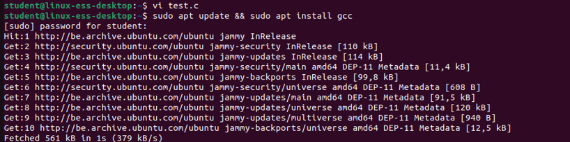
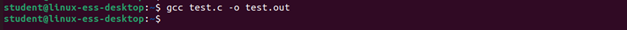
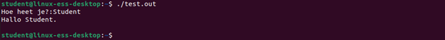
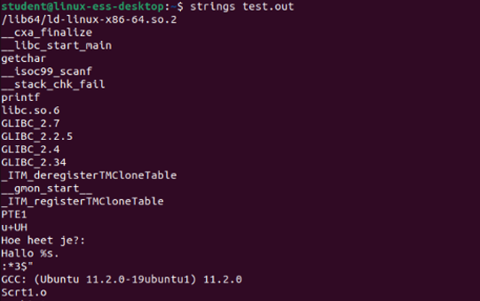

# Assignment on file contents

## Task 1
Find out why ‘less’ is better practice to do than ‘more’

```
Less is a pager where you are able to scroll upwards
```

## Task 2
Show the first line of the file /proc/meminfo to find out how much memory you’ve given to your Ubuntu Virtual machine. 
<br/>

## Task 3
Show the last line of the file passwd located in the folder etc of the root folder.
<br/>


## Task 4
Show the first 4 characters (=bytes) of the file /etc/passwd. What do you see? 
<br/>

## Task 5
Use cat to put the following text in a new file “mytextfile” in your home folder:
This is my text
spaced over multiple lines.
<br/>

## Task 6
Use cat to copy the file .bashrc in your home folder to a new file named .bashrc.backup
<br/>

## Task 7
When you add a new use, a new line is added to the file /etc/passwd. Show the contents of the file but in order from newest user to oldest user (other way around than normal) 
<br/>


## Task 8
Create with nano a file named “test.c” with the following text:	

```
#include <stdio.h>
int main()
{
	char naam[30];
	printf( "Hoe heet je?:");
	scanf("%s",naam);
	printf("Hallo %s.\n", naam);
	getchar();
	getchar();
	return 0;
}
```


## Task 9
Install the gcc-compiler with following command
```bash
sudo apt install gcc
```
<br/>

## Task 10
Compile the file from before with the C-compiler using the following command: 
```bash
gcc test.c -o test.out
```
<br/>


## Task 11
Test the program as follows: 
```bash
./test.out
```

<br/>

## Task 12
Search for readable ascii-characters in the binary-file test.out

<br/>