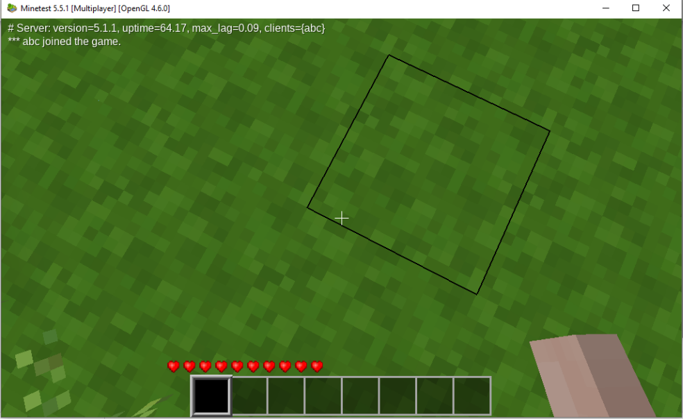

# Lab <!-- {docsify-ignore} -->

Linus finally feels comfortable enough navigating the operating system using commands and working with files and folders. It is time to go back to the core of this lab setup: getting a minetest server up and running.

## Recap - installing a package
Remember in [chapter 3 - lab](../03_commandline/02_lab.md) where we ran the following command:
```bash
student@linux-ess:~$ sudo apt-get install minetest
[sudo] password for student:
Reading package lists... Done
Building dependency tree
Reading state information... Done
The following additional packages will be installed:
...
Setting up minetest (5.1.1+repack-1build1) ...
Processing triggers for mime-support (3.64ubuntu1) ...
Processing triggers for libc-bin (2.31-0ubuntu9.2) ...
Processing triggers for man-db (2.9.1-1) ...
```

We've now learnt that this command actually uses the package manager to go look for (and install) a package called `minetest` in its repositories. It also installs all the needed dependencies and sets up the operating system so we can actually use the `minetest` command.

To learn more about the command we can first run the `man minetest` command:
```bash
minetest(6)                                                                                               minetest(6)

NAME
       minetest, minetestserver - Multiplayer infinite-world block sandbox

SYNOPSIS
       minetest [--server SERVER OPTIONS | CLIENT OPTIONS] [COMMON OPTIONS] [WORLD PATH]

       minetestserver [SERVER OPTIONS] [COMMON OPTIONS] [WORLD PATH]

DESCRIPTION
       Minetest  is  one  of the first InfiniMiner/Minecraft(/whatever) inspired games (started October 2010), with a
       goal of taking the survival multiplayer gameplay in a slightly different direction.

       The main design philosophy is to keep it technically simple, stable and portable. It will be kept  lightweight
       enough to run on fairly old hardware.

COMMON OPTIONS
       --help Print allowed options and exit

       --version
              Print version information and exit

       --config <value>
              Load configuration from specified file

       --logfile <value>
              Set logfile path ('' for no logging)

 Manual page minetest(6) line 1 (press h for help or q to quit)
 ```

## Running the server
 We notice there is an option: `--server`. The package we installed has both the client version (the one you load up to connect to the server and play) and the server version (the one you run to actually host a server where other players can connect to using a client).

 We also check where the executable file is located using the `which minetest` command:
 ```bash
student@linux-ess:~$ which minetest
/usr/games/minetest
 ```

?> We could both run the commands `minetest` and `/usr/games/minetest`. Both would run the same executable. This is possible because of the `$PATH` variable which contains the folder `/usr/games`. When you type a command, the CLI will look for an executable file in all of the folders in the `$PATH` variable and then run that file. This makes it easier to run commands as we don't always need the full path to a file. You can type `echo $PATH` to see the value of the PATH variable.

 When running the `minetest` command you will notice that you will get an error: 
 ```bash
 student@linux-ess:~/linuscraft$ minetest
ALSA lib confmisc.c:767:(parse_card) cannot find card '0'
ALSA lib conf.c:4732:(_snd_config_evaluate) function snd_func_card_driver returned error: No such file or directory
ALSA lib confmisc.c:392:(snd_func_concat) error evaluating strings
ALSA lib conf.c:4732:(_snd_config_evaluate) function snd_func_concat returned error: No such file or directory
ALSA lib confmisc.c:1246:(snd_func_refer) error evaluating name
ALSA lib conf.c:4732:(_snd_config_evaluate) function snd_func_refer returned error: No such file or directory
ALSA lib conf.c:5220:(snd_config_expand) Evaluate error: No such file or directory
ALSA lib pcm.c:2642:(snd_pcm_open_noupdate) Unknown PCM default
AL lib: (EE) ALCplaybackAlsa_open: Could not open playback device 'default': No such file or directory
terminate called after throwing an instance of 'std::runtime_error'
  what():  Audio: Global Initialization: Device Open
Aborted
 ```

We notice that we get an error message saying `cannot find card '0'`. Remember that we are trying to run the client version of the game. This client is an actual graphical user interface that would look something like this:



We get this error because we are running an Ubuntu server using a command line interface. There is no graphical user interface present so the actual GUI of the client cannot be loaded. We will install the client version of the game later on in this lab on our laptop.

So to get our server up and running we will have to focus on using the `minetest --server` command:
```bash
student@linux-ess:~$ minetest --server
        .__               __                   __
  _____ |__| ____   _____/  |_  ____   _______/  |_
 /     \|  |/    \_/ __ \   __\/ __ \ /  ___/\   __\
|  Y Y  \  |   |  \  ___/|  | \  ___/ \___ \  |  |
|__|_|  /__|___|  /\___  >__|  \___  >____  > |__|
      \/        \/     \/          \/     \/
2022-08-25 09:36:24: ACTION[Main]: World at [/home/student/.minetest/worlds/world]
2022-08-25 09:36:24: ACTION[Main]: Server for gameid="minetest" listening on 0.0.0.0:30000.
```

We don't get our prompt back. This is because the server application is an active running process. We can always interrupt this process by using the keyboard combination `ctrl+c`.

?> Note that we need to have the `minetest` executable running if we want to actually connect to the server later on!

When running the command using the `--server` option, we can see that it created a `worlds/world` folder in `/home/student/.minetest`. This is interesting because, by default, this is where `minetest` stores all the configuration files of our actual server. We also notice that the server is _listening_ for connections on port `30000`.  

Linus does not want to use the default configuration though. He made a folder `~/linuscraft/serverfiles` for exactly the purpose of managing the world files. Using the manpage we see that we can tell the server to use this path as to where the world files have to be saved:
```bash
student@linux-ess:~$  minetest --server --world ~/linuscraft/serverfiles/myworld --logfile ~/linuscraft/serverfiles/logfile.txt
        .__               __                   __
  _____ |__| ____   _____/  |_  ____   _______/  |_
 /     \|  |/    \_/ __ \   __\/ __ \ /  ___/\   __\
|  Y Y  \  |   |  \  ___/|  | \  ___/ \___ \  |  |
|__|_|  /__|___|  /\___  >__|  \___  >____  > |__|
      \/        \/     \/          \/     \/
2022-08-25 09:45:01: ACTION[Main]: World at [/home/student/linuscraft/serverfiles/myworld]
2022-08-25 09:45:01: ACTION[Main]: Server for gameid="minetest" listening on 0.0.0.0:30000.
```
We also used the `--logfile` option to save all the server logs to a specific file. We now see that the world has been created in `~/linuscraft/serverfiles/myworld`. We can check this by pushing 'ctrl+c' (this will shutdown the minetest server) and running an `ls` command:
```bash
student@linux-ess:~$ ls linuscraft/serverfiles/myworld/
env_meta.txt  force_loaded.txt  ipban.txt  map_meta.txt  map.sqlite  world.mt
```

## Connecting to the server
*First* we need to get the IP adres of the server. We type `ip a` and look for the IP address of our network interface (ens33 or eth0)
```bash
ip a
```


<br />

*Second* we need make sure the server is actually running by using the `minetest` command we created above. We leave this process active:
```bash
student@linux-ess:~$  minetest --server --world ~/linuscraft/serverfiles/myworld --logfile ~/linuscraft/serverfiles/logfile.txt
        .__               __                   __
  _____ |__| ____   _____/  |_  ____   _______/  |_
 /     \|  |/    \_/ __ \   __\/ __ \ /  ___/\   __\
|  Y Y  \  |   |  \  ___/|  | \  ___/ \___ \  |  |
|__|_|  /__|___|  /\___  >__|  \___  >____  > |__|
      \/        \/     \/          \/     \/
2022-08-25 09:45:01: ACTION[Main]: World at [/home/student/linuscraft/serverfiles/myworld]
2022-08-25 09:45:01: ACTION[Main]: Server for gameid="minetest" listening on 0.0.0.0:30000.
```

### Download the client
Next up we need to download the client on our Windows laptop. You can download the client on https://www.minetest.net/downloads/. Download and extract the `Minetest x.x.x - portable, 64-bit (recommended)`. After extracting the folder, you will find a file named `minetest.exe` in the subfolder `bin` which you can doubleclick:


### Connecting to our server
When booting up the client on our Windows machine you will get a menu with several options. Since we want to join a server and not play locally we click the _join game_ tab.


On the right side of the menu we can enter the ip address that we found earlier on the server by running the command `ip a`. The port should be set to the value `30000` by default. We also provide a username and password and click on the `register` button:


?> The next time you join, you will have to click the login button and provide the selected password!

We set the password and click on the `Register` button:


After this process, the client should connect you to the server and you will be able to run around and build stuff!


?> Be careful. Dangerous creatures roam around the world at night!

When we hop back to the CLI of our server, you will also notice that output of our command has changed. It now shows that a player has connected (and disconnected) from the server:
```bash
student@linux-ess:~$ minetest --server --world ~/linuscraft/serverfiles/myworld
        .__               __                   __
  _____ |__| ____   _____/  |_  ____   _______/  |_
 /     \|  |/    \_/ __ \   __\/ __ \ /  ___/\   __\
|  Y Y  \  |   |  \  ___/|  | \  ___/ \___ \  |  |
|__|_|  /__|___|  /\___  >__|  \___  >____  > |__|
      \/        \/     \/          \/     \/
2022-08-25 10:24:46: ACTION[Main]: World at [/home/dries/linuscraft/serverfiles/myworld]
2022-08-25 10:24:46: ACTION[Main]: Server for gameid="minetest" listening on 0.0.0.0:30000.
2022-08-25 10:32:51: ACTION[Server]: linus [172.25.xxx.x] joins game.
2022-08-25 10:32:51: ACTION[Server]: linus joins game. List of players: linus
2022-08-25 10:37:33: ACTION[Server]: linus digs default:acacia_tree at (6,5,3)
```

### Running a downloaded map
The default map is quite empty so Linus wants to impress his friends by downloading a prebuild map he found on Google. To do this we go into your `serverfiles` directory:
```bash
student@linux-ess:~$ cd ~/linuscraft/serverfiles
```

After doing so we will download the zip file containing our new world by running the command below:
```bash
student@linux-ess:~/linuscraft/serverfiles$ wget https://d-ries.github.io/linux-essentials/data/customworld.zip
```
If we want to take a look into the zip, we can use ```less customworld.zip```  

This will give us a `zip` file that we need to extract by running ```unzip customworld.zip```.

We can remove the zipfile as we no longer need this:
```bash
student@linux-ess:~/linuscraft/serverfiles$ rm customworld.zip
student@linux-ess:~/linuscraft/serverfiles$ ls
pxl-world  logfile.txt  myworld
```

As seen in the output above, the new world is called `pxl-world`. We can now use the command we saw earlier to start the server using the new map files:
```bash
student@linux-ess:~/linuscraft/serverfiles$ minetest --server --world ~/linuscraft/serverfiles/pxl-world/ --logfile ~/linuscraft/serverfiles/logfile.txt
```
If you join now, you should be in a world that contains a lake/sea with the PXL university college logo floating in the air!
