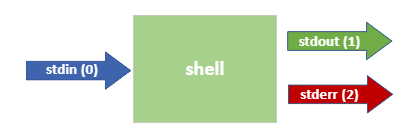

# Advanced command structures

## shell expansion

All the words you type after the prompt to form a command are interpreted by the shell. The command line interpretor or shell in ubuntu is `bash`, which stands for `Bourne Again SHell`.

The command line will be cut in pieces everytime the interpreter sees one or more `consecutive spaces` or `tabs` and this forms arguments (the spaces and tabs will be removed). The first argument is the `command` and all the other arguments are given as values to this command. This mechanism is called `shell expansion`. This is the reason that consecutive spaces will be trimmed with the echo command: 
```bash
student@linux-ess:~$ echo I like to game                                                # one space between the words
I like to game
student@linux-ess:~$ echo     I    like            to                   game            # multiple spaces between the words
I like to game
student@linux-ess:~$ echo I    like     to     game                                     # one tab between the words
I like to game
student@linux-ess:~$ echo     I              like        to                     game    # multiple tabs between the words
I like to game
student@linux-ess:~$ echo   I             like          to                      game    # multiple spaces & tabs between the words
I like to game
```

If we want to retain the spaces we have three options.
The `first option` is to use `double quotes`. With this option the spaces will be retained and variables will still be interpreted.
```bash
student@linux-ess:~$ action="play       games"
student@linux-ess:~$ echo    I             like      to                  $action    # multiple spaces and tabs between the words
I like to play games
student@linux-ess:~$ echo "    I             like      to                  $action"    # multiple spaces and tabs between the words
    I             like      to                  play       games
```

The `second option` is to use `single quotes`. With this option the spaces will be retained but the text will not be interpreted. So variables won't be changed to their value.
```bash
student@linux-ess:~$ action='play       games'
student@linux-ess:~$ echo    I             like      to                  $action    # multiple spaces and tabs between the words
I like to play games
student@linux-ess:~$ echo '    I             like      to                  $action'    # multiple spaces and tabs between the words
    I             like      to                  $action
```

The `third option` is to escape every space. Don't use this mechanism in variables because it won't work.
```bash
student@linux-ess:~$ echo \ \  I \ \ \ \ \ \ \ like \ \ to \ \ \ \ \ \ \ \ \ \ \ \ \ \ play\ \ \ \ games
    I       like   to              play    games
```

### Single and double quotes

## File globbing
When specifying filenames, we can get the shell to generate the filenames dynamically by giving a certain pattern. For example: we might want to find all the files starting with `temp` followed by whatever text or extention. The concept where we generate file names dynamically is called _file globbing_. There are a couple of special characters that we can use as seen in the example below:
```bash
student@linux-ess:~/globbing$ ls
File4  File5  FileABC  Filec  afilea  file1  file2  file3  filea  fileabc fileb  filebc 
student@linux-ess:~/globbing$ ls file*
file1  file2  file3  filea  fileabc  fileb  filebc
student@linux-ess:~/globbing$ ls *a
afilea  filea
student@linux-ess:~/globbing$ ls *a*
afilea  filea fileabc
student@linux-ess:~/globbing$ ls F*
File4  File5  FileABC  Filec
student@linux-ess:~/globbing$ ls F*ile*
File4  File5  FileABC  Filec
```
an asterix (`*`) in _file globbing_ means zero, one or more characters can be whatever they want. This is often called a wildcard that we can use one or multiple times in a filename. Another option would be a question mark (`?`) which is interpreted as exactly _one character_ can be what they want as seen in the following example:
```bash
student@linux-ess:~/globbing$ ls
File4  File5  FileABC  Filec  afilea  file1  file2  file3  filea  fileb  filebc
student@linux-ess:~/globbing$ ls File?
File4  File5  Filec
student@linux-ess:~/globbing$ ls file??
filebc
student@linux-ess:~/globbing$ ls ?fi*
afilea
```

Lastly we can also use square brackets (`[ ]`) which usually contain one or more characters in between the brackets. The brackets define one character that matches one of the characters between the brackets:
```bash
student@linux-ess:~/globbing$ ls
File4 File5 FileABC Filec afilea file1 file2 file3 filea fileb filebc
student@linux-ess:~/globbing$ ls file[12]
file1  file2
student@linux-ess:~/globbing$ ls file[a]
filea
student@linux-ess:~/globbing$ ls file[1ac]
file1  filea  fileb
```
When using brackets we can also define ranges:
```bash
student@linux-ess:~/globbing$ ls
File4  File5  FileABC  Filec  afilea  file1  file2  file3  filea  fileb  filebc
student@linux-ess:~/globbing$ ls file[a-z]
filea  fileb
student@linux-ess:~/globbing$ ls File[A-Z]*
FileABC
student@linux-ess:~/globbing$ ls File[a-zA-Z]*
filea  fileb  FileABC
student@linux-ess:~/globbing$ ls file[0-9]
file1  file2  file3
```
### Prevent file globbing
We can prevent file globbing by _escaping_ the special characters in our command. Escaping can be done by placing a `\` in front of the character. This tells the shell to interpret the next character as a regular symbol rather than the special operation:
```bash
student@linux-ess:~/globbing$ ls
 File4   File5   FileABC   Filec   afilea  'file*'   file1   file2   file3   filea   fileb   filebc
student@linux-ess:~/globbing$ ls file*
'file*'   file1   file2   file3   filea   fileb   filebc
student@linux-ess:~/globbing$ ls file\*
'file*'
student@linux-ess:~/globbing$ echo **** TITLE ****
File4   File5   FileABC   Filec   afilea  'file*'   file1   file2   file3   filea   fileb   filebc TITLE  File4   File5   FileABC   Filec   afilea  'file*'   file1   file2   file3   filea   fileb   filebc
student@linux-ess:~/globbing$ echo \*\*\*\* TITLE \*\*\*\*
**** TITLE ****
```

## Aliases
Aliases are a way to give a simple name to a rather complex command as seen below:
```bash
student@linux-ess:~$ alias show='ls -lah ~'
student@linux-ess:~$ show
total 16K
drwxr-xr-x 1 student student  512 Jun  4 22:19 .
drwxr-xr-x 1 root  root       512 Mar  7 17:09 ..
-rw------- 1 student student 1.1K May 22 22:41 .bash_history
-rw-r--r-- 1 student student  220 Mar  7 17:09 .bash_logout
-rw-r--r-- 1 student student 3.7K Jun  4 21:25 .bashrc
...
```

Aliases are often used for implementing an extra layer of security:
```bash
student@linux-ess:~$ alias rm='rm -i'
student@linux-ess:~$ rm jokes.txt
rm: remove regular file 'jokes.txt'? y
```

You already used aliases. For example the ls command we use prints colored text in its output. This is because we use the alias. If we put a `\` in front a command it will use the command instead of the alias.
```bash
student@linux-ess:~$ alias ls
alias ls='ls --color=auto'
```

If we want to remove an alias we can use the unalias command:
```bash
student@linux-ess:~$ unalias rm
```

## I/O redirection
### I/O Streams
When working with the shell we actually work with something called streams. There are 3 basic streams available when using a shell:


The most basic example is called `stdinn`. This is the stream that we use to input data into the shell using our keyboard.

The output that gets generated from running commands is split up in two seperate streams:
* `stdout` gives us all the regular command output. By default this output gets printed on our screen.
* `stderr` gives us all the error messages a command generates. By default these error messages get printed on our screen.
Because both `stdout` and `stderr` get printed in the shell, we don't notice the difference between the two.

Every stream has his own identifier number as seen in the image above. These identifiers are important in the next paragraphs.

### Stream redirection
We can redirect any of this streams to make the output go _somewhere else_. Often 'somewhere else' means to a file. This means we can both seperate regular output (stdout) and errors (stderr) to go to seperate files and save the output there. Below is an example on how you can save the output of a command to a file:
```bash
student@linux-ess:~$ ls / 1>listrootfolder
student@linux-ess:~$ head listrootfolder
bin
boot
dev
etc
home
init
lib
lib32
lib64
libx32
```
The `1>` means we redirect stream `1` to the file `listrootfolder`. Stream `1` refers to the `stdout` stream. Note that in this case the number `1` is optional, so the command below will work as well:
```bash
student@linux-ess:~$ ls / >listrootfolder
```

?> You might recognize this syntax as we've used it before in chapter 5. We used the command `echo hello world >ourfile` to write the string `hello world` to the file `ourfile`.

If we want to redirect `stderr` we can use the same concept as follows:
```bash
student@linux-ess:~$ find / 2>/dev/null
```

And we could even combine redirecting both streams to seperate files in one command:
```bash
student@linux-ess:~$ find / >results.txt 2>errors.txt
```

If we want to redirect both `stderr` and `stdout` to the same file we can use the `&>` operator as follows:
```bash
student@linux-ess$ find / &> results_and_errors.txt
```

## Control operators
### Seperating commands
We can use a `;` (semicolon) character in our commands to seperate multiple commands in one line. Each command can have his own options and arguments and they will be ran sequentially. The shell will wait for the first command before executing the second one:
```bash
student@linux-ess:~$ echo hello ; echo pxl ; pwd
hello
pxl
/home/student
```

### Logical operators
Next up are some control operators that we can use that you might know from other use cases or environments:
* logical _AND_ operator (`&&`): The second command will only execute if the first command scuceeds
```bash
student@linux-ess:~$ echo first && echo second
first
second
student@linux-ess:~$ zecho first && echo second

Command 'zecho' not found, did you mean:

  command 'echo' from deb coreutils (8.30-3ubuntu2)

Try: sudo apt install <deb name>
```
* logical _OR_ operator (`||`): The second command is only executed when the first command fails
```bash
student@linux-ess:~$ echo first || echo second
first
student@linux-ess:~$ zecho first || echo second

Command 'zecho' not found, did you mean:

  command 'echo' from deb coreutils (8.30-3ubuntu2)

Try: sudo apt install <deb name>

second
```

We can combine both operators as well to simulate an _if-then-else_ like structure as follows:
```bash
student@linux-ess:~$ touch testfile
student@linux-ess:~$ rm testfile && echo file deleted || echo failed to delete
file deleted
student@linux-ess:~$ rm testfile && echo file deleted || echo failed to delete
rm: cannot remove 'testfile': No such file or directory
failed to delete
```
