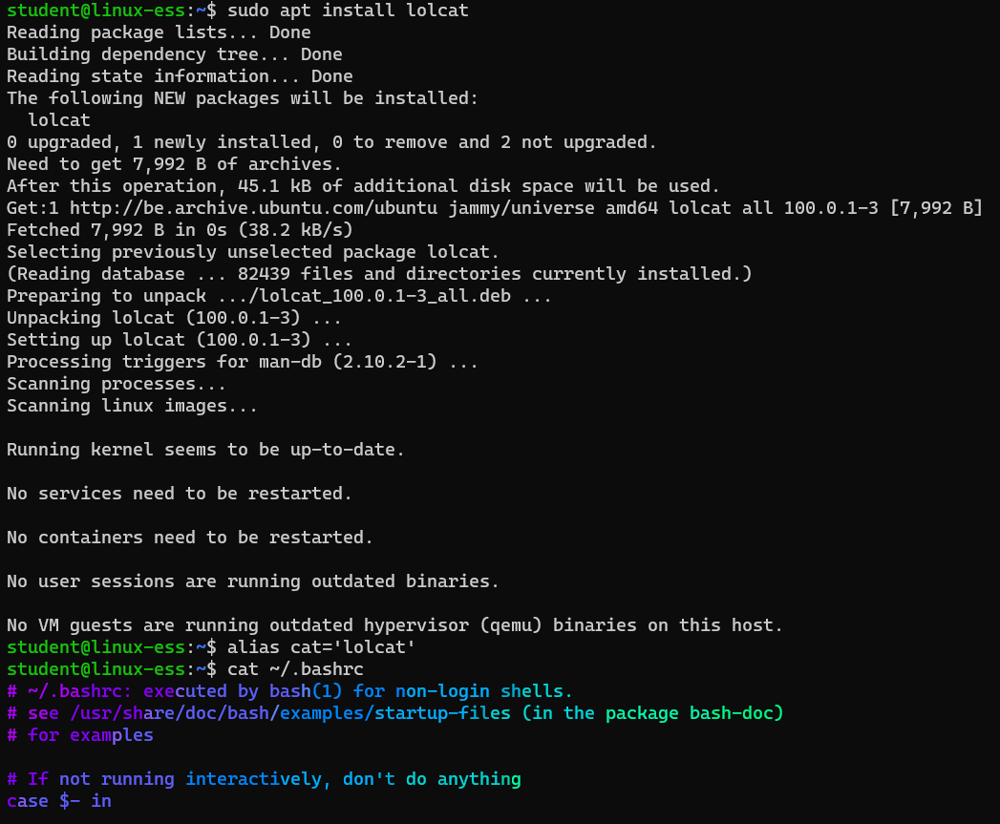
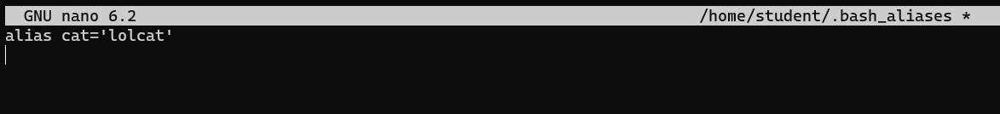
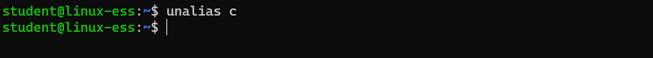
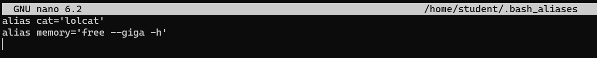

# Aliases

## Task 1
Install the package lolcat and create an alias to run `lolcat` instead of `cat`. View the file ~/.bash_history with cat    
   

## Task 2
Once tested make sure that your alias will be remembered in the future (after reboot, etc)  
   
   

## Task 3
Create an aliases to clear you screen when you give the command `c`  
   

## Task 4
Remove the alias `c` to clear your screen  
    

## Task 5
Search the manpage of the command `free` to find out how you can show the results in __gigabytes__ and __human readable__. Add an alias to the system that will be remembered in the future (after reboot, etc) that when you issue the command `memory` the command `free` will be executed with the options you have found.    
   
   
