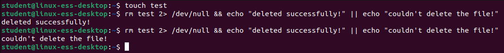

# Solutions on Control operators

## Task 1

Make sure there are no more aliases for the commands rm, cp and mv. You made these commands in the last assignments in the file ~/.bashrc or ~/.bash_aliases. Delete these lines from those files and start a new shell by opening a new terminal window, ssh session, relogin or typing ‘bash’.

<br/>
<br/>

## Task 2
Create a command that while deleting the file "test":
- The error messages suppresses by sending them to the black hole (rm test 2> /dev/null)
- The text "deleted successfully!" shows when the file is deleted
- The text "warning while deleting" shows when the files couldn’t be deleted 

<br/>

## Task 3
Imagine you need to create a backup of all home folders to the folder /backup. After the backup is done copying, the pc needs to shut down. Unfortunately, you need to go. How are you able to do this so you can leave now. Try this.

<br/>

?> <i class="fa-solid fa-circle-info"></i>Option 2 is better in this situation. We only want to shut down when our back up happened. If it fails, we will come back to our powered-on pc and need to fix the problem that occurred. 

## Task 4
Create a directory source and a directory goal in your home folder. Also create a text file named "important.txt" in the folder source. You need to copy this file to the folder goal. If the copy was successful, you can delete the folder source with the command rm -rf. How are you able to do this with only one command? Try this.

<br/>

## Task 5
What is the output of: (Try to answer without typing it in the terminal first) 
```bash
echo Hello#world
```

<br/>

## Task 6
What is the output of: (Try to answer without typing it in the terminal first)

```bash
echo Hello #world
```
<br/>

## Task 7
What is the output of: (Try to answer without typing it in the terminal first)
```bash
echo \\\\\??\#\"\ \\ #\\
```

<br/>
