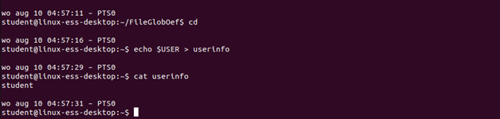
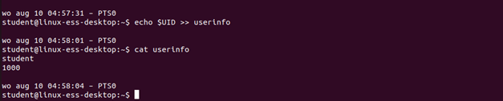
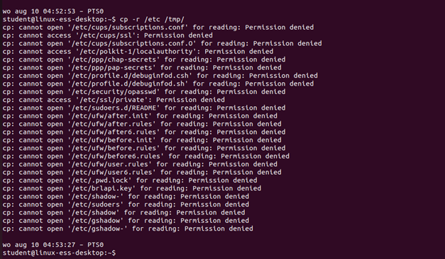
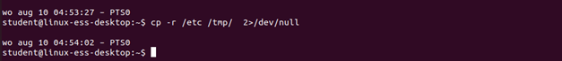
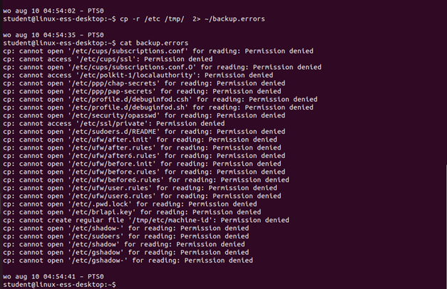
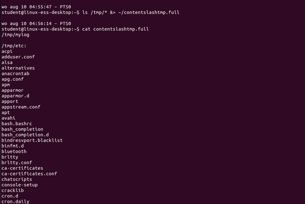
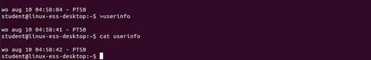
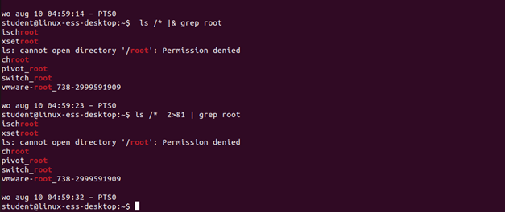
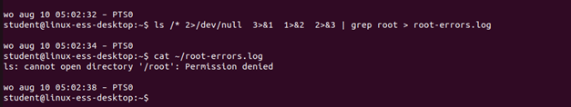

# Solutions on I/O redirection

## Task 1
Create a new file names "userinfo" in your homefoler. Do this by redirecting the output of the echo command of the variable $USER to this file. 

 

## Task 2
Add the output of the echo command of the variable $UID to this file.

 

## Task 3
Copy, without using sudo, the directory /etc to the directory /tmp recursively

 

## Task 4
Do the last exercise again, but send the error messages to the black hole

 

## Task 5
Do the penultimate exercise again, but send the error messages to ~/backup.errors

 

## Task 6
Execute ls /tmp/* while sending the result and error messages to the file ~/contentslashtmp.full

 

## Task 7
Empty out the file userinfo by adding only one character before the filename in the command line 

 

## Task 8
Execute the command "ls /*", from the result and any error messages only keep the lines with the word "root". For example there should not be a line "lost+found"

 

## Task 9
Extra challenge: 
From the last command, only send the error messages with the text "root" to the file ~/root-errors.log

 
