# Solutions on Filters

## Task 1
Show the last five users created on the system, from newest to oldest. Show only the usernames

<br/>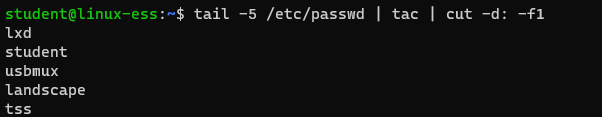

## Task 2
What is the option to use grep case insensitive?

<br/>
<br/>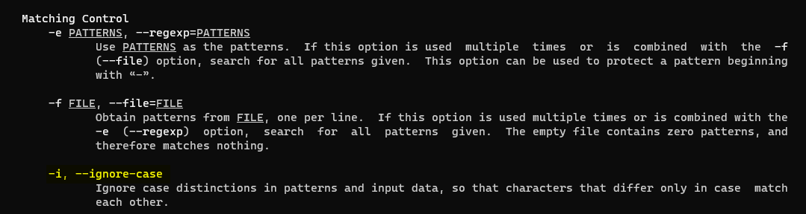

## Task 3
Show the lines and line numbers from the file linux.txt that contain the word unix or Unix. Search the manpage of grep to find a solution.
Try to find two solutions. One with the use of square brackets and one without

Example of linux.txt:

```
I'm working with Linux
It know something about Minix
The foundation is Unix
unix
Minix
Unix
Test
Test
Test
```

<br/>
<br/>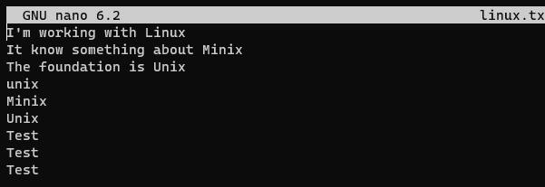
<br/>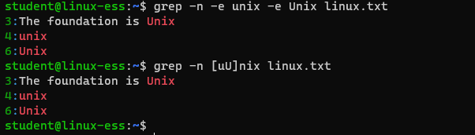


## Task 4
Show the lines from linux.txt that contain the word Linux, Minix or Unix

<br/>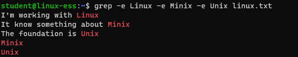

## Task 5
Show the number of lines that contain the word Unix in the file linux.txt. Search the manpage to find a solution
<br/>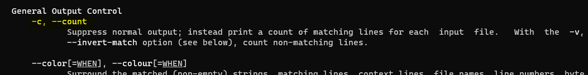
<br/>

## Task 6
Show all lines from the file linux.txt that start with a capital. 

?> <i class="fa-solid fa-circle-info"></i> Capital letters can be matched using [A-Z]
?> <i class="fa-solid fa-circle-info"></i> The start of a line can be match using ^

<br/>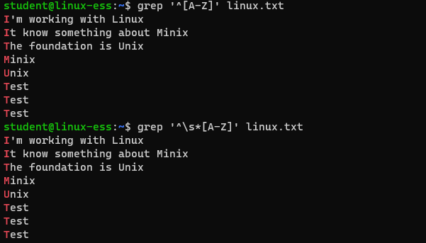


## Task 7
Print the password file, ordered by userid. Search for this option in the manpage. Search section 5 of the manpage of passwd to find out which field holds the userid. Search the manpage of sort to find out how to sort numeric fields. In the result the user `nobody` must be the last one 

<br/>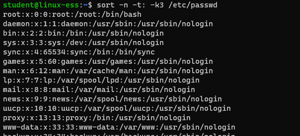


## Task 8
Store the output of `ls ~` in a file called __shownfiles__. Store the output of `ls -a ~` in a file called __allfiles__. Give a comparison of what files and directories are only in __shownfiles__, which ones are only in __allfiles__ and which occur in both files

<br/>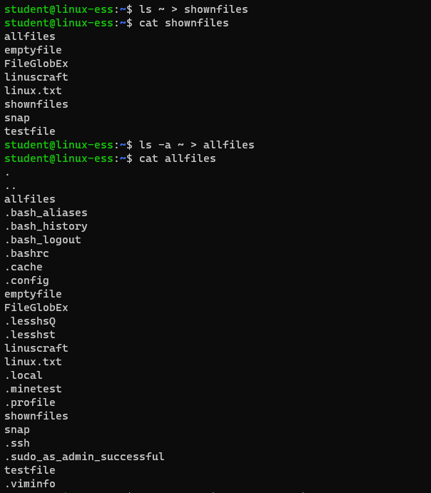
<br/>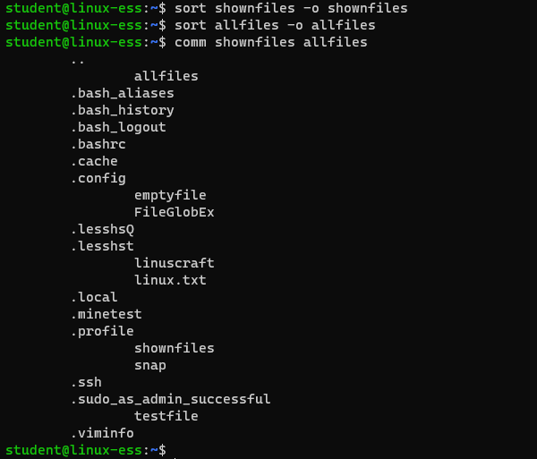


## Task 9
Show only the files that occur in both files. 

<br/>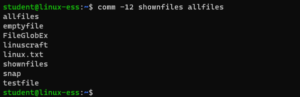


## Task 10
Start with the ls command of the root-folder (/) and try to end with a list of files and folders separated by spaces. Use the tr command to translate all new line characters to spaces.

<br/>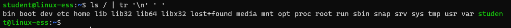

## Task 11
Use the command `ls -la ~` and change in the output: 

?> <i class="fa-solid fa-circle-info"></i> The reference "." To ". (this folder)" and ".." to ".. (parent folder)". Also remove the line that shows the amount of files and folders in the directory. 
?> <i class="fa-solid fa-circle-info"></i> Hint: if you use the $ sign at the end of a string to search, it means the line needs to end with that string.   
To complete this task you will have to use the `sed` command multiple times

<br/>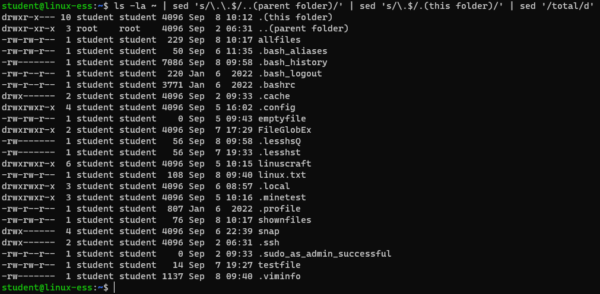
<br/>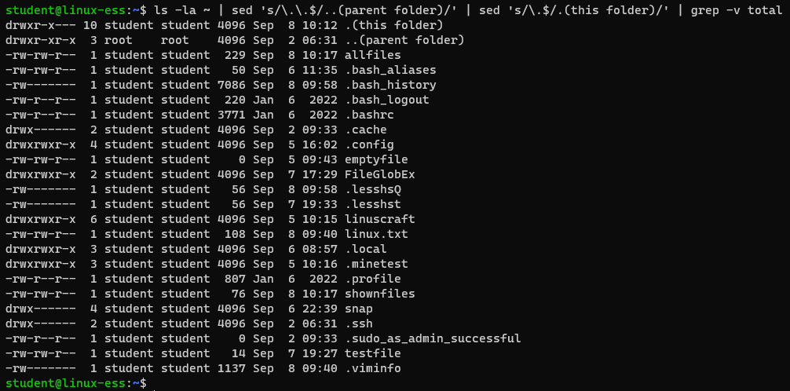

## Task 12
Go to your homefolder. Paste all shown files and folders (not the hidden ones) from the directory one after the other and count the number of words. The result is only a number 

<br/>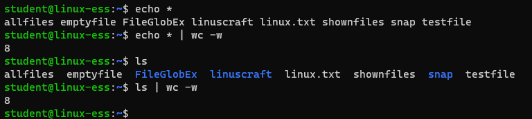
