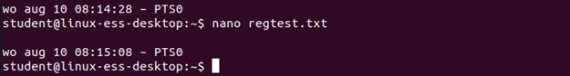

# Solutions on Regular Expressoins

?> <i class="fa-solid fa-circle-info"></i> http://www.regular-expressions.info/

## Task 1
Create the file regtest.txt with the following content:

```
apple
banana
apricot
peer
peach
strawberry
mango
grape
orange
5isanumber
123
123abc
abc123
35abcd35
5five5
55fivefive55
555fivefivefive555
77sevenseven77
@d
@tsign@@
atsiiiiiiiiiiiign
```

<br/>
<br/>

## Task 2
Use regular expressions to filter the lines that:

1.	Contain the letter a
<br/>

2.	Contain the letter a or s
<br/>
<br/>
<br/>

3.	Contain the letter a and s
<br/>

4.	Contain a @
<br/>

5.	Start with the letter p
<br/>

6.	End with the letter t 
<br/>

7.	Start with a number 
<br/>

8.	Start with a number and end with a letter 
<br/>

9.	Contains 2 or more consecutive letters a

<br/>

?> <i class="fa-solid fa-circle-info"></i> Without the + is also possible here:

<br/>


10.	Only contains numbers
<br/>

11.	Only contains letters
<br/>

12.	Contains one or more numbers, followed by one or more letters
<br/>

13.	Contains one or more numbers, followed by one or more letters and ending with a number. 
<br/>


## Task 3
Use sed to: 

1.	To create a file regtest_5.txt from the file regtest.txt where all numbers 5 are replaced with "five"
<br/>

2.	To create a file regtest_7.txt from the file regtest.txt where the text ‘seven’ is replaced by the number 7
<br/>

3.	To create a file regtest_at.txt from the file regtest.txt where all the @ symbols are replaced by _at_
<br/>

?> <i class="fa-solid fa-circle-info"></i>  !!! For extended regex you need to use sed -r ‘s/extendedregex/tochange/g’. The -r ensures that sed uses extended regexes 


## Task 4
Count the amount of time 5 can be found in regtest.txt
search the manpage of grep for a solution

<br/>
<br/>

## Task 5
Search in the bash manpage to the header name "REDIRECTION" (The text starts at the left-side line) . Is this search-function case sensitive? 
<br/>

?> <i class="fa-solid fa-circle-info"></i>  If you only use lowercase, the search function is not case sensitive. The moment you type an uppercase letter, it becomes case sensitive. 

## Task 6
Try with the same regular expression to only show hidden files from your home folder. 
<br/>

