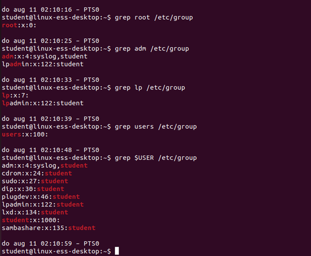
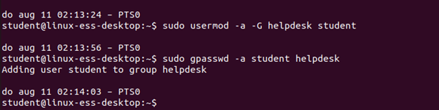
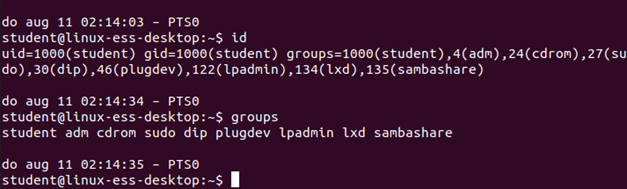
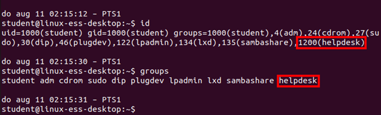
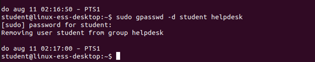
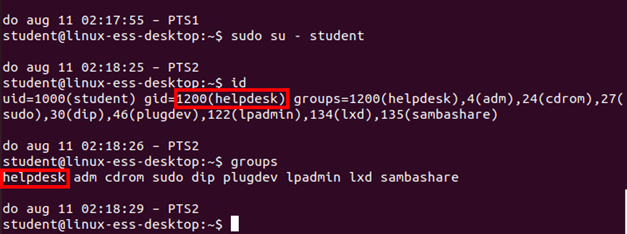
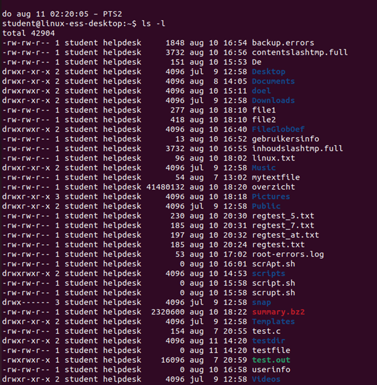
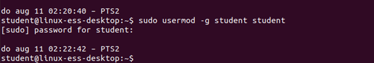

# Solutions on Groups

## Task 1
Each linux (UNIX) system is a multi-user system. The different users are divided into groups.
In which file are all groups defined? /etc/group
Give the id of the following groups:

Group | Group-ID
--- | ---
Root | 0
adm | 4
lp | 7
users| 100
Your primary group | 1000

<br/>

## Task 2
Create a group named "ict" with group-ID 1200.

<br/>


## Task 3
Change the name of the group "ict" to "helpdesk".

<br/>


## Task 4
Add your user to the group helpdesk as a secondary group.

<br/>

## Task 5
Check if the system knows you have been added to this group.

<br/>

```
No
```

## Task 6
Log out and in again with your user. 

<br/>


## Task 7
Check if the system now knows you have been added to the group

<br/>

```
Yes
```

## Task 8
Delete your user from the group helpdesk 

<br/>

## Task 9
Add you user to the group helpdesk as the primary group 

<br/>

## Task 10
Make sure the system knows that this is your new primary group

<br/>

?> <i class="fa-solid fa-circle-info"></i> Logout & login is also possible

## Task 11
Create an empty folder and file in your home folder

<br/>

## Task 12
Execute the ls -l command in your home folder. What do you notice about the two new items? 

<br/>

```
The groupowner is now helpdesk
```


## Task 13
Give your user back its own primary group

<br/>

## Task 14
Remove the group "helpdesk"

<br/>
