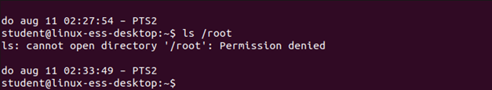
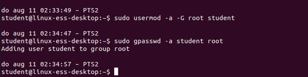
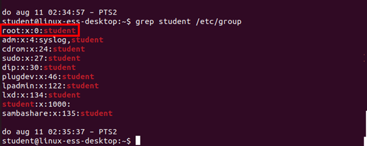
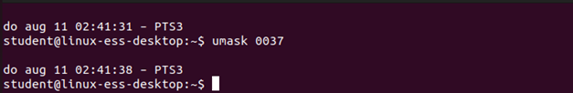
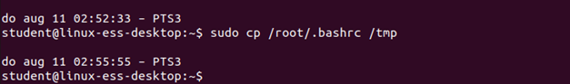
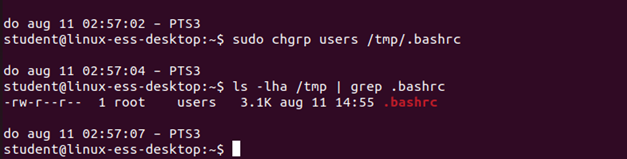
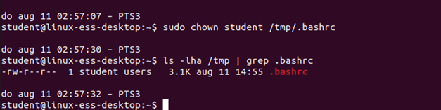
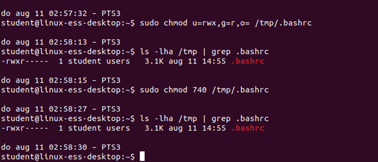
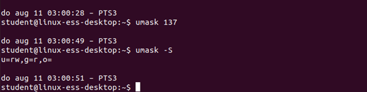
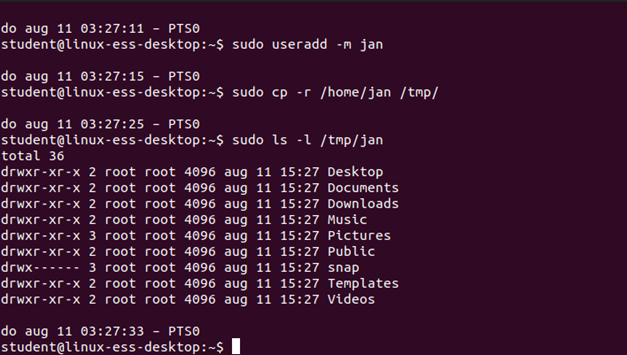

# Assignment Standard File Permissions

## Task 1
Execute the following command: <br />
```bash
ls /root
```

<br/>


## Task 2
This output is show because the directory /root is property of the user ‘root’ and because the security is set so that no one except for the ‘root’ (and maybe users who are member of the group ‘root’) have access. You can see this using the command ls -ld /root
Now let’s say you are the system administrator and you need access to the directories of the group ‘root’. In this case we need to add our user to the group ‘root’. <br />
What command can be used to accomplish this?

<br/>

## Task 3
What is changed in the file /etc/group?

```
The user student has been added to the group root. (Do not forget to relog or open a new bash instance)
```
<br/>


## Task 4
Are you able to use the ls command in the directory /root? YES / NO

```
No, the group root has no permissions for the folder. 
```
<br/>


## Task 5
If not, resolve this problem

<br/>

## Task 6
Change your umask to 0037.

<br/>

## Task 7
Test on your system if the following is correct: <br />
‘If someone has write permissions in a directory, it is automatically added to all the files in this directory, which means this person can change all these files?’

```
It is not automatically on the file as well. 
If we only have read rights; we can open the files with nano and vi. With nano we cannot change the file. With vi it is possible if we use :wq!, but this will probably erase the file and save a new one. This is allowed, but the userowner and groupowner will be changed.

```

## Task 8

Copy the file .bashrc from the root’s home folder to /tmp

<br/>

## Task 9

Change the groupowner of /tmp/.bashrc file to the group users
<br/>


## Task 10
Change the userowner of the file /tmp/.bashrc to your user

<br/>

## Task 11
Change the permissions of the file /tmp/.bashrc to: <br />
- The userowner:	    read, write and execute
- The groupowner: 	    read only
- Others:		        Nothing

<br/>

## Task 12

Show the command that ensures that all newly created files get the following permission: <br />
rw-r-----

<br/>

## Task 13
Copy someone else's home folder (not the one from root) with all its contents to the /tmp folder. Check the ownership and permissions of the copied files. What do you notice?

```
root is user owner and group owner of all the files and folders.
```

<br/>


## Task 14
Copy someone else's home folder (not the one from root) with all its contents to the /tmp folder, ensure that all permissions and ownerships are preserved. Check the ownership and permissions of the copied files. <br />
What do you notice?

```
Ownership and permissions have been kept intact. 
```

<br/>
