# Solutions on Users, Groups, Permissions - Extra Exercises

## Task 1

Suppose you work in a company where devices are designed, created, repaired and sold. Engineers are appointed to design the devices. Technicians are appointed to create and repair these devices and for selling them, sellers are appointed. Alle employees of this company work on a central Linux system. The users of this system should be defined so the engineers have their own home directory and have a shared directory /home/shared/design (where they have all permissions). All technicians share one home directory /home/technicians and all Sales personnel have their own home directory but share a directory /home/shared/info (where they have all permissions) where all technical/marketing data is stored about the devices. The engineers also need access to the directory /hope/shared/info (all permissions). <br />

(username/password)
- The engineers are: 		    peter/zomer1	patrick/zomer2
- The technicians are:		    wim/winter1	    ward/winter2
- The Sales personnel are:	    bert/budget1	ilse/budget2

The groups for the different employments are:

- Employment: Linux group
- Engineers: engineer
- Technician: technic (primary group)
- Sales: sales


The special groups for the shared directories: <br />

| Directory | Linux group | 
| --- | --- |
| /home/shared/design | design | 
| /home/shared/info | info | 

The owner of the shared directories is the ‘root’ user


### Task 1.1
Create the groups and users as mentioned in the situation above. 

Groups: <br />
```bash
sudo groupadd –g 401 engineer
sudo groupadd –g 402 technic
sudo groupadd –g 403 sales
sudo groupadd –g 404 design
sudo groupadd –g 405 info
```

<br/>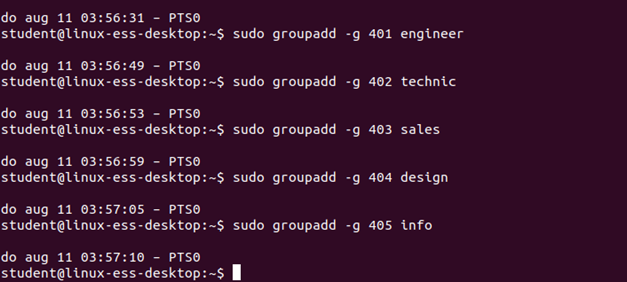
<br/>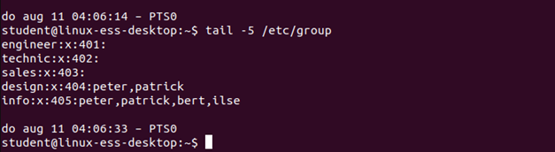


Users: <br />
```bash
sudo useradd –c "Ir. Peter" –d /home/peter –g 401 –G design, info –s /bin/bash –u 451 peter
sudo passwd peter
sudo useradd –c "Ir. Patrick" –d /home/patrick –g 401 –G design, info –s /bin/bash –u 452 patrick
sudo passwd patrick
sudo useradd –c "Tech Wim" –d /home/technicians –g technic –s /bin/bash –u 453 wim
sudo passwd wim
sudo useradd –c "Tech Ward" –d /home/technicians –g technic –s /bin/bash –u 454 ward
sudo passwd ward
sudo useradd –c "Sale Bert" –d /home/bert –g sales –G info –s /bin/bash –u 455 bert
sudo passwd bert
sudo useradd –c "Sale Ilse" –d /home/ilse –g sales –G info –s /bin/bash –u 456 ilse
sudo passwd ilse

<br/>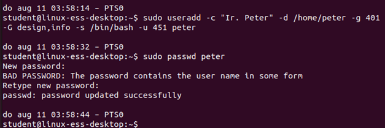
<br/>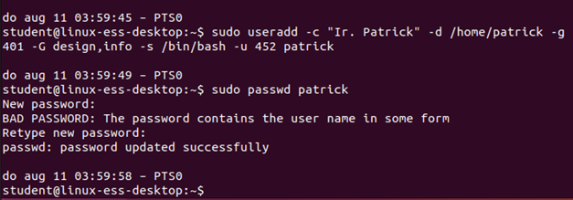
<br/>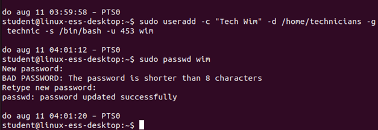
<br/>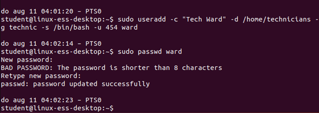
<br/>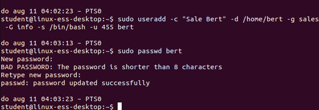
<br/>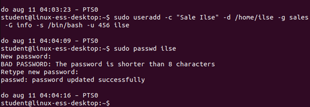
<br/>
<br/>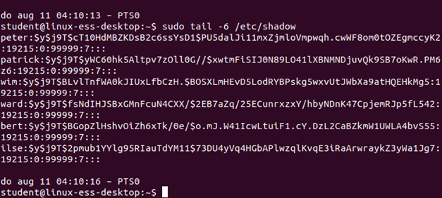


Dirs:

```bash
sudo mkdir /home/shared
sudo mkdir /home/shared/design
sudo mkdir /home/shared/info
# sudo ownership:
sudo chown root.design /home/shared/design
sudo chown root.info /home/shared/info
```

Permissions:

```bash
sudo chmod 770 /home/shared/design
sudo chmod 770 /home/shared/info
```
<br/>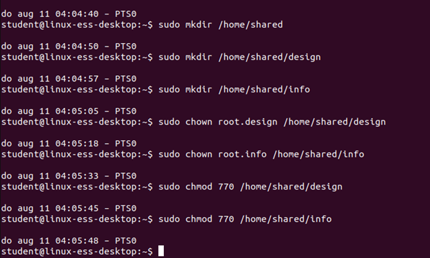
<br/>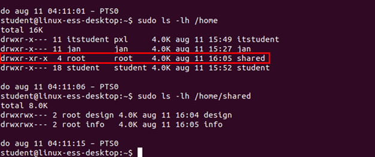


## Task 2
Create 7 users named: <br />
Walter, Karel, Dirk, Evert, Ine, Els and Tina<br />
<br />
Els, Tina and Ine have users as their primary group, their secondary group should be Sales.<br />
Walter and Karel are member of the group planning <br />
Dirk and Evert are part of both the departments and are because of this member of both groups<br />
<br />
Alle users have their home directory in /home/username.<br />
There are 3 extra directories, which can be found in /home:<br />
/home/planning: contains the planning, customizable for all members of planning. <br />
/home/sales: contains information about sales, customizable for all members of sales<br />
/home/general: contains general information for everyone? (Evert is responsible for this folder and therefore only Evert has writing permissions on this directory and its content. 

All users (members of the group users) have reading permissions for these directories. 
Test these settings!

Groups:
users already exist

```bash
sudo groupadd –g 2000 Sales
sudo groupadd –g 2001 planning
```

<br/>
<br/>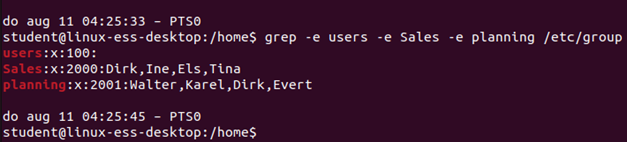

Users:

```bash
sudo useradd –d /home/Walter –g users –G planning –u 3000 Walter
sudo passwd Walter
sudo useradd –d /home/Karel –g users –G planning –u 3001 Karel
sudo passwd Karel
sudo useradd –d /home/Dirk –g users –G planning,Sales –u 3002 Dirk
sudo passwd Dirk
sudo useradd –d /home/Evert –g users –G planning –u 3003 Evert
sudo passwd Evert
sudo useradd –d /home/Ine –g users –G Sales –u 3004 Ine
sudo passwd Ine
sudo useradd –d /home/Els –g users –G Sales –u 3005 Els
sudo passwd Els
sudo useradd –d /home/Tina –g users –G Sales –u 3006 Tina
sudo passwd Tina
```

<br/>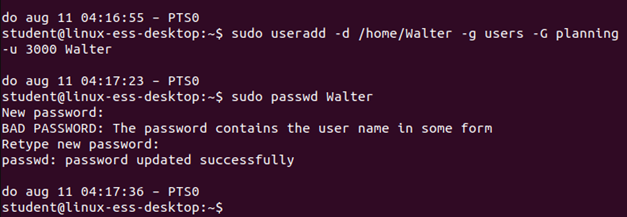
<br/>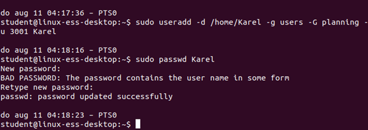
<br/>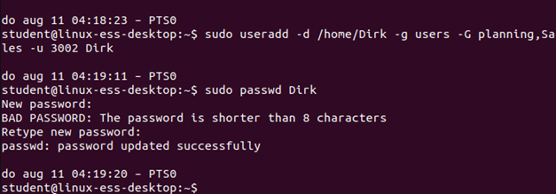
<br/>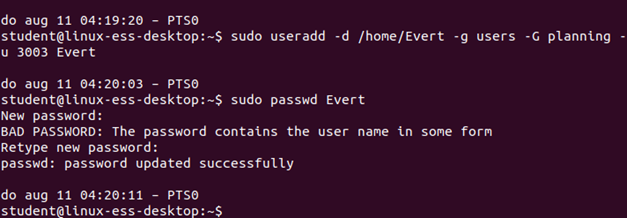
<br/>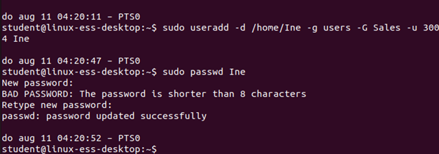
<br/>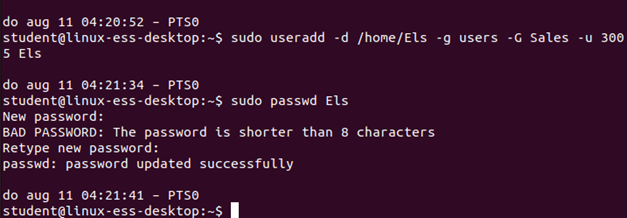
<br/>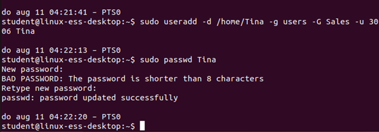
<br/>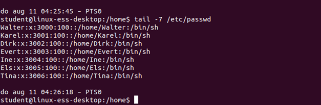
<br/>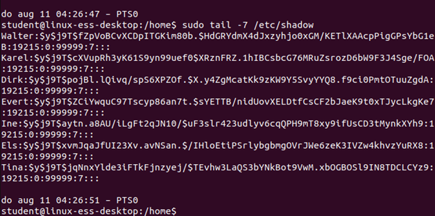

Dirs:

```bash
cd /home
sudo mkdir planning
sudo chown root:planning planning
sudo chmod 775 planning		(x for the dir, otherwise you cannot enter!)

sudo mkdir Sales
sudo chown root:Sales Sales
sudo chmod 775 Sales

sudo mkdir general
sudo chown Evert:users general
sudo chmod 755 general
```

<br/>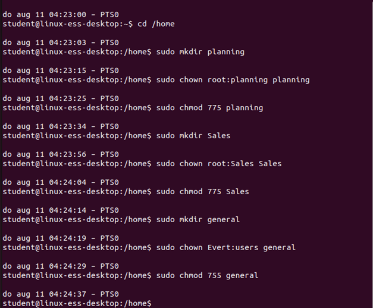
<br/>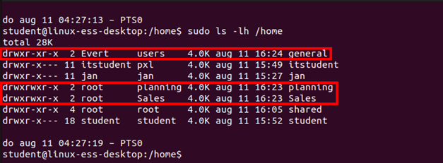


## Task 3
Create a group named pxl and a user itstudent. This user's primary group is pxl. Set the password for the user to test123. The home directory for this user is /home/itstudent and for the shell the user uses /bin/bash.

```bash
sudo groupadd pxl
sudo useradd –g pxl –m –s /bin/bash itstudent
sudo passwd itstudent
```

<br/>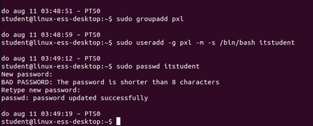


## Task 4
Make sure the user itstudent becomes a sudoer. Test if this works. 

```bash
sudo adduser itstudent sudo
```
<br/>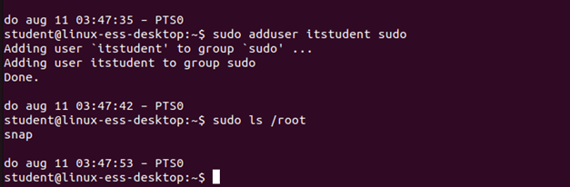


## Task 5
Copy the file /etc/hosts to your home directory (do not do this as root!). Set the permissions with the chmod command as follows: 
xr for others, wr for group and no permissions for the file owner. Check with the ls -l command if everything is changed. 
- Can the file owner check the file contents? Why / Why not?

```
No, he does not have read permissions. 
```

- Can he change permissions?

```
Yes, he still is the file owner.
```

- Can he delete the file? 

```
Yes, he still is the file owner.
```

<br/>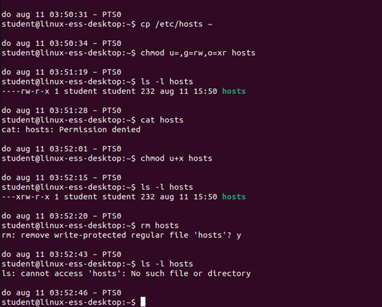

