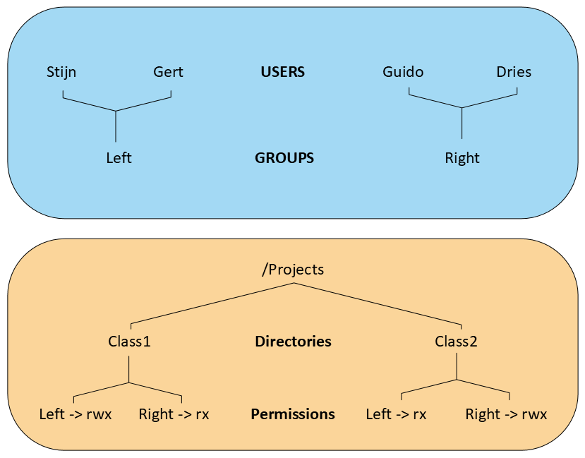

# Assignment on Users, Groups, Permissions - Extra Exercises

## Task 1

Suppose you work in a company where devices are designed, created, repaired and sold. Engineers are appointed to design the devices. Technicians are appointed to create and repair these devices and for selling them, sellers are appointed. Alle employees of this company work on a central Linux system. The users of this system should be defined so the engineers have their own home directory and have a shared directory /home/shared/design (where they have all permissions). All technicians share one home directory /home/technicians and all Sales personnel have their own home directory but share a directory /home/shared/info (where they have all permissions) where all technical/marketing data is stored about the devices. The engineers also need access to the directory /hope/shared/info (all permissions).  

(username/password)
- The engineers are: 		    George/zomer1	Isla/zomer2
- The technicians are:		    Leo/winter1	    Amelia/winter2
- The Sales personnel are:	    Jack/budget1	Grace/budget2

The groups for the different employments are:

- Employment: Linux group
- Engineers: engineer
- Technician: technic (primary group)
- Sales: sales

The special groups for the shared directories:  

| Directory | Linux group | 
| --- | --- |
| /home/shared/design | design | 
| /home/shared/info | info | 

The owner of the shared directories is the ‘root’ user

### Task 1.1
Create the folders, groups and users as mentioned in the situation above. 

### Task 1.2
Give all users the correct groups as mentioned in the situation above.

### Task 1.3
Set all the permissions and ACL's as mentioned in the situation above.

## Task 2
Create 7 users named:  
Walter, Michael, George, James, Mia, Emma and Charlotte 
 
Emma, Charlotte and Mia have users as their primary group, their secondary group should be Sales. 
Walter and Michael are member of the group planning  
George and James are part of both the departments and are because of this member of both groups 
 
Alle users have their home directory in /home/username. 
There are 3 extra directories, which can be found in /home: 
/home/planning: contains the planning, customizable for all members of planning.  
/home/sales: contains information about sales, customizable for all members of sales 
/home/general: contains general information for everyone? (James is responsible for this folder and therefore only James has writing permissions on this directory and its content. 

All users (members of the group users) have reading permissions for these directories. 
Test these settings!

## Task 3
Create a group named pxl and a user itstudent. This user's primary group is pxl. Set the password for the user to test123. The home directory for this user is /home/itstudent and for the shell the user uses /bin/bash.

## Task 4
Make sure the user itstudent becomes a sudoer. Test if this works. 

## Task 5
Copy the file /etc/hosts to your home directory (do not do this as root!). Set the permissions with the chmod command as follows: 
xr for others, wr for group and no permissions for the file owner. Check with the ls -l command if everything is changed. 
- Can the file owner check the file contents? Why / Why not?
- Can he change permissions?
- Can he delete the file? 

## Task 6
Create the directory sturcture with the necessary users, groups and ACLs as show in the image below.

## Task 7
Find out how to copy the ACL-configurations of one folder to another one. 

## Task 8
Find out how to create a backup of the ACL-configurations set on a directory.
