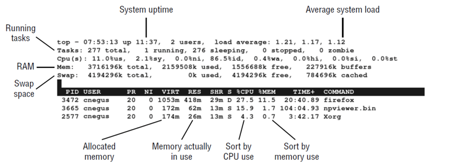
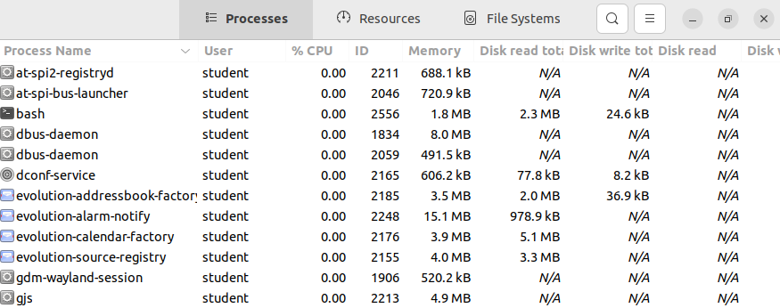

# Managing running processes
By now we learned that Linux is a multi-user and multi-tasking Operating system. 
In this chapter we will take a look at running programs, better called a process. Linux has the tools to show a list of the running processes, to monitor the system usage and to stop or kill processes. These commands that show information about processes, extract their info from the /proc folder. Each process will save their info in a subdirectory of /proc and will be named a number, more specific the process ID. For example /proc/1/status, will show the status of the process with process ID 1. 
An example of a process is to start the vi-editor by using the vi-command that is saved on your Linux. If 15 users would do this at the same time, not one but 15 processes would start. Every one of these processes could be identified by its process ID. This ID is a unique number on the current system. No process can have the same PID as another process, as long as this process is running. If a process ends, another process can reuse it’s PID. Another attribute of a process is that every process is associated with a user account and group account. This association will determine what system resources the process is able to use. For example: a process that runs as root will have more access to the filesystem than a process a normal user would have started. A system manager should be able to manage the processes. Some processes might influence the performance of the system. Searching for these processes, based on memory- and CPU-usage, will be looked at in the chapter. 

## Listing processes with ps
ps is the oldest and most used command to list the running processes. 
```bash
student@linux-ess-desktop:~$ ps
    PID TTY          TIME CMD
   2556 pts/0    00:00:00 bash
  11680 pts/0    00:00:00 ps
```
By adding the option u to the ps command some additional information is shown. These being: The usernames, start time of the process, CPU- and memory usage, from where the process is started for example tty1 or pts/0. The concept of these terminals descends from the time people exclusively worked from terminals. There was one person on one terminal. Nowadays multiple terminals can be opened on the same screen by opening multiple virtual terminals. 
```bash
student@linux-ess-desktop:~$ ps -u
USER         PID %CPU %MEM    VSZ   RSS TTY      STAT START   TIME COMMAND
student     1906  0.0  0.1 171040  6104 tty2     Ssl+ 13:41   0:00 /usr/libexec/gdm-wayland-ses
student     1915  0.0  0.3 231688 15420 tty2     Sl+  13:41   0:00 /usr/libexec/gnome-session-b
student     2556  0.0  0.1  20040  5684 pts/0    Ss   13:41   0:00 bash
student    11683  0.0  0.0  21328  3608 pts/0    R+   14:49   0:00 ps -u
```
In this example we can see that: 
*	student started process 11683, which is command ps -u
*	pts/0 is used
*	STAT shows the status of the process, ‘r’ for running of ‘s’ for sleeping
*	USER is de name of the user who started the process
*	PID is the unique number of the process. This number will later be used to kill of send signals to a process. 
*	%CPU and %MEM are the CPU and memory time the process is using. 
*	VSZ, the virtual set size, shows the image size of the process in kilobytes and RSS, the resident set size, shows the size of the process in memory. 
*	START is the time the process started
*	TIME is de cumulative system time that has been used. 

A lot of processes running on your system are not associated with a terminal, these are mostly process that run in the background. For example: logging of system activities, listening to incoming data from the network. These process often start when Linux start and stop when you shut down. When starting a graphical environment a lot of background process start as well, look at audio, authentication, …) 

To show all running processes for your current user use: 
```bash
student@linux-ess-desktop:~$ ps ux | less
USER         PID %CPU %MEM    VSZ   RSS TTY      STAT START   TIME COMMAND
student     1807  0.0  0.3  20956 13480 ?        Ss   13:41   0:00 /lib/systemd/systemd --user
student     1808  0.0  0.1 105604  5328 ?        S    13:41   0:00 (sd-pam)
student     1814  0.0  0.1  48228  6440 ?        S<sl 13:41   0:00 /usr/bin/pipewire
student     1815  0.0  0.1  32116  6468 ?        Ssl  13:41   0:00 /usr/bin/pipewire-media-sess
student     1817  0.1  0.7 1508148 30068 ?       S<sl 13:41   0:05 /usr/bin/pulseaudio --daemon
student     1825  0.0  0.1 249548  7592 ?        Sl   13:41   0:00 /usr/bin/gnome-keyring-daemo
student     1834  0.0  0.3  15716 12076 ?        Ss   13:41   0:00 /usr/bin/dbus-daemon --sessi
student     1842  0.0  0.2 249300  8384 ?        Ssl  13:41   0:00 /usr/libexec/gvfsd
student     1846  0.0  0.1 619288  7516 ?        Ssl  13:41   0:00 /usr/libexec/xdg-document-po
student     1848  0.0  0.1 380884  6332 ?        Sl   13:41   0:00 /usr/libexec/gvfsd-fuse /run
student     1852  0.0  0.1 244796  5416 ?        Ssl  13:41   0:00 /usr/libexec/xdg-permission-
student     1895  0.0  0.6 715924 27288 ?        SNsl 13:41   0:00 /usr/libexec/tracker-miner-f
student     1906  0.0  0.1 171040  6104 tty2     Ssl+ 13:41   0:00 /usr/libexec/gdm-wayland-ses
student     1907  0.0  0.2 398428 10412 ?        Ssl  13:41   0:00 /usr/libexec/gvfs-udisks2-vo
student     1915  0.0  0.3 231688 15420 tty2     Sl+  13:41   0:00 /usr/libexec/gnome-session-b
student     1943  0.0  0.1 245296  6640 ?        Ssl  13:41   0:00 /usr/libexec/gvfs-goa-volume
student     1948  0.0  0.9 643640 39360 ?        Sl   13:41   0:00 /usr/libexec/goa-daemon
:
```
To show all running process of all users use: $ps aux | less
```bash
student@linux-ess-desktop:~$ ps aux | less
USER         PID %CPU %MEM    VSZ   RSS TTY      STAT START   TIME COMMAND
root           1  0.0  0.3 102468 13252 ?        Ss   13:41   0:03 /sbin/init splash
root           2  0.0  0.0      0     0 ?        S    13:41   0:00 [kthreadd]
root           3  0.0  0.0      0     0 ?        I<   13:41   0:00 [rcu_gp]
root           4  0.0  0.0      0     0 ?        I<   13:41   0:00 [rcu_par_gp]
root           5  0.0  0.0      0     0 ?        I<   13:41   0:00 [netns]
root           7  0.0  0.0      0     0 ?        I<   13:41   0:00 [kworker/0:0H-events_highpri
root          10  0.0  0.0      0     0 ?        I<   13:41   0:00 [mm_percpu_wq]
root          11  0.0  0.0      0     0 ?        S    13:41   0:00 [rcu_tasks_rude_]
root          12  0.0  0.0      0     0 ?        S    13:41   0:00 [rcu_tasks_trace]
root          13  0.0  0.0      0     0 ?        S    13:41   0:00 [ksoftirqd/0]
root          14  0.0  0.0      0     0 ?        I    13:41   0:01 [rcu_sched]
root          15  0.0  0.0      0     0 ?        S    13:41   0:00 [migration/0]
root          16  0.0  0.0      0     0 ?        S    13:41   0:00 [idle_inject/0]
root          17  0.0  0.0      0     0 ?        S    13:41   0:00 [cpuhp/0]
:
```

In the following example the option -e is used to show all running processes, the option -o is given when specific data is wanted. We chose for the process ID, user and user ID, group and group ID, virtual set size, resident set size and the command. 
```bash
student@linux-ess-desktop:~$ ps -eo pid,user,uid,group,gid,vsz,rss,comm | less
PID USER       UID GROUP      GID    VSZ   RSS COMMAND
  1 root         0 root         0 102468 13252 systemd
  2 root         0 root         0      0     0 kthreadd
  3 root         0 root         0      0     0 rcu_gp
  4 root         0 root         0      0     0 rcu_par_gp
  5 root         0 root         0      0     0 netns
  7 root         0 root         0      0     0 kworker/0:0H-events_highpri
 10 root         0 root         0      0     0 mm_percpu_wq
 11 root         0 root         0      0     0 rcu_tasks_rude_
 12 root         0 root         0      0     0 rcu_tasks_trace
 13 root         0 root         0      0     0 ksoftirqd/0
 14 root         0 root         0      0     0 rcu_sched
 15 root         0 root         0      0     0 migration/0
 16 root         0 root         0      0     0 idle_inject/0
 17 root         0 root         0      0     0 cpuhp/0
 18 root         0 root         0      0     0 cpuhp/1
:
```

We can also add the option –sort= to the command and chose a parameter to sort our list. We chose the rss command from large to small with the – sign. 
```bash
student@linux-ess-desktop:~$ ps -eo pid,user,uid,group,gid,vsz,rss,comm --sort=-rss | less
    PID USER       UID GROUP      GID    VSZ   RSS COMMAND
   2049 student   1000 student   1000 4206700 249244 gnome-shell
   2398 student   1000 student   1000 210408 69364 Xwayland
   2449 student   1000 student   1000 532284 67976 gsd-xsettings
   2248 student   1000 student   1000 745232 65668 evolution-alarm
   1972 student   1000 student   1000 593316 63092 gnome-remote-de
  11720 student   1000 student   1000 2802980 59368 gjs
   2538 student   1000 student   1000 573632 55012 gnome-terminal-
  10308 root         0 root         0 874784 42912 snapd
   1948 student   1000 student   1000 643640 39360 goa-daemon
   2295 student   1000 student   1000 297212 38652 vmtoolsd
   2596 student   1000 student   1000 502600 31468 update-notifier
   2176 student   1000 student   1000 849096 30592 evolution-calen
   1817 student   1000 student   1000 1508176 30068 pulseaudio
   2164 student   1000 student   1000 671504 29232 xdg-desktop-por
:
```

## Listing processes with top
Another command that can be used is top, this command is more screen oriented than ps and provides the possibility to change the state of processes by using the kill command to end a process or renice command to change the priority. If you want to edit all processes you’ll need to start top as root. 



In the top window there are a few possible command to use:
*	h for help
*	q to go back
*	M to sort based on memory usage
*	P to sort based on CPU usage
*	1 to switch between CPU’s, if multiple CPU’s are available 
*	R to inverse sort the output shown
*	u, then insert a username to show all processes of this user
*	r to renice, after r, you will need the PID of the process and the value between -20 and 19
*	k to kill, followed by the PID of the process, thereafter 15 to kill clean or 9 to kill abruptly

## Listing process with the system monitor
A third option is the gnome-system-monitor, this option can be used to manage processes in a graphical way. To start this program go to applications and click system monitor, in this window choose processes. You can also open this program by entering the gnome-system-monitor command. At standard all process of the current user are shown alphabetically, other sorting options can be set by clicking on the column-titles. Right clicking a process gives options to:
*	Stop: pause the process, equal to ctrl + Z in the shell
*	Continue: restart a stopped process
*	End: terminate a process with signal 15 (clean)
*	Kill: terminate a process with signal 9 (abrupt)
*	Change: a slider can be set to renice, only root can set a negative or higher priority, you’ll need to enter the root-password when trying this. 
*	Memory maps show which libraries and other components from memory are used by the process
*	Properties show extra information about the process



To show all processes and not only the ones of the current user, go to the menu button and choose all processes. As root you’ll be able to manage all processes. 
The monitor option is only available in graphical interfaces, when this is not available as with the server version of Ubuntu. You’ll need to use commands to manage processes.

## Managing front- and background processes
Our bash shell does not have graphical User Interface tool to run different programs simultaneously, but we are able to run programs in the front- or background. With this options it is possible to run multiple programs at the same time in our shell and you’ll be able to choose what is running at what time. There are different methods of running programs in the background. 
You can add a & after the command to start it in the background
```bash
student@linux-ess-desktop:~$ find /usr > /tmp/allusrfiles &
[1] 11896
```
You can use the at command to run a process at a specific time. With the cron command it is possible to do this on a regular basis. 
To see what processes are running in the background use the jobs command.
```bash
student@linux-ess-desktop:~$ jobs
[1]   Running                 sleep 30 &
[2]   Running                 sleep 25 &
[3]   Running                 sleep 20 &
[4]-  Running                 sleep 15 &
[5]+  Done                    find /usr > /tmp/allusrfiles
```
The + shows the most recents process added to the background
The – shows the second to last process added to the background
To pause a process and put it in the background use ctrl + Z. 
```bash
student@linux-ess-desktop:~$ sleep 50
^Z
[1]   Done                    sleep 30
[2]   Done                    sleep 25
[3]   Done                    sleep 20
[4]   Done                    sleep 15
[5]+  Stopped                 sleep 50
```
To bring the command back to the front, use the fg command.
```bash
student@linux-ess-desktop:~$ fg
sleep 50
```
*	Fg %<jobnumber>
*	%string : command needs to start with string
*	%?string : job has string in the commandline 
*	%+ : last job send to background
*	%- : second to last program send to background
With the bg command you can resume a paused process that is located in the background
```bash
student@linux-ess-desktop:~$ sleep 50
^Z
[1]+  Stopped                 sleep 50
student@linux-ess-desktop:~$ jobs
[1]+  Stopped                 sleep 50
student@linux-ess-desktop:~$ bg %1
[1]+ sleep 50 &
student@linux-ess-desktop:~$ jobs
[1]+  Running                 sleep 50 &
```
A process running in the background can still show its output, even when another process is running. For example, when working with nano, an output can come up in your screen. Press ctrl + L to renew the window. 
Hint: use 2> /dev/null to send all errors to the void so they won’t show up. 
Killing or renicing (changing the priority) is also possible with these commands
```bash
student@linux-ess-desktop:~$ sleep 500 &
[1] 11977
student@linux-ess-desktop:~$ kill 11977
[1]+  Terminated              sleep 500
student@linux-ess-desktop:~$ sleep 500 &
[1] 11981
student@linux-ess-desktop:~$ kill -9 11981
student@linux-ess-desktop:~$ sleep 500 &
[1] 11982
student@linux-ess-desktop:~$ kill -15 11982
student@linux-ess-desktop:~$ sleep 500 &
[1] 11983
student@linux-ess-desktop:~$ kill -SIGKILL 11983
```
With the kill or killall command, there are more possibilities than stopping a process. You can reload configuration files, pause, continue, … To do this signals are used, numbers of names. A few examples, use the kill -l command to show all options:
*	SIGKILL (9): abruptly and immediately stop a process
*	SIGTERM (15): stand way of stopping a process, cleanly shutdown the process
*	SIGHUP (1): tell a process to reload its configuration files
*	SIGSTOP (19): pause a process
*	SIGCONT (18): resume a process
*	…
Processes are unable to ignore the signals SIGKILL and SIGSTOP. For even more info about the signals use man 7 signal. When multiple signal numbers are listed, use the middle one. The first number is used for Alpha, the last for MIPS. 
With the nice command, a process can start with a given nice-value or priority. This value gives the process priority to use the CPU. -20 is the best or highest nice-value and 19 the worst or lowest. A normal use can only use a value between 0 and 19. 
```bash
student@linux-ess-desktop:~$ nice -n 10 sleep 100 &
[4] 11986
student@linux-ess-desktop:~$ ps ao user,ni,comm | grep sleep
student   10 sleep
student@linux-ess-desktop:~$ nice -n -15 sleep 100 &
[6] 11995
student@linux-ess-desktop:~$ nice: cannot set niceness: Permission denied
student@linux-ess-desktop:~$ ps ao user,ni,comm | grep sleep
student    0 sleep
```
Use the renice command to change the priority of a running process. Only root can set the priority higher.
```bash
student@linux-ess-desktop:~$ nice -n 0 sleep 100 &
[1] 12011
student@linux-ess-desktop:~$ sudo renice -n -5 12011
12011 (process ID) old priority 0, new priority -5
student@linux-ess-desktop:~$ ps ao user,ni,comm | grep sleep
student   -5 sleep
```