# Oefeningen op installatie
## Oefening 1 - Download Ubuntu Desktop
Linux heeft ook een desktopversie. Download [Ubuntu Desktop](https://ubuntu.com/download/desktop). 

## Oefening 2 - Installeer Ubuntu Desktop 

Installeer [Ubuntu Desktop](https://ubuntu.com/download/desktop) in een nieuwe virtuele machine en verken de interface. 

### De nieuwe VM maken 
Om een nieuwe virtuele machine (VM) aan te maken in VMWare ga je naar het menu `File`>`New Virtual Machine`. De wizard voor het maken van een nieuwe VM wordt weergegeven. 

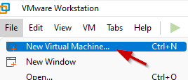 

In het eerste scherm selecteren we de optie `Typical`: 

 

Vervolgens kiezen we voor `I will install the operating system later`:

 

Vervolgens kiezen we voor het besturingssysteem `Linux`. In de versie dropdown selecteren we `Ubuntu 64-bit`. Dit is de Linux-distributie die we tijdens de labs zullen gebruiken. 

 

In het volgende scherm geven we de virtuele machine een naam. Je kunt ook een andere map opgeven om de virtuele machine op je computer op te slaan. 
?> <i class="fa fa-exclamation-circle" style="font-size:48px;color:red"></i> Let op dat je de bestanden van de VM niet opslaat in een map die gesynced wordt met de cloud (OneDrive, Dropbox, Google Drive)?. Je VM zal crashed en je zal alles in de VM kwijt zijn!

 

In het volgende scherm configureren we de grootte van de virtuele harde schijf voor de VM. We zullen een schijf maken met 30 GB opslagruimte. Houd er rekening mee dat de schijfruimte enkel wordt ingenomen door het opslaan van bestanden (dus groeiend tot maximum 30 GB): 

 

We moeten op `Customize Hardware` klikken om de virtuele machine verder te configureren: 

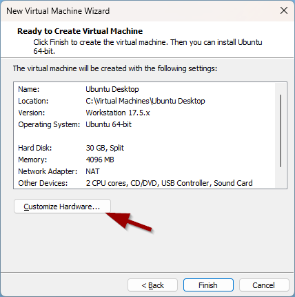 

We moeten het ISO-bestand van de Ubuntu-desktop nog koppelen aan het virtuele cd-rom-station. Dit doen we door `New CD/DVD` te selecteren en naar het gedownloade `iso` bestand te bladeren: 

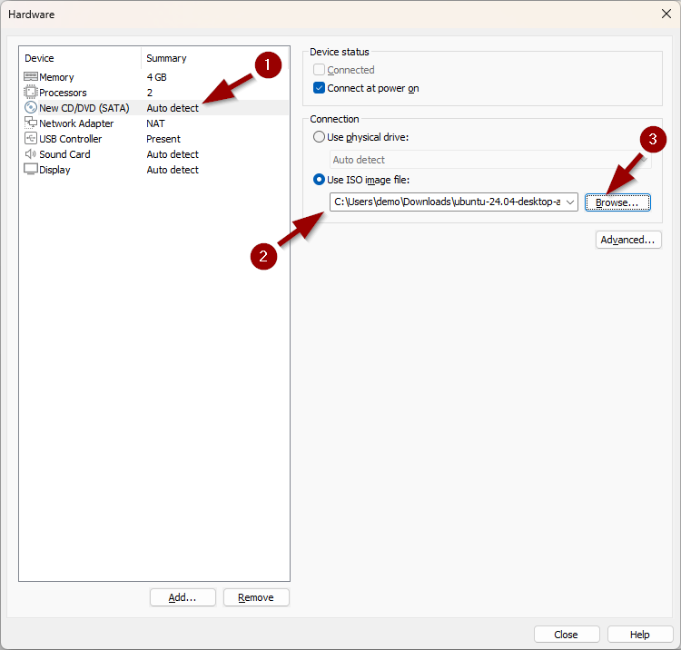 

Klik op `Finish` en de virtuele machine wordt gemaakt. 

 

We kunnen nu de UEFI bios nog instellen. Klik hiervoor op `Edit virtual machine settings`. 
  
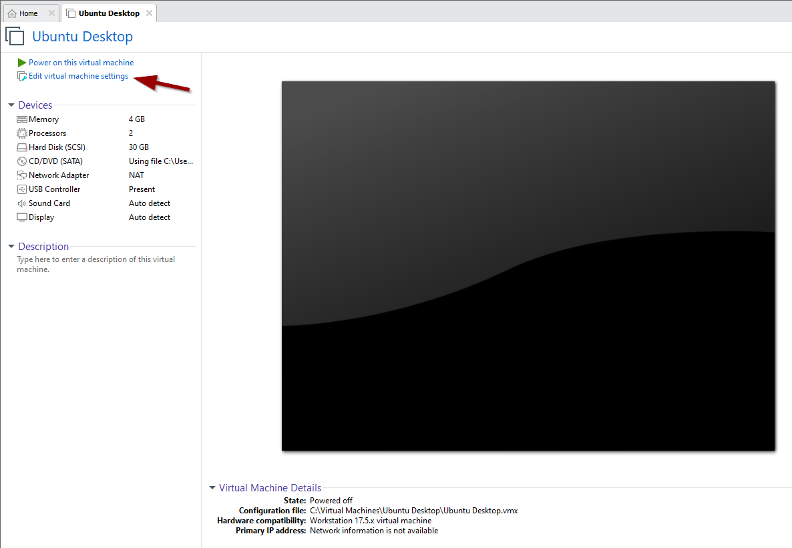 

Ga naar het tabblad `Options`, klik op `Advanced` en selecteer de optie `UEFI`. Hier vind je ook de instelling omtrent `Side channel mitigations` zou je daar straks een waarschuwing van krijgen tijdens het starten van de Virtuele Machine. 
  
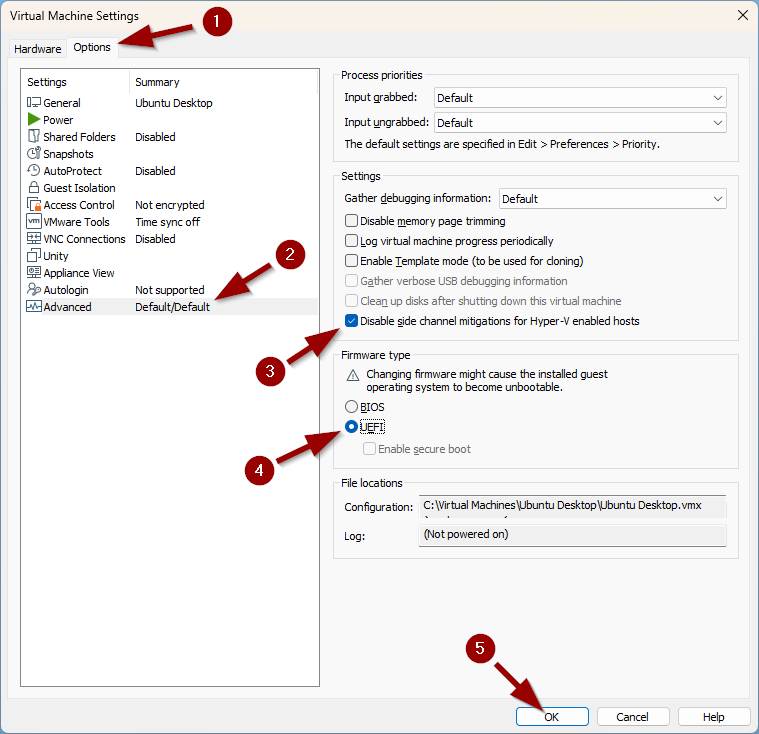 
  
Je kan de VM nu opstarten door op het groene pijltje te klikken. Hiermee wordt de virtuele machine opgestart en wordt het installatieproces uitgevoerd. 

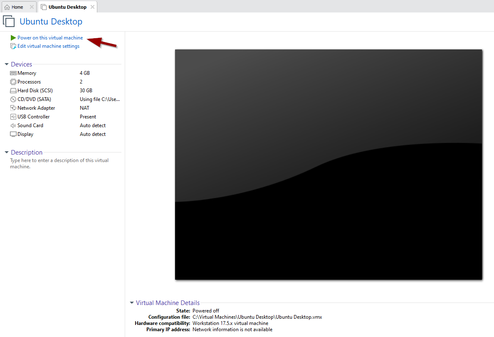 

### Installatie Ubuntu Desktop 

?> <i class="fa-solid fa-circle-info"></i> Resulteert het opstarten van de VM in de fout `This host supports Intel VT-x, but Intel VT-x is diabled`? Dan moet je de VT-X-optie activeren in de BIOS van je laptop. Meer informatie is te vinden in [dit artikel](https://www.qtithow.com/2020/12/fix-error-this-host-supports-Intel-VT-x.html). 

Wanneer we de VM voor de eerste keer opstarten, moeten we op `enter` drukken of 30 seconden wachten: 

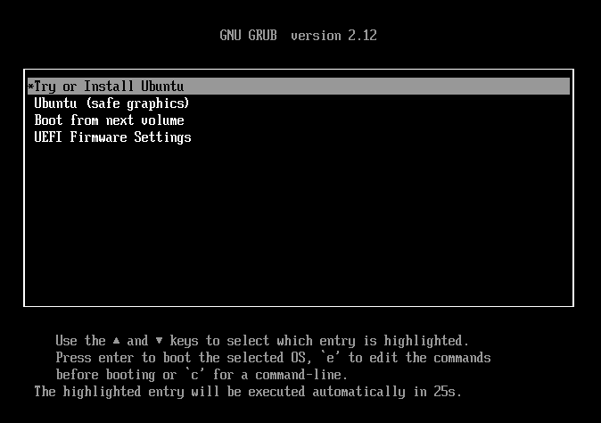 

We moeten een paar seconden wachten tot de boot klaar is: 

 

In de volgende paar stappen zal er een installatieproces zijn dat we moeten doorlopen.  
Wij maken de keuze om het volgende te installeren: 

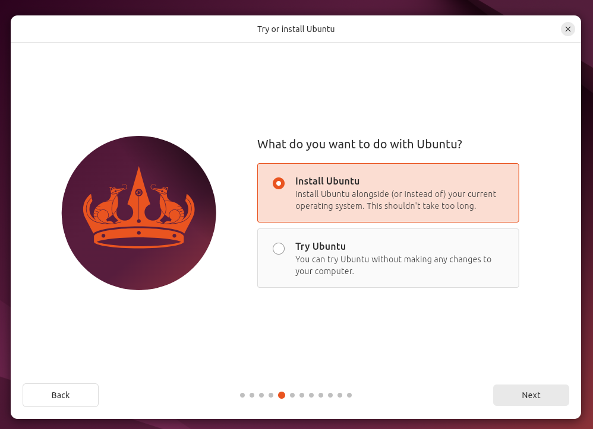 

We kiezen de juiste toetsenbordindeling. Voor `azerty` selecteren we `Belgian`: 

 

?> <i class="fa-solid fa-circle-info"></i> Als je een QWERTY-toetsenbord hebt, moet je het bij `English (US)` houden 

We gaan voor de normale installatie met wat extra closed source drivers en software: 

 

We kiezen ervoor om de schijf te wissen en Ubuntu Desktop erop te installeren: 

 

We kiezen ervoor om de wijzigingen toe te passen door de wijzigingen naar de schijf te schrijven: 

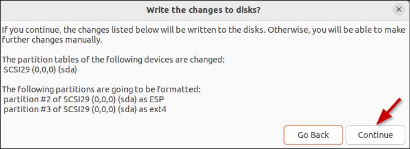 

?> <i class="fa-solid fa-circle-info"></i> Houd er rekening mee dat je de virtuele schijf van je VM wist, maar het is een nieuwe/lege disk waarop we gaan installeren. `De harde schijf van je computer/laptop wordt niet gewist!` 

Voor de tijdzone wijzen we Brussel aan op de kaart of schrijven we het in het tekstvak: 

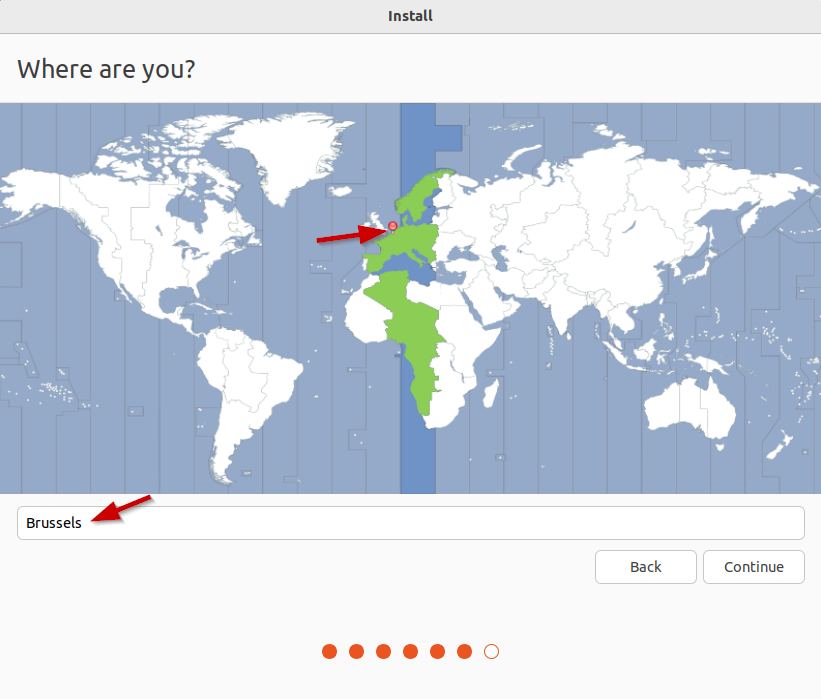 

We specificeren de gebruikersnaam en computernaam: 

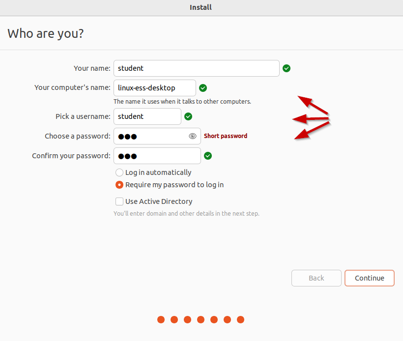 

Nu moeten we wachten tot de installatie klaar is: 

 

Zodra de installatie is voltooid, moeten we op `Restart Now` klikken om de VM opnieuw op te starten: 

 

Op het laatste scherm druk je gewoon op `enter`. De computer wordt opnieuw opgestart en de installatie is voltooid: 

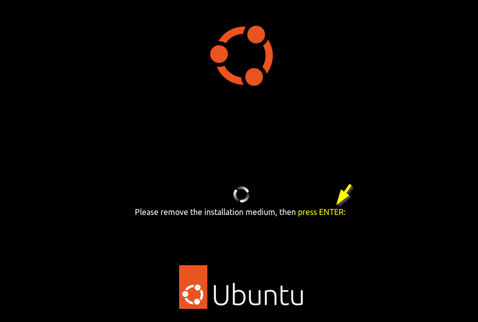 

## Oefening 3 - Log voor de eerste keer in 

De allereerste keer dat we inloggen, moeten we enkele configuratieschermen doorlopen: 

?> <i class="fa-solid fa-circle-info"></i> Als er een venster met de naam `Software Updater` verschijnt, kunnen we op `Install Now` klikken! 
[Ubuntu_Desktop_First_Login_Click_Updates](../images/02/LAB_Ubuntu_Desktop_First_Boot_Updates.png)

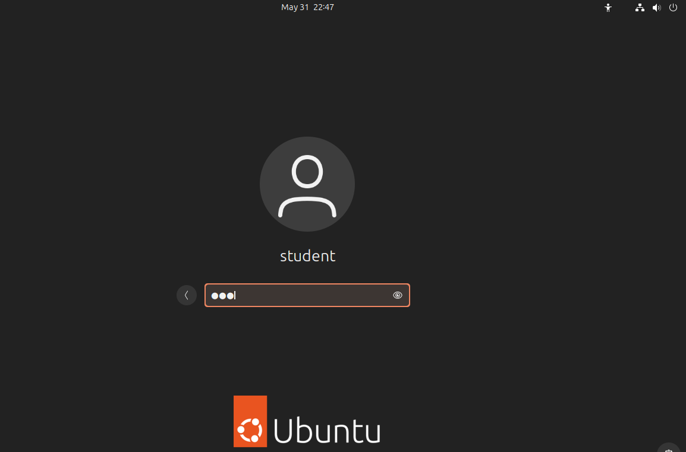

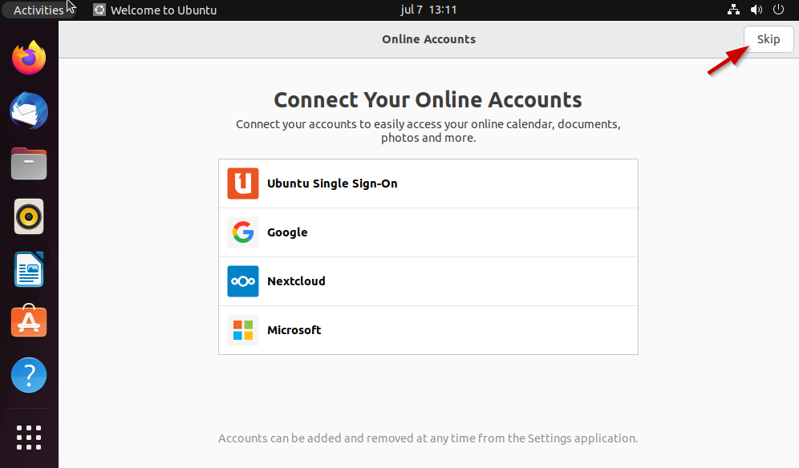

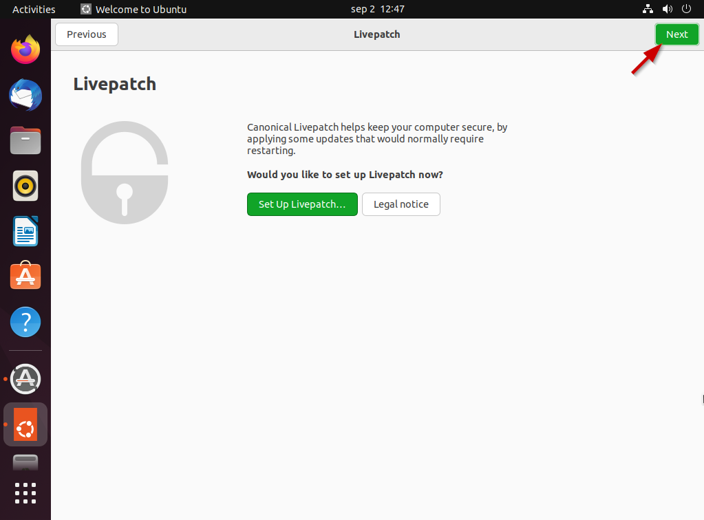

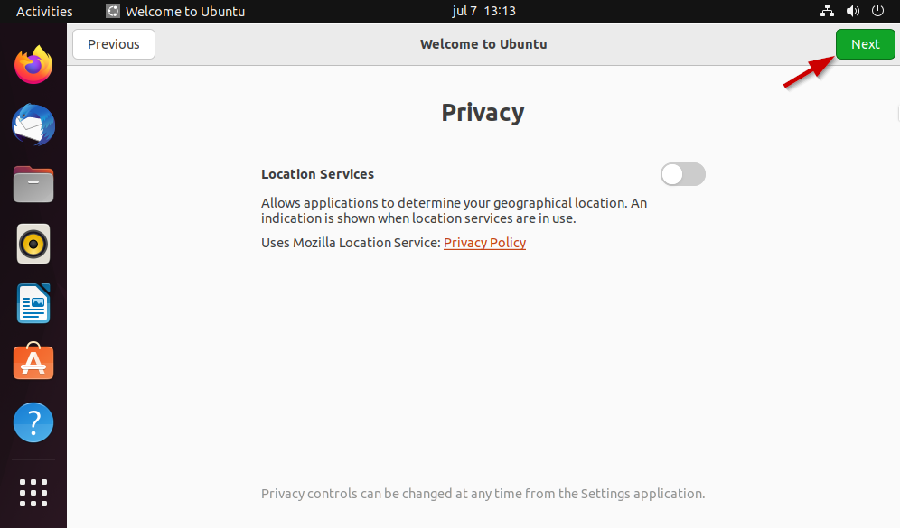

Nu zijn we klaar om Ubuntu Desktop te verkennen: 

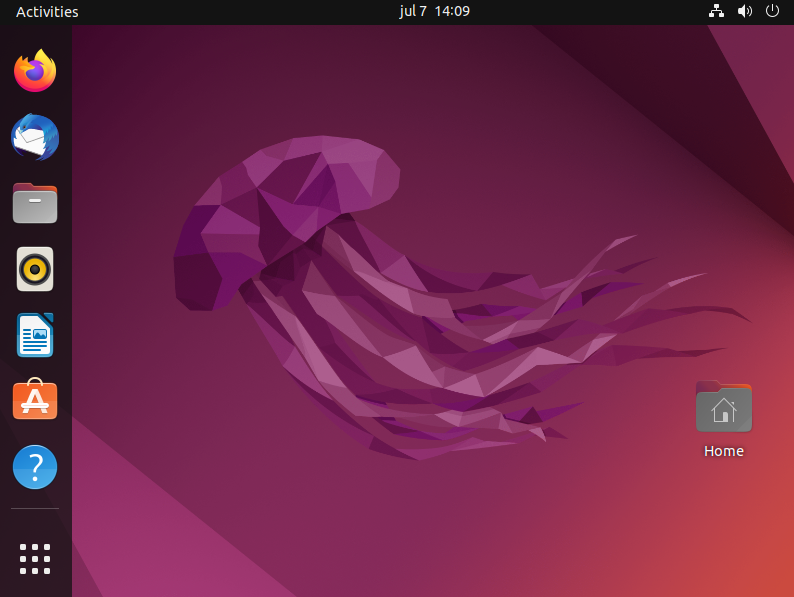

## Oefening 4 - Maak een momentopname van de VM 

Voordat je iets anders doet, is het een goede gewoonte om een momentopname, oftewel snapshot, te maken. Als op een later tijdstip onze Ubuntu Desktop breekt, kunnen we altijd terugkeren naar deze momentopname. 
Het is een tijdsbesparing om terug te kunnen keren naar dit punt, omdat we anders het Linux-systeem opnieuw moeten installeren. 

`Maak een momentopname van de Ubuntu Desktop VM, genaamd "Clean Install"` als volgt: 

_Sluit eerst de VM af..._

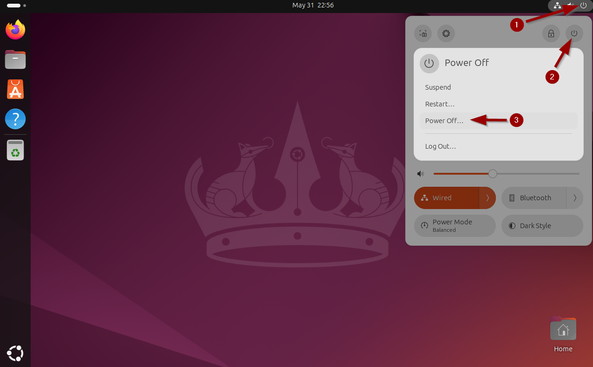

_VM/Snapshot/Take Snapshot..._
 

?> <i class="fa-solid fa-circle-info"></i> Op een later tijdstip kun je altijd teruggaan naar deze momentopname in de tijd met: 

_VM/Snapshot/Revert to Snapshot..._

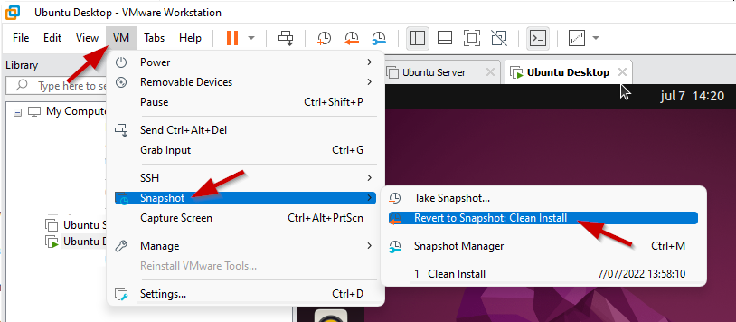

## Oefening 5 - Verken de desktopomgeving 
Probeer op de Ubuntu-desktopmachine de volgende suboefeningen uit te voeren:  
- Verander de desktopachtergrond
- Maak een nieuw tekstbestand met de tool "Text Editor" (= gedit) en probeer het op te slaan in je documentenmap  
- Controleer met de bestandsverkenner (Files) of het bestand bestaat  
- Verwijder het bestand en leeg de prullenbak  
- Pin (=Favorite) de Terminal-applicatie aan het Dock (=launcher)  
- Surf met Firefox naar de website van de school 
- Installeer de Chromium-webbrowser, start de app, maak deze vast aan het Dock en plaats deze boven het Firefox-pictogram  
- Surf met Chromium naar de school webmail portal 
- Installeer wps-office en test de apps  
- Installeer Spotify en test de app  
- Installeer Visual Studio Code en test de app  
- Installeer Gimp en bekijk de app 
