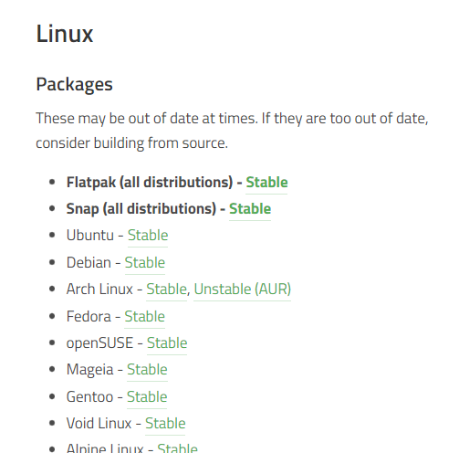

# Lab <!-- {docsify-ignore} -->

## Nuttige opdrachten vinden 

Op de [downloads pagina van de Minetest website](https://www.minetest.net/downloads/) zien we een link die verwijst naar een specifieke ubuntu url genaamd `packages.ubuntu.com/...`. Dit betekent dat je het `minetest`-pakket kunt installeren met behulp van een CLI-tool. 

 

## Manieren vinden om minetest te installeren 

Linus moet minetest op de een of andere manier op zijn server installeren. Hij moet een commando vinden waarmee hij pakketten kan installeren. 

Linus gebruikt het commando `man` om een lijst met commando's te vinden die het trefwoord _package_ in hun beschrijving hebben: 
```bash
man -k package                    or                    apropos package
```
De opdracht geeft de volgende uitvoer: 
```
student@linux-ess:~$ man -k package
apt-extracttemplates (1) - Utility to extract debconf config and templates from Debian packages
apt-get (8)          - APT package handling utility -- command-line interface
apt-mark (8)         - show, set and unset various settings for a package
apt-sortpkgs (1)     - Utility to sort package index files
check-language-support (1) - returns the list of missing packages in order to provide a complete language environment
debconf-apt-progress (1) - install packages using debconf to display a progress bar
dh_bash-completion (1) - install bash completions for package
```
Het `apt-get`-commando in deze lijst ziet er veelbelovend uit. Linus besluit het `apt-get`-commando te onderzoeken. Allereerst doet hij dit met het commando `whatis`: 
```bash
whatis apt-get
```
Hij wil meer informatie over het gebruik van het commando dus besluit hij de manpage te bekijken: 
```bash
man apt-get
```
Dit commando geeft ons de volledige _handleiding/manual_ van het `apt-get` commando: 

```
APT-GET(8)                                               APT                                               APT-GET(8)

NAME
       apt-get - APT package handling utility -- command-line interface

SYNOPSIS
       apt-get [-asqdyfmubV] [-o=config_string] [-c=config_file] [-t=target_release] [-a=architecture] {update |
               upgrade | dselect-upgrade | dist-upgrade | install pkg [{=pkg_version_number | /target_release}]...  |
               remove pkg...  | purge pkg...  | source pkg [{=pkg_version_number | /target_release}]...  |
               build-dep pkg [{=pkg_version_number | /target_release}]...  |
               download pkg [{=pkg_version_number | /target_release}]...  | check | clean | autoclean | autoremove |
               {-v | --version} | {-h | --help}}

DESCRIPTION
       apt-get is the command-line tool for handling packages, and may be considered the user's "back-end" to other
       tools using the APT library. Several "front-end" interfaces exist, such as aptitude(8), synaptic(8) and
       wajig(1).

       Unless the -h, or --help option is given, one of the commands below must be present.

       update
           update is used to resynchronize the package index files from their sources. The indexes of available
           packages are fetched from the location(s) specified in /etc/apt/sources.list. For example, when using a
           Debian archive, this command retrieves and scans the Packages.gz files, so that information about new and
           updated packages is available. An update should always be performed before an upgrade or dist-upgrade.
           Please be aware that the overall progress meter will be incorrect as the size of the package files cannot
           be known in advance.

       upgrade
       ...
       install
           install is followed by one or more packages desired for installation or upgrading. Each package is a
           package name, not a fully qualified filename (for instance, in a Debian system, apt-utils would be the
           argument provided, not apt-utils_2.0.6_amd64.deb). All packages required by the package(s) specified for
           installation will also be retrieved and installed. The /etc/apt/sources.list file is used to locate the
           desired packages. If a hyphen is appended to the package name (with no intervening space), the identified
           package will be removed if it is installed. Similarly a plus sign can be used to designate a package to
           install. These latter features may be used to override decisions made by apt-get's conflict resolution
           system.

           A specific version of a package can be selected for installation by following the package name with an
           equals and the version of the package to select. This will cause that version to be located and selected
           for install. Alternatively a specific distribution can be selected by following the package name with a
           slash and the version of the distribution or the Archive name (stable, testing, unstable).

           Both of the version selection mechanisms can downgrade packages and must be used with care.

           This is also the target to use if you want to upgrade one or more already-installed packages without
           upgrading every package you have on your system. Unlike the "upgrade" target, which installs the newest
           version of all currently installed packages, "install" will install the newest version of only the
           package(s) specified. Simply provide the name of the package(s) you wish to upgrade, and if a newer
           version is available, it (and its dependencies, as described above) will be downloaded and installed.

           Finally, the apt_preferences(5) mechanism allows you to create an alternative installation policy for
           individual packages.
       ...
```
Hij kan door de manpage navigeren met behulp van de pijltjestoetsen op het toetsenbord. Na het lezen van de manpage sluit hij deze af door op de `q`-toets op zijn toetsenbord te drukken. Met behulp van de info in de manpage, kunnen we zien dat het `apt-get` commando een subcommando heeft genaamd `install`. Linus komt erachter dat hij dit kan gebruiken om minetest op zijn systeem te installeren. 

## Minetest installeren 
Met de kennis die hij zojuist heeft verzameld, probeert hij Minetest te installeren: 

```bash
student@linux-ess:~$ apt-get install minetest
E: Could not open lock file /var/lib/dpkg/lock-frontend - open (13: Permission denied)
E: Unable to acquire the dpkg frontend lock (/var/lib/dpkg/lock-frontend), are you root?
```

Hij ziet een fout (`permission denied`). Het is belangrijk om foutmeldingen te leren analyseren. Zoals hij kan zien, verwijst de fout ook naar de gebruiker `root`. In dit hoofdstuk hebben we gezien dat sommige opdrachten _beheerdersrechten_ vereisen om te worden uitgevoerd. `apt-get` is een systeemcommando dat het hele systeem beïnvloedt, dus dit commando vereist speciale rechten. Linus kan dit commando als superuser uitvoeren met het commando `sudo`: 

?> <i class="fa-solid fa-circle-info"></i> Gebruik de `pijl-omhoog` om de _history_ te gebruiken en gebruik de `linkerpijl` of `home-toets` om naar het _begin van de lijn_ te gaan om sudo te typen. 

```bash
student@linux-ess:~$ sudo apt-get install minetest
[sudo] password for student:
Reading package lists... Done
Building dependency tree
Reading state information... Done
The following additional packages will be installed:
...
After this operation, 38,8 MB of additional disk space will be used.
Do you want to continue? [Y/n] Y
...
Setting up minetest (5.1.1+repack-1build1) ...
Processing triggers for mime-support (3.64ubuntu1) ...
Processing triggers for libc-bin (2.31-0ubuntu9.2) ...
Processing triggers for man-db (2.9.1-1) ...
...
student@linux-ess:~$
```

?> <i class="fa-solid fa-circle-info"></i> Als je een fout krijgt bij het uitvoeren van de bovenstaande opdracht, probeert `sudo apt-get update` uit te voeren en voert de opdracht `sudo apt-get install minetest` opnieuw uit. We zullen in een latere les meer te weten komen over het bijwerken van `apt`-repositories. 

De bovenstaande opdracht vraagt je om je wachtwoord en kan je ook vragen of je zeker weet dat je een heleboel pakketten wilt installeren.  

De installatie is geslaagd (denkt hij, want we krijgen niet echt een succesboodschap ofzo). Linus ziet een hele hoop uitvoer, maar hij heeft geen idee waar minetest zich bevindt of hoe hij zelfs de serverbestanden kan uitvoeren. In het volgende hoofdstuk zullen we onderzoeken hoe bestanden en mappen in Linux werken. 

Soms is het nuttig dat we tekst kunnen kopiëren en plakken in onze CLI-omgeving. Bij het gebruik van de CLI in de virtuele machine kunnen we dit niet doen. We zouden verbinding kunnen maken met de virtuele machine met behulp van SSH. Dit is een protocol dat externe verbindingen mogelijk maakt met machines waartoe we fysiek geen toegang hebben. Bijvoorbeeld als je sever in de cloud staat. Een van de voordelen van het gebruik van SSH is dat we ook tekst in onze CLI kunnen kopiëren en plakken. 


## Een SSH-verbinding instellen 

Linus probeert verbinding te maken met zijn server via SSH. De procedure is als volgt: 

*Eerst* moet hij het IP-adres van de server krijgen. Hij typt `ip a` en zoekt naar het IP-adres van de netwerkinterface (ens33) 
```bash
ip a
```


<br />

*Als tweede* besluit hij Powershell te openen en een ssh-verbinding met de server te maken. Hij werkt nu vanaf zijn desktop aan de server. Cool, nietwaar? 
```bash
ssh student@<server-ip>
```


<br />

Zoals je kunt zien krijgt hij nu een prompt new prompt. Dit is een shell op zijn Ubuntu-server die in VMWare draait. Het idee klinkt misschien raar omdat hij de virtuele machine met een CLI op zijn laptop heeft draaien. Maar stel je een scenario voor waarin de virtuele machine niet op zijn laptop zou draaien, maar in plaats daarvan ergens op Amazon-webservices in de cloud zou worden gehost. Hij zou het `ssh user@server-ip`-commando op zijn apparaat gebruiken om verbinding te maken met die server. 

Je kan ervoor kiezen om te blijven werken met behulp van het commando `ssh` in Powershell of terug te gaan naar je VM in de interface van VMware Workstation.