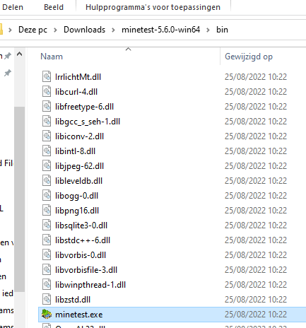
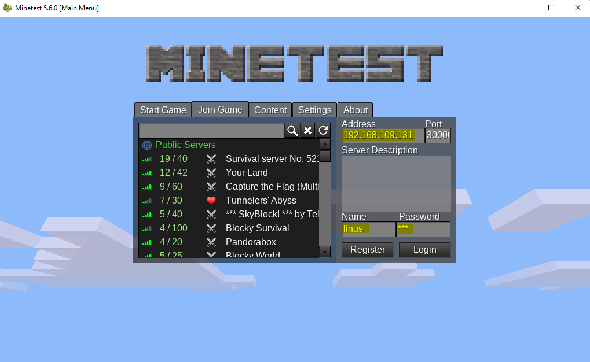

# Lab <!-- {docsify-ignore} -->

Linus voelt zich eindelijk comfortabel genoeg bij het navigeren door het besturingssysteem met behulp van opdrachten en het werken met bestanden en mappen. Het is tijd om terug te gaan naar de kern van deze labopstelling: een mintest server aan de praat krijgen. 

## Herhaling - een pakket installeren 
Denk eraan in [hoofdstuk 3 - lab](/./be-nl/03_commandline/02_lab.md) waar we de volgende opdracht hebben uitgevoerd: 
```bash
student@linux-ess:~$ sudo apt-get install minetest
[sudo] password for student:
Reading package lists... Done
Building dependency tree
Reading state information... Done
The following additional packages will be installed:
...
Setting up minetest (5.1.1+repack-1build1) ...
Processing triggers for mime-support (3.64ubuntu1) ...
Processing triggers for libc-bin (2.31-0ubuntu9.2) ...
Processing triggers for man-db (2.9.1-1) ...
```

We hebben nu geleerd dat dit commando eigenlijk de pakketbeheerder gebruikt om een pakket met de naam `minetest` in zijn repositories te zoeken (en te installeren). Het installeert ook alle benodigde dependencies en stelt het besturingssysteem in, zodat we het commando `minetest` daadwerkelijk kunnen gebruiken. 

Om meer te weten te komen over het commando kunnen we eerst het `man minetest` commando uitvoeren: 
```bash
minetest(6)                                                                                               minetest(6)

NAME
       minetest, minetestserver - Multiplayer infinite-world block sandbox

SYNOPSIS
       minetest [--server SERVER OPTIONS | CLIENT OPTIONS] [COMMON OPTIONS] [WORLD PATH]

       minetestserver [SERVER OPTIONS] [COMMON OPTIONS] [WORLD PATH]

DESCRIPTION
       Minetest  is  one  of the first InfiniMiner/Minecraft(/whatever) inspired games (started October 2010), with a
       goal of taking the survival multiplayer gameplay in a slightly different direction.

       The main design philosophy is to keep it technically simple, stable and portable. It will be kept  lightweight
       enough to run on fairly old hardware.

COMMON OPTIONS
       --help Print allowed options and exit

       --version
              Print version information and exit

       --config <value>
              Load configuration from specified file

       --logfile <value>
              Set logfile path ('' for no logging)

 Manual page minetest(6) line 1 (press h for help or q to quit)
 ```

## De server uitvoeren 
We merken dat er een optie is: `--server`. Het pakket dat we hebben geïnstalleerd, heeft zowel de clientversie (degene die je laadt om verbinding te maken met de server en af te spelen) als de serverversie (degene die je uitvoert om daadwerkelijk een server te hosten waarmee andere spelers verbinding kunnen maken via een client). 

We controleren ook waar het uitvoerbare bestand zich bevindt met behulp van het commando `which minetest`: 
 ```bash
student@linux-ess:~$ which minetest
/usr/games/minetest
 ```

?> We konden allebei de commando's `minetest` en `/usr/games/minetest` uitvoeren. Beide zouden hetzelfde uitvoerbare bestand uitvoeren. Dit is mogelijk door de variabele `$PATH` die de map `/usr/games` bevat. Wanneer je een commando typt, zoekt de CLI naar een uitvoerbaar bestand in alle mappen in de variabele `$PATH` en voert dat bestand vervolgens uit. Dit maakt het gemakkelijker om opdrachten uit te voeren, omdat we niet altijd het volledige pad naar een bestand nodig hebben. JE kan `echo $PATH` typen om de waarde van de PATH-variabele te zien. 

Bij het uitvoeren van het commando `minetest` zal je merken dat je een foutmelding krijgt: 
 ```bash
 student@linux-ess:~/linuscraft$ minetest
ALSA lib confmisc.c:767:(parse_card) cannot find card '0'
ALSA lib conf.c:4732:(_snd_config_evaluate) function snd_func_card_driver returned error: No such file or directory
ALSA lib confmisc.c:392:(snd_func_concat) error evaluating strings
ALSA lib conf.c:4732:(_snd_config_evaluate) function snd_func_concat returned error: No such file or directory
ALSA lib confmisc.c:1246:(snd_func_refer) error evaluating name
ALSA lib conf.c:4732:(_snd_config_evaluate) function snd_func_refer returned error: No such file or directory
ALSA lib conf.c:5220:(snd_config_expand) Evaluate error: No such file or directory
ALSA lib pcm.c:2642:(snd_pcm_open_noupdate) Unknown PCM default
AL lib: (EE) ALCplaybackAlsa_open: Could not open playback device 'default': No such file or directory
terminate called after throwing an instance of 'std::runtime_error'
  what():  Audio: Global Initialization: Device Open
Aborted
 ```

We merken dat we een foutmelding krijgen met de melding `cannot find card '0'`. Vergeet niet dat we proberen de clientversie van het spel uit te voeren. Deze client is een echte grafische gebruikersinterface die er ongeveer zo uit zou zien: 

 

We krijgen deze fout omdat we een Ubuntu-server uitvoeren met behulp van een command line interface. Er is geen grafische gebruikersinterface aanwezig, dus de eigenlijke GUI van de client kan niet worden geladen. De clientversie van het spel installeren we later in dit lab op onze laptop. 

Dus om onze server aan de praat te krijgen, zullen we ons moeten concentreren op het gebruik van het commando `minetest --server`: 
```bash
student@linux-ess:~$ minetest --server
        .__               __                   __
  _____ |__| ____   _____/  |_  ____   _______/  |_
 /     \|  |/    \_/ __ \   __\/ __ \ /  ___/\   __\
|  Y Y  \  |   |  \  ___/|  | \  ___/ \___ \  |  |
|__|_|  /__|___|  /\___  >__|  \___  >____  > |__|
      \/        \/     \/          \/     \/
2022-08-25 09:36:24: ACTION[Main]: World at [/home/student/.minetest/worlds/world]
2022-08-25 09:36:24: ACTION[Main]: Server for gameid="minetest" listening on 0.0.0.0:30000.
```

We krijgen onze prompt niet terug. Dit komt omdat de servertoepassing een actief proces is. We kunnen dit proces altijd onderbreken door de toetsenbordcombinatie `ctrl+c` te gebruiken. 

?> Merk op dat we het `minetest` uitvoerbare bestand actief moeten hebben als we later daadwerkelijk verbinding willen maken met de server! 

Bij het uitvoeren van het commando met behulp van de optie `--server`, kunnen we zien dat het een map `worlds/world` heeft gemaakt in `/home/student/.minetest`. Dit is interessant omdat hier `minetest` standaard alle configuratiebestanden van onze eigenlijke server opslaat. We merken ook dat de server _luisterd_ voor verbindingen op poort `30000`.  

Linus wil echter niet de standaardconfiguratie gebruiken. Hij maakte een map `~/linuscraft/serverfiles` met als doel de wereldbestanden te beheren. Met behulp van de manpage zien we dat we de server kunnen vertellen om dit pad te gebruiken over waar de wereldbestanden moeten worden opgeslagen: 
```bash
student@linux-ess:~$  minetest --server --world ~/linuscraft/serverfiles/myworld --logfile ~/linuscraft/serverfiles/logfile.txt
        .__               __                   __
  _____ |__| ____   _____/  |_  ____   _______/  |_
 /     \|  |/    \_/ __ \   __\/ __ \ /  ___/\   __\
|  Y Y  \  |   |  \  ___/|  | \  ___/ \___ \  |  |
|__|_|  /__|___|  /\___  >__|  \___  >____  > |__|
      \/        \/     \/          \/     \/
2022-08-25 09:45:01: ACTION[Main]: World at [/home/student/linuscraft/serverfiles/myworld]
2022-08-25 09:45:01: ACTION[Main]: Server for gameid="minetest" listening on 0.0.0.0:30000.
```
We hebben ook de optie `--logfile` gebruikt om alle serverlogboeken op te slaan in een specifiek bestand. We zien nu dat de wereld is gemaakt in `~/linuscraft/serverfiles/myworld`. We kunnen dit controleren door op `ctrl+c` te drukken (dit zal de minetest-server afsluiten) en een `ls`-commando uit te voeren: 
```bash
student@linux-ess:~$ ls linuscraft/serverfiles/myworld/
env_meta.txt  force_loaded.txt  ipban.txt  map_meta.txt  map.sqlite  world.mt
```

## Verbinding maken met de server 
*Eerst* moeten we het IP-adres van de server krijgen. We typen `ip a` en zoeken naar het IP-adres van onze netwerkinterface (ens33 of eth0) 
```bash
ip a
```


<br />

*Ten tweede* moeten we ervoor zorgen dat de server daadwerkelijk draait met behulp van het `minetest`-commando dat we hierboven hebben gemaakt. We laten dit proces actief: 
```bash
student@linux-ess:~$  minetest --server --world ~/linuscraft/serverfiles/myworld --logfile ~/linuscraft/serverfiles/logfile.txt
        .__               __                   __
  _____ |__| ____   _____/  |_  ____   _______/  |_
 /     \|  |/    \_/ __ \   __\/ __ \ /  ___/\   __\
|  Y Y  \  |   |  \  ___/|  | \  ___/ \___ \  |  |
|__|_|  /__|___|  /\___  >__|  \___  >____  > |__|
      \/        \/     \/          \/     \/
2022-08-25 09:45:01: ACTION[Main]: World at [/home/student/linuscraft/serverfiles/myworld]
2022-08-25 09:45:01: ACTION[Main]: Server for gameid="minetest" listening on 0.0.0.0:30000.
```

### Download de client 
Vervolgens moeten we de client downloaden op onze Windows-laptop. Je kan de client downloaden op https://www.minetest.net/downloads/. Download en pak de `Minetest x.x.x - portable, 64-bit (recommended)` uit. Na het uitpakken van de map vindt je een bestand met de naam `minetest.exe` in de submap `bin` waarop je kan dubbelklikken: 



### Verbinding maken met onze server 
Bij het opstarten van de client op onze Windows-machine krijg je een menu met verschillende opties. Omdat we lid willen worden van een server en niet lokaal willen spelen, klikken we op het tabblad _join game_. 


Aan de rechterkant van het menu kunnen we het ip-adres invoeren dat we eerder op de server hebben gevonden door het commando `ip a` uit te voeren. De poort zou standaard ingesteld moeten zijn met de waarde `30000`. We geven ook een gebruikersnaam en wachtwoord en klikken op de knop `register`: 


?> De volgende keer dat je lid wordt, moet je op de inlogknop klikken en het geselecteerde wachtwoord opgeven! 

We stellen het wachtwoord in en klikken op de knop `Register`: 


Na dit proces moet de client je verbinden met de server en kan je rondrennen en dingen bouwen! 


?> Wees voorzichtig. Gevaarlijke wezens zwerven 's nachts over de hele wereld! 

Wanneer we teruggaan naar de CLI van onze server, zal je merken dat de uitvoer van ons commando is gewijzigd. Het laat nu zien dat een speler verbinding heeft gemaakt (en de verbinding heeft verbroken) met de server: 
```bash
student@linux-ess:~$ minetest --server --world ~/linuscraft/serverfiles/myworld
        .__               __                   __
  _____ |__| ____   _____/  |_  ____   _______/  |_
 /     \|  |/    \_/ __ \   __\/ __ \ /  ___/\   __\
|  Y Y  \  |   |  \  ___/|  | \  ___/ \___ \  |  |
|__|_|  /__|___|  /\___  >__|  \___  >____  > |__|
      \/        \/     \/          \/     \/
2022-08-25 10:24:46: ACTION[Main]: World at [/home/dries/linuscraft/serverfiles/myworld]
2022-08-25 10:24:46: ACTION[Main]: Server for gameid="minetest" listening on 0.0.0.0:30000.
2022-08-25 10:32:51: ACTION[Server]: linus [172.25.xxx.x] joins game.
2022-08-25 10:32:51: ACTION[Server]: linus joins game. List of players: linus
2022-08-25 10:37:33: ACTION[Server]: linus digs default:acacia_tree at (6,5,3)
```

### Een gedownloade wereld gebruiken 
De standaard wereld is vrij leeg, dus Linus wil indruk maken op zijn vrienden door een vooraf gebouwde wereld te downloaden die hij op Google heeft gevonden. Om dit te doen gaan we naar je `serverfiles` directory: 
```bash
student@linux-ess:~$ cd ~/linuscraft/serverfiles
```

Nadat we dit hebben gedaan, downloaden we het zip-bestand met onze nieuwe wereld door de onderstaande opdracht uit te voeren: 
```bash
student@linux-ess:~/linuscraft/serverfiles$ wget https://d-ries.github.io/linux-essentials/data/customworld.zip
```
Als we een kijkje willen nemen in het zip-bestand, kunnen we ```less customworld.zip``` gebruiken  

Dit geeft ons een `zip`-bestand dat we moeten uitpakken door ```unzip customworld.zip``` uit te voeren. 

We kunnen het zipbestand daarna verwijderen omdat we dit niet langer nodig hebben: 
```bash
student@linux-ess:~/linuscraft/serverfiles$ rm customworld.zip
student@linux-ess:~/linuscraft/serverfiles$ ls
pxl-world  logfile.txt  myworld
```

Zoals te zien is in de output hierboven, heet de nieuwe wereld `pxl-wereld`. We kunnen nu het commando gebruiken dat we eerder zagen om de server te starten met behulp van de nieuwe wereld bestanden: 

```bash
student@linux-ess:~/linuscraft/serverfiles$ minetest --server --world ~/linuscraft/serverfiles/pxl-world/ --logfile ~/linuscraft/serverfiles/logfile.txt
```
Als je nu lid wordt, zou je in een wereld moeten zijn die een meer/zee bevat met het Hogeschool PXL logo dat in de lucht zweeft! 
