# Assignment File globbing

## Task 1
Create a new folder named FileGlobEx with the files script.sh, scrupt.sh and scrApt.sh. Use the touch command to create the files. 

<br/>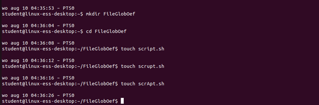


## Task 2
Try following command: ls scr[a-z]pt.*
- Make sure this command is case sensitive and test
- Make sure this command is not case sensitive and test
?> <i class="fa-solid fa-circle-info"></i> Currently it is set to automatically use not case sensitive.

<br/>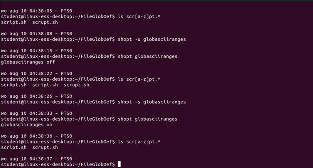

## Task 3
Create the following files with only one command: script.sd, script.dh, script2.dh, script.ds, script2.ds and script3.ds

<br/>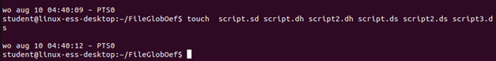

## Task 4
Search your folder for all files ending in .sh or .sd or .dh or .ds

<br/>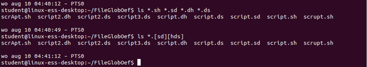
?> <i class="fa-solid fa-circle-info"></i> The second option works as well in this situation, but also shows results ending in .ss and .dd

## Task 5
Search for folder for all files starting with scr, then any character followed by pt. The files need to end with an h or an s
<br/>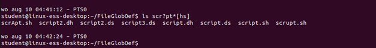

## Task 6
Make sure that the command ls /b* does not show the content of the found folders. Look this up in the man page.

<br/>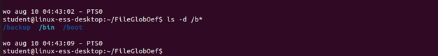


## Task 7
Show all files and directories ending with ".conf" found in the folder "/etc"

<br/>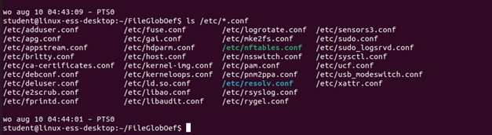

## Task 8
Show all files and directories ending with ".d" found in the folder "/etc", do not show the contents of these directories

<br/>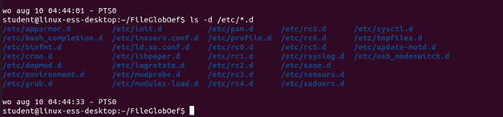


## Task 9
Show all files and directories from the folder "/etc" that have "sh" somewhere in their name 

<br/>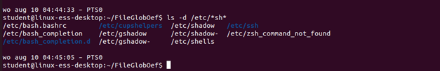

## Task 10
Show all files and directories from the folder "/etc"  with just 10 characters in their name, do not show the contents of the found folders. 

<br/>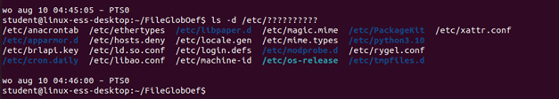


## Task 11
Search in the "/etc" folder for a file that has "os" in its name followed by "release" somewhere. Show the contents of this file. 

<br/>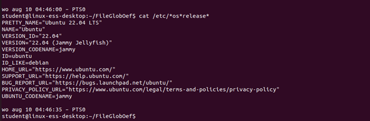

## Task 12
Execute the following command and explain its result: 
```bash
ls -d /usr/share/bash-completion/completions/resolv*conf
```

<br/>

?> <i class="fa-solid fa-circle-info"></i> It shows resolvconf because the * means 0 of more characters. 

## Task 13
Search for all files that start with two numbers from the folder "/etc/grub.d"

<br/>


## Task 14
List all files that do not start with a number from the folder "/etc/grub.d"

<br/>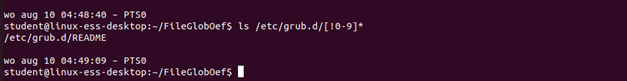


## Task 15

Extra: Try all examples of file-globbing of the textbook again. Practice makes perfect ;-)
