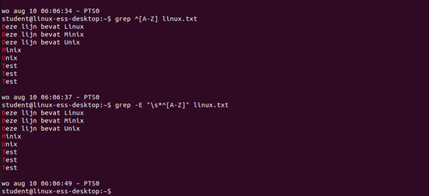
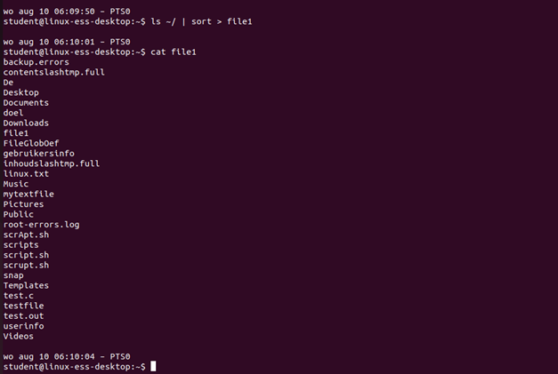
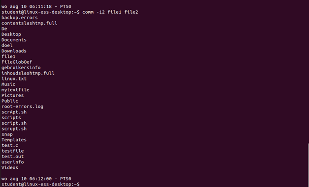
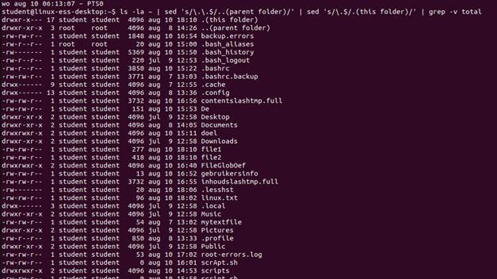

# Assignment Filters

## Task 1
Show the last 5 created users, from newest to oldest.

<br/>

## Task 2
What is the option to use grep case insensitive

<br/>
<br/>

## Task 3

Show the following text on your screen using commands, environment variables, etc. 

The computer ubuntu has the ip address `10.0.2.132` given to him by its mac address `000C2903E436`.

?> <i class="fa-solid fa-circle-info"></i> Note: the mac address does not have colons and is all uppercase. Do all of this in on commandline. Do not use ";" to put multiple commands in a row.

?> <i class="fa-solid fa-circle-info"></i>
```
ubuntu -> This is the hostname of the computer
172.16.12.128 -> the ip address (Hint: ip a. You need adapter ens33)
000C29DDED7C -> the mac address (Hint: ip a. You need adapter ens33)
```

<br/>
<br/>

## Task 4
Show the lines and line numbers from the file linux.txt that contain the word unix or Unix.
Example of linux.txt:

```
Deze lijn bevat Linux
Deze lijn bevat Minix
Deze lijn bevat Unix
unix
Minix
Unix
Test
Test
Test
```

<br/>
<br/>
<br/>


## Task 5
Show the lines from linux.txt that contain the word Linux, Minix or Unix

<br/>

## Task 6
Show the number of lines that contain the word Unix in the file linux.txt. Search for this option in the manpage
<br/>
<br/>

## Task 7
Show all lines from the file linux.txt that start with a capital. 

?> <i class="fa-solid fa-circle-info"></i> Capital letters can be matched using [A-Z]
?> <i class="fa-solid fa-circle-info"></i> The start of a line can be match using ^

<br/>


## Task 8
HARD: Count the number of users that can log into the ubuntu-vm.
These users can be found by looking at the second field in the /etc/shadow file. This field cannot contain * or !

<br/>


## Task 9
Print the password file, ordered by userid. Search for this option in the manpage 

<br/>

## Task 10
Show the names of all users that have at least one running process, orden them on the number of processes. (Hint: ps aux) 

<br/>

## Task 11
Put the output of ls from your homedir in file1 a,d ls -a from your homedir in file2. Give a comparison of what files and directories are only in file1, which ones are only in file2 and which occur in both files. 

<br/>
<br/>


## Task 12
Show only the files that occur in both files. 

<br/>


## Task 13
Start with the ls command of the root-folder (/) and try to end with a list of files and folder separated by spaces. Use the tr command to translate all new line characters to spaces.

<br/>

## Task 14
Use the ls -la command in your home folder. Change in the output: 

?> <i class="fa-solid fa-circle-info"></i> The reference "." To ". (this folder)" and ".." to ".. (parent folder)". Also remove the line that shows the amount of files and folders in the directory. 
?> <i class="fa-solid fa-circle-info"></i> Hint: if you use the $ sign at the end of a string to search, it means the line needs to end with that string. 

<br/>
<br/>

## Task 15
Go to you home directory. Paste all files from the directory one after the other and count the number of words. 

<br/>
