# Assignment Linux file tree

## Task 1
Add the following text in the given files, on desktop and server:

```bash
/etc/profile		→  echo "/etc/profile executed" >> /tmp/mylog
/etc/bash.bashrc	→  echo "/etc/bash_bashrc executed" >> /tmp/mylog
~/.profile		→  echo "~/.profile executed" >> /tmp/mylog
~/.bashrc		→  echo "~/.bashrc executed" >> /tmp/mylog
```

→ Look at which texts appeard in the file /tmp/mylog on start-up, login, start of the Gnome terminal and start of a subshell (= type bash)

<br/>

<br/>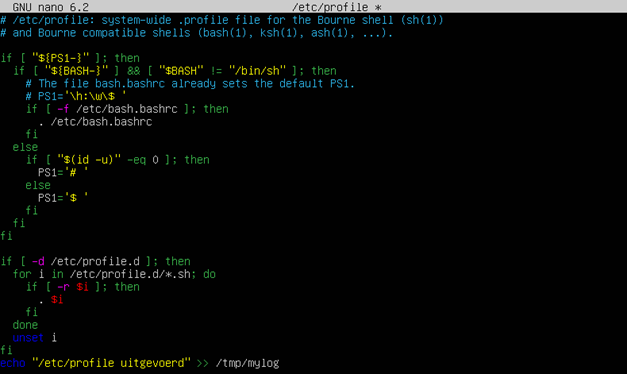

<br/>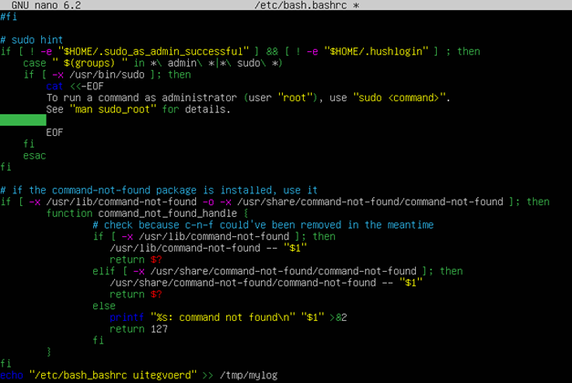

<br/>

<br/>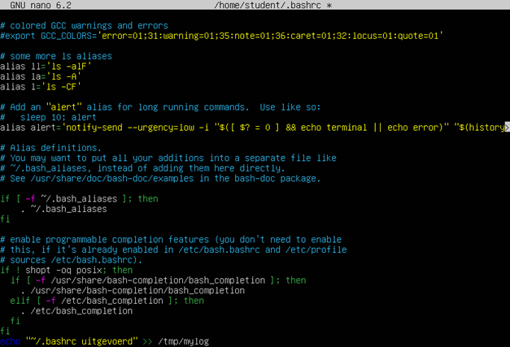
```
Login:		    /etc/profile 		~/.profile 
Open terminal:	 /etc/bash_bashrc 	~/.bashrc 
Subshell:		 /etc/bash_bashrc 	~/.bashrc 
```

```
Server: 
Login:		    /etc/bash_bashrc	/etc/profile	~/.bashrc	~/.profile
Subshell: 		/etc/bash_bashrc 	~/.bashrc
```

## Task 2
Find out what the command su does. 
Run the command su <other_user> and su - <other_user> and observe the difference
Run the command “su student” and “su – student” and observe the difference with the previous task

<br/>

```
Switch user
“-“ also loads the environment -> your path is set to the homefolder of the user you su’ed
```

## Task 4
Add a few lines to the (new) file ~/.bash_aliases of your home directory, so that in the future, if needed, confirmation is asked to execute the commands rm, mv and cp. 

<br/>

<br/>

## Task 5
Close the terminal-window and start a new one (or type bash). Test if all aliases are known. 

<br/>

## Task 6
Make sure that this is added automatically in the home folder of all newly created users. 
To do this, add .bash_aliases to the folder /etc/skel. This is the folder that is copied to new homefolder on creation. 

<br/>

## Task 7
Add a new user via the GUI

<br/>

<br/>

<br/>

<br/>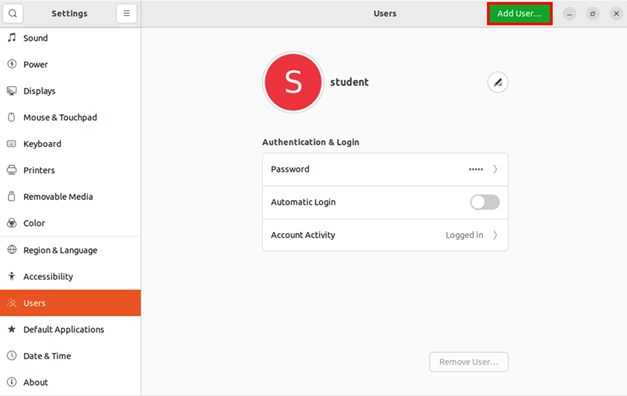

<br/>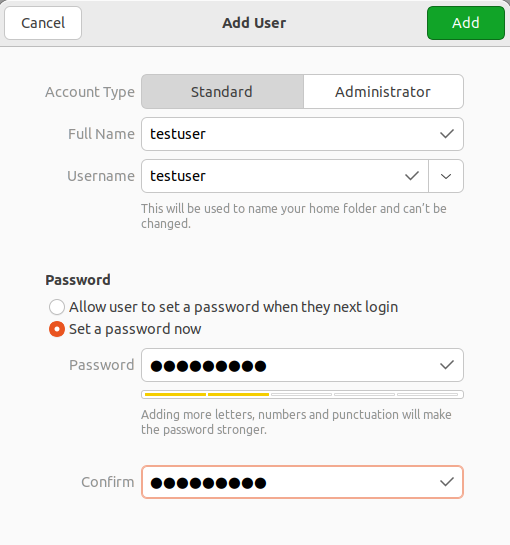

<br/>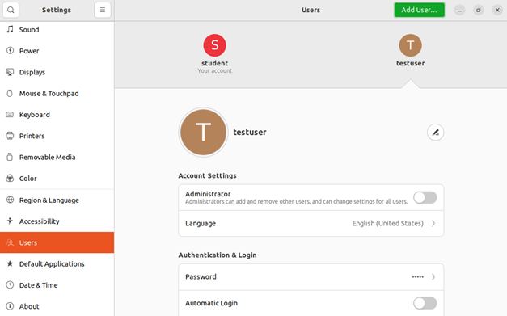

## Task 8
Log in with the new user and test if the aliases are known 

<br/>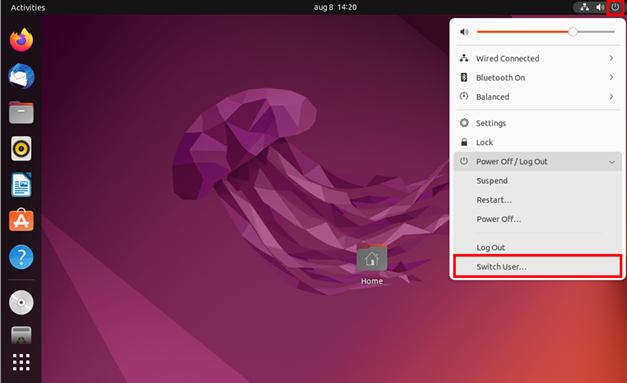
<br/>
<br/>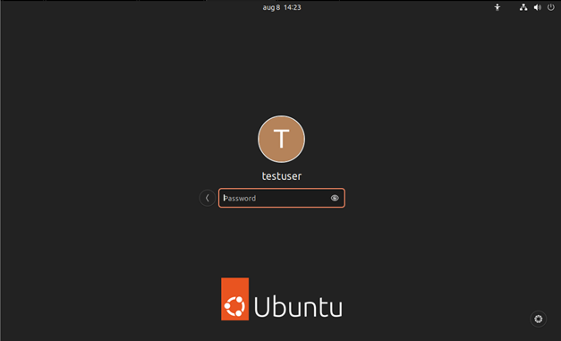
<br/>

## Task 9
Log out and log in again with the original user (created at installation) 

<br/>
<br/>
<br/>

## Task 10
Remove the use you just created

<br/>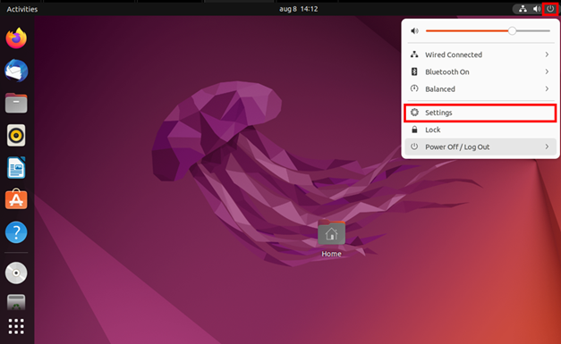
<br/>
<br/>
<br/>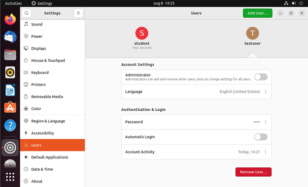
<br/>

## Task 11
Try to see all files from /etc that end in .conf with the ls-command. Try this while you’re in the /etc folder and when you’re in your home folder

<br/>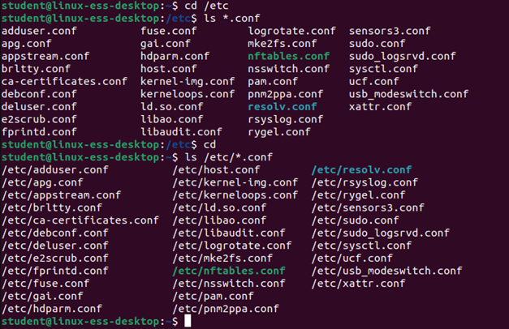


## Task 12
Look at the general logfile with the command less. Go directly to the last line and go up again to see a few lines

<br/>
```
Press G to jump to the end followed by the up arrow to go up one again. Press Q to leave this view.
```

## Task 13
How many hard disks are In your vm and how many partitions do each of them have? This is visible in the directory /dev. The special files of disks start with sd. The number in the filename indicates the partition. 

<br/>
```
There is one hard disk available, sda, which is partitioned into 4 partitions. 
```


## Task 14
If the CDROM is mounted, you should’ve a subdirectory in /media. Check this

<br/>

## Task 15
Create a file in the folder /tmp. Restart Ubuntu and check if the file is still present
<br/>
<br/>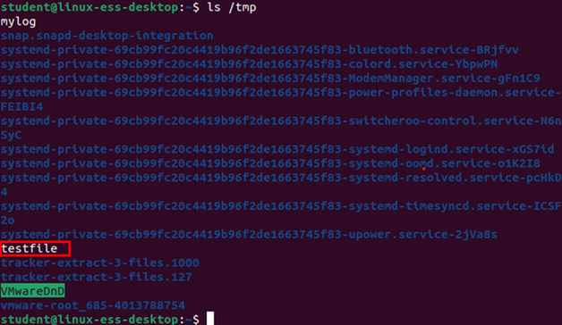
<br/>
<br/>