# Assignment Users

## Task 1
The definition of users is kept in the file /etc/passwd. This file have 1 line for each user. Each of these lines is divided into 7 fields, separated by a “:”. Give a description of each of these fields:

Field 1:	Login name
Field 2:	X to show there is a password for this user in /etc/shadow
Field 3:	Numerical user ID
Field 4:	Numerical group ID
Field 5:	Username and/or comment field
Field 6:	User home directory 
Field 7:	Login shell 

<br/>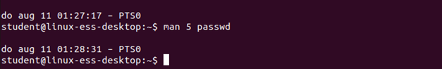
<br/>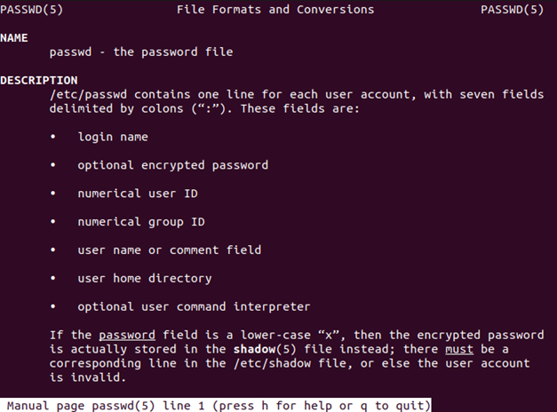

## Task 2
Back in the early days of Unix, the file /etc/passwd didn’t only keep user-information, it also contained a coded version of the password. This was a weak point in the security of the Unix system of course, because everyone can read the /etc/passwd file and thus could see the coded passwords. For a hacker the next step would be to create a tool to decode these passwords, for example: cracker. After this problem was recognized, it was decided that the passwords were to be kept in a different file. This file would only be accessible by the user root, who’s ID is used to run the passwd and login programs. 
What is the name of the file with the coded passwords? 

```
/etc/shadow, note that only the user student currently has a password, all the other users show a * where the encrypted password would be.
```


## Task 3
Create a user with following characteristics:
User-name:	jan
User-ID:	1111
Group-ID:	100 (=users)
Description:	Testuser jan
Home-dir:	/home/jan
Shell:		/bin/bash


<br/>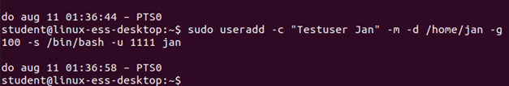
<br/>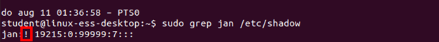

?> <i class="fa-solid fa-circle-info"></i> After a user is created, its password is set to “!”, which means that this name cannot be used to log in. To make this possible you need to give Jan a password. Set Jan’s password to “January”. 

<br/>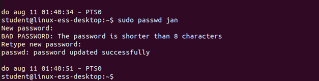


## Task 4
Check the changed files:
Wat is changed in the file /etc/passwd?

```
One line has been added for the user jan
```
<br/>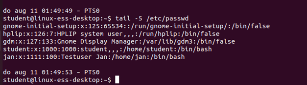


## Task 5
What is changed in the file /etc/shadow?

```
One line has been added for the password of jan 
```
<br/>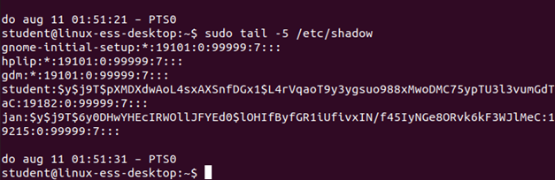


## Task 6
Wat is changed in the file /etc/group?

```
jan has been added behind the group users (100)
```

## Task 7
Wat is changed in the directory /home? 

```
a directory has been added for jan's home folder 
```
<br/>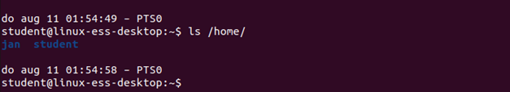


## Task 8
The user Jan is now created on your system. Now Jan should be able to ask information about himself. 
Log in as Jan and execute the following command: 
```bash
id
```

<br/>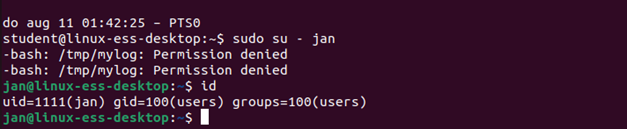


## Task 9
Remove the user Jan from your system using the command:  userdel –r jan
What is changed in the file /etc/passwd?

<br/>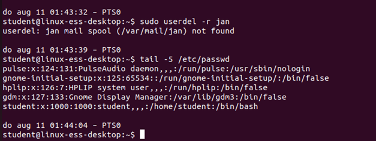

?> <i class="fa-solid fa-circle-info"></i> The line with user Jan is deleted.

## Task 10
What is changed in the file /etc/shadow?

```
The line with user jan is deleted. 
```
<br/>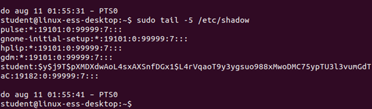


## Task 11
What is changed in the file /etc/group?

```
Jan is not shown in the group users anymore  
```
<br/>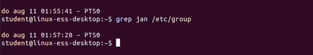

## Task 12
Does the directory /home/jan still exist? YES / NO

```
NO
```

<br/>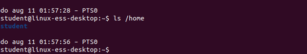


## Task 13
Create a user Piet, by only specifying its username and that he must have a home folder. 

<br/>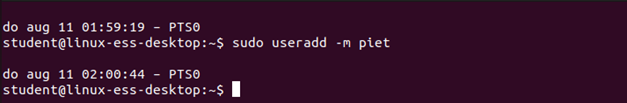


## Task 14
Examine the files that have been modified
What is changed in the file /etc/passwd?

```
One line has been added for the user piet. 
```

<br/>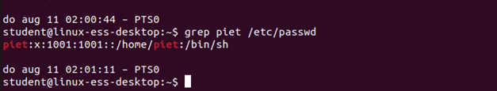


## Task 15
What is changed in the file /etc/shadow?

```
One line has been added for the user piet, but no password as set yet. 
```
<br/>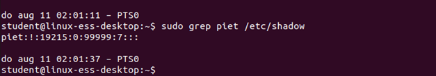


## Task 16
What is changed in the file /etc/group?

```
One line has been added for the new group piet, the primary group for the user piet.
```

<br/>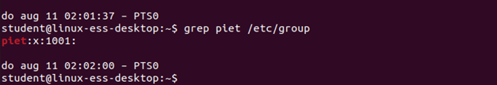

## Task 17
What is changed in the directory /home?

```
One directory has been added for the home folder of the user piet.
```

<br/>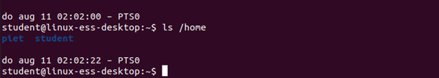


## Task 18
Give the user Piet a password

<br/>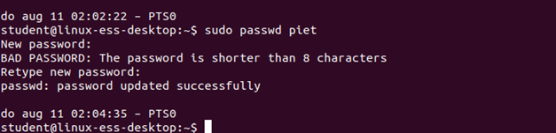


## Task 19
Try to log in as Piet

<br/>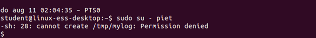

## Task 20
Remove the user Piet, but keep his home folder

<br/>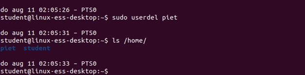


## Task 21
Delete Piet’s home folder

<br/>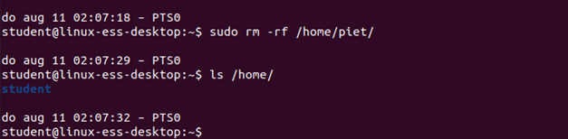